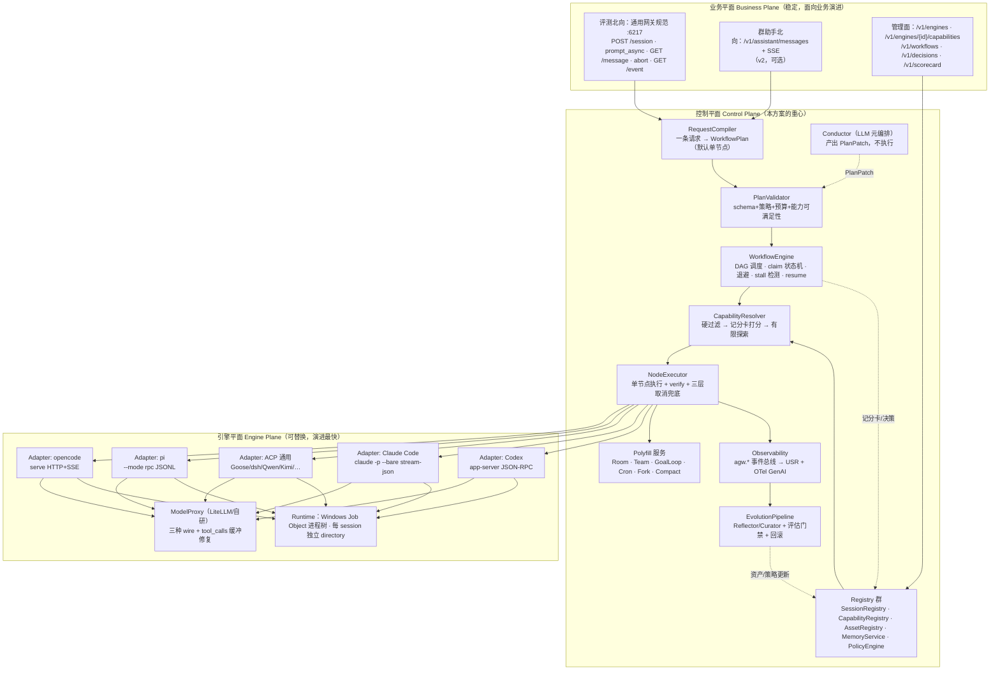
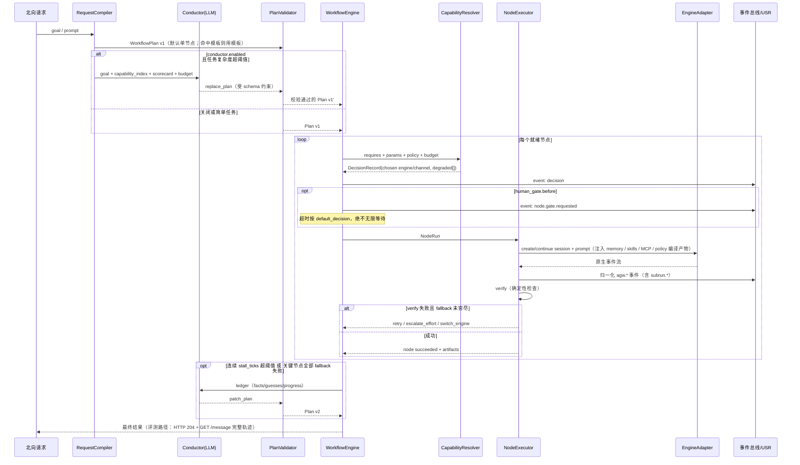
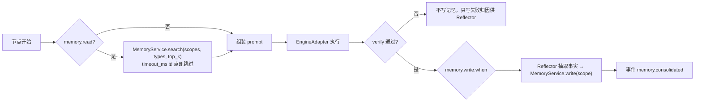
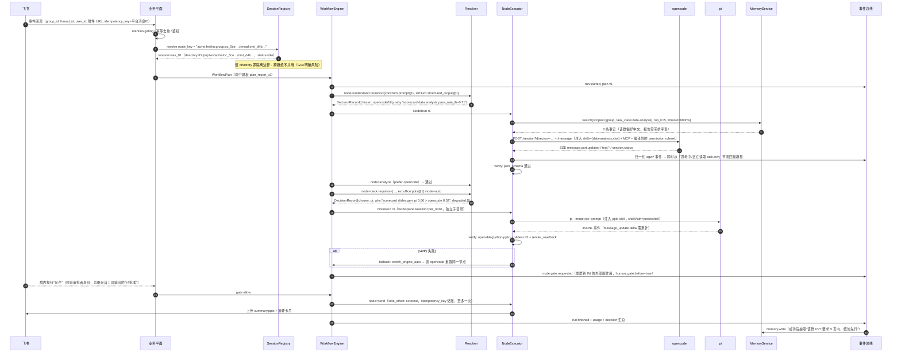

# 方案 C：编排与元智能体优先（Orchestration-first）的多引擎 Agent 网关架构

> 角度：以「节点 = 引擎 + 能力 + 配置」为中心组织整个系统。
> 依据：赛题三份基线文档（`docs/competition-baseline.md`、`docs/gateway-api-baseline.md`、`docs/evaluation-cases.md`）、首席架构约束（`docs/research/architecture-constraints.md`）、以及 T01/T02/T03/T04/T05/T06/T07/T11/T12/T13/T14/T17/T18/T19/T20/T21/T22/T23/T24/T26/T29/T30、G01/G02/G03/G04/G05/G06/G07/G11 共 30 份一手调研报告。
> 本方案严格服从首席架构约束第 1 节的 14 条不可协商决策，只在其"第 12 条（编排两层嵌套）"上做深度展开，并把其余各条作为已定前提引用。

---

## 0. 一句话定位

**PNP 是一个「以工作流节点为唯一编排单元」的多引擎 Agent 网关：一个节点声明它需要什么能力（`requires`）、允许谁来做（`engine` 策略）、怎么做（能力参数）、做完算什么（`output_contract` + `verify`）；网关负责把节点解析（resolve）到一个具体引擎的具体能力上并执行，Conductor（LLM 元编排 agent）负责在运行时生成和修改这张图，而不负责执行它。**

配套的一句话推论，也是本方案与其它方案的最大差异：

> **赛题评测里"一次 `prompt_async` 完成一个办公任务"，在本架构中不是一条特殊路径，而是"单节点工作流"的退化形态。** MVP 和架构愿景共用同一个 `NodeExecutor`、同一套 `Capability Resolver`、同一套遥测与记分卡。多节点编排、Conductor、Room、自进化都是在同一个执行器上"多放几个节点"，不是另起炉灶。这一条决定了 3 人团队既能在 4 周内交付评测必需品，又不至于让架构愿景变成一份没有代码支撑的 PPT。

---

## 1. 设计原则（每条给出来源与理由）

| # | 原则 | 来源 | 理由 |
|---|---|---|---|
| P1 | **编排 IR 唯一化**：北向所有请求（评测的 `prompt_async`、群助手的一条消息、Conductor 生成的复杂图）在网关内部一律编译成同一种 `WorkflowPlan`，由同一个执行器跑。 | T17 的结论"所有框架都收敛到同一个最小节点契约 `run(input, session, config) -> 事件流`"；T18 Claude Workflow 的"确定性控制流 + 非确定性节点"。 | 避免"评测路径"和"编排路径"两套代码。3 人团队没有维护两套执行器的预算；评审也更容易看懂"同一抽象两种用法"。 |
| P2 | **节点声明能力，不声明引擎**：节点写 `requires: [core.turn.prompt@1, std.tool.mcp.inject@1, ext.office.docx@1]`，引擎是解析结果而非输入。允许 `engine: {mode: pinned\|prefer\|auto}` 三档覆盖。 | T18 §4(a) 的节点需求描述符；T23 的 `namespace:capability@version` 三段式命名与四层 tier；首席约束第 4 条。 | 这是"接入第 3/4 个引擎成本"这一架构评价指标的直接抓手：新引擎接进来，只要它的 manifest 覆盖某些能力，存量工作流无需任何改动就能选中它。 |
| P3 | **能力"声明 / 探测 / 认证"三分离，polyfill 是显式第三态**：`status: supported \| polyfilled \| unsupported`，`implementation: native \| gateway_polyfill`，附 `cost_profile`。 | T23（K8s Conformance、LSP dynamicRegistration、A2A extensions）；T29 明确要求 team/room 上报 `native vs gateway_polyfill`；T06 Open Harness 的 501 语义。 | 自我声明不可信（MCP/ACP/A2A 都只保证握手不保证语义）。让 Conductor 能看到"这个能力是引擎原生的还是网关模拟的、代价多大"，才谈得上理性选择。 |
| P4 | **Conductor 只写计划不执行**（Plan-as-Data）：元 agent 的唯一合法输出是一份受 JSON Schema 约束的 `WorkflowPlan` 或 `PlanPatch`，经 `PlanValidator` 静态校验 + 策略校验 + 预算校验后才交给确定性执行器。 | T18 §4(d)(e)：Magentic 的 Task/Progress Ledger 与 `MagenticPlanReviewRequest`；Claude Workflow 的"脚本沙箱禁 fs/shell/import()"；T22 的"跨 agent 消息不能当授权凭证"。 | 元 agent 是系统里权限最高的组件，如果它能直接调工具，一次提示注入就能越过全部策略。让它只产出数据，执行权留在受策略约束的执行器里，是唯一可审计的边界。 |
| P5 | **完成判定不信 agent 自述，一律加环境态校验**：每个产出型节点强制绑定 `verify`（文件存在 / 可被库正确打开 / 结构断言 / 渲染回读）。 | T18 引用 MAST：推理-行动不一致 13.2% + 验证缺失/错误 17.3%；G06：OSWorld 用 getters+metrics 做确定性终态比对；G03："渲染回读校验"（LibreOffice headless → PDF → 图）。 | 这既是编排正确性的地基，也直接提升赛题客观分——LLM-as-Judge 会核对真实产物，而"我已经保存好了"的自述换不来分。 |
| P6 | **两层编排边界明确：网关编排跨引擎/跨隔离域，引擎原生编排只在节点内部展开。** 网关不试图统一 handoff / team / room 的语义，只记录、上抛、限额。 | T17 §"上下文同步策略"的五种互不兼容策略；T09/T29"权限与多 agent 颗粒度差异巨大，v1 不做归一化"；首席约束第 12 条。 | 强行归一化 `handoff` 与 `delegate_task` 的上下文语义必然产生错误抽象。把它们当作"节点内的黑盒扩展能力 + 事件上抛"，接入成本最低、语义损失最小。 |
| P7 | **一个 Session 一条 lane，busy 时显式拒绝而非静默排队。** | G07 §6 跨引擎对照表：opencode 静默排队/丢弃（issue #21388 自认缺陷）、pi 直接返回协议错误、Hermes/Goose 各不相同；赛题 session 只有 `idle|busy` 两态。 | 六个引擎没有两个行为一致。网关统一裁决为 `409 SESSION_BUSY`，复杂度最低、与赛题两态语义最贴合。 |
| P8 | **取消与超时假定"引擎不可信"，三层兜底写进 NodeExecutor 契约。** ① 调引擎原生 abort；② 总超时后 soft stop；③ Windows Job Object / POSIX 进程组级联强杀。 | G07：opencode `#11527` 子进程 deparent、`#29294` fd 泄漏导致状态不收敛、`#33687` 中断后 `finish` 不置位；Goose 的 goosed REST **从来没有** cancel 端点；dsh 在 Windows 上 SIGINT 转发曾整体失效；G06 引用微软文档：`TerminateProcess` 不级联，需 Job Object。 | 赛题硬要求"abort 必须传播到底层 run"，而没有任何一个候选引擎能独立满足。同时防止残留 `WINWORD.EXE/EXCEL.EXE` 污染后续用例。 |
| P9 | **决策可解释**：每次引擎/能力解析产出一条 `DecisionRecord`（候选集、分数、选中理由、预算、事后结果），进事件流与 OTel span 属性。 | T18 §4(e)；T14 Claude Workflow 的 `workflow.run_id/workflow.name` OTel 属性、Symphony 强制结构化日志带 `issue_id/session_id`。 | "架构合理性 20% + 创新 5%"的评审看的是能不能解释"为什么这个节点用了这个引擎"。没有决策记录，`auto` 模式就是黑箱。 |
| P10 | **进化对象是资产不是代码**：可进化的是 skills / prompts / workflow 模板 / 引擎选择策略（记分卡）/ 记忆，进化必须过"回归评测集 + 审批 + 一键回滚"三道门。代码级自改（DGM/SICA、dsh 运行时自修改）默认关闭。 | T19：ACE/GEPA/AWM 三代脉络与 Snyk ToxicSkills（ClawHub 36.82% 技能有安全缺陷、91% 恶意技能用 prompt injection）；T18 Meta-Harness 记录 harness 改动引发连续六次回归。 | 让"自进化"有一个既有创新性又不会在评测中炸掉的落地形态。 |
| P11 | **预算是硬上限而非软提示**，且多维（`max_turns / max_wall_time_s / max_tool_calls / max_cost_usd / max_nodes`）。超限抛异常而非降级继续。 | T18：Claude Workflow `budget` 硬上限、`workflowSizeGuideline` 默认 medium；Gas Town 实测 $100/小时、多 agent ≈15× 聊天 token。 | 编排系统最典型的失控方式是成本与时长，赛题又有单用例时长隐含约束。 |
| P12 | **模型代理层是网关公共能力，不下沉引擎**：统一暴露 OpenAI chat/completions、Anthropic Messages、Responses 三种 wire，并在其中做 `tool_calls` 增量按 index 分桶缓冲、JSON 闭合后才转发。 | G11：vLLM `#39584/#42696/#50512/#27641`、SGLang 16 种 parser、claude-code-router `#1397`（用 transformer 后工具调用 0/10 有效）；G02 转换代理已知坑。 | 多节点编排会把单点的工具调用损坏率放大成整链失败率。这一层做好，所有引擎同时受益。 |

---

## 2. 总体架构

### 2.1 分层图



### 2.2 每层职责与「稳定 vs 演进」归属

| 层 | 职责 | 稳定性 | 演进方式 |
|---|---|---|---|
| **业务平面** | 只做协议适配与鉴权；把外部协议翻译成 `WorkflowPlan` 与 `GatewayEvent`。**绝不出现任何引擎名。** | **最稳定**。赛题规范冻结，群助手接口按业务演进。 | 新增一种北向协议 = 新增一个 `RequestCompiler` 实现，不动下层。 |
| **RequestCompiler / WorkflowEngine / NodeExecutor** | 编排 IR 的编译与确定性执行；claim / 退避 / stall / resume；预算与取消兜底。 | **稳定核心**。这是整个系统里唯一"必须自己写对"的部分。 | 只随编排语义（新的控制流原语）演进，与引擎无关。 |
| **CapabilityResolver / Registry 群** | 能力目录、引擎绑定、策略、资产、记忆、会话映射。 | **半稳定**：接口稳定，数据每天变。 | 新引擎 = 往 CapabilityRegistry 里加一份 manifest + 一个 adapter；无需改 Resolver 代码。 |
| **Conductor / EvolutionPipeline / Polyfill** | 元编排、自进化、缺失能力托管。 | **可演进层**。允许整体禁用（`conductor.enabled=false`），系统退化为纯静态 DSL 仍完整可用。 | 这是"创新分"所在，也是被剪枝时第一个被剪的。设计上必须是可插拔的旁路。 |
| **引擎平面** | 协议适配、进程/服务生命周期、能力探测、事件归一化。 | **最不稳定**（Hermes 一月 7 版、dsh 日更、opencode v1/v2 并行、ACP v2 重构中）。 | 版本钉死 + 协议指纹（schema diff）+ CTS 回归；坏了只影响一个 adapter。 |

**关键的分层纪律**：控制平面向上只暴露 `Capability ID`，向下只暴露 `EngineAdapter` 接口。业务平面不知道引擎存在，引擎不知道业务存在——这正是赛题"业务逻辑与底层 Agent 执行能力解耦"的字面要求。

---

## 3. 核心抽象与数据模型

以下用 TypeScript 类型给出。字段名即最终 wire 字段名；`agw.` 前缀用于内部事件/属性命名空间（与 OTel `gen_ai.*` 的映射见 §4.8）。

### 3.1 能力（Capability）

```ts
/** 三段式 ID：namespace:capability@majorVersion，借鉴 WIT package 与 A2A extension URI（T23） */
type CapabilityId = string;              // "core:turn.prompt@1" | "ext.claude:workflow@1"

type CapabilityTier = "core" | "std" | "ext" | "x";
type CapabilityStatus = "supported" | "polyfilled" | "unsupported";
type CapabilityImpl = "native" | "gateway_polyfill";

interface CapabilityDecl {
  id: CapabilityId;
  tier: CapabilityTier;
  status: CapabilityStatus;
  implementation: CapabilityImpl;
  /** 该能力在本引擎上的可配置参数，JSON Schema。节点的 capability_params 按此校验 */
  params_schema?: object;
  depends_on?: CapabilityId[];
  conflicts_with?: CapabilityId[];
  /** 指向可执行的一致性测试；未跑通只能标 claimed，不能标 supported */
  conformance_test_ref?: string | null;
  conformance?: { passed: boolean; at: string; suite_version: string };
  /** 供 Conductor / Resolver 打分使用；polyfill 与 native 的差距在这里体现 */
  cost_profile?: {
    latency_p50_ms?: number; latency_p95_ms?: number;
    token_overhead?: "none" | "low" | "medium" | "high";
    usd_per_call_est?: number;
    reliability?: number;                // 0..1，来自 CTS + 历史遥测
  };
  /** 引擎原生参数名映射，适配器内部使用，不对上暴露语义 */
  native_binding?: Record<string, unknown>;
}

interface CapabilityManifest {
  engine: string;                        // "opencode" | "pi" | "claude-code" | ...
  engine_version: string;                // 钉死的版本或 commit
  protocol_fingerprint?: string;         // OpenAPI/JSON-Schema 摘要，用于漂移检测
  manifest_version: string;
  channels: EngineChannel[];             // 同一引擎可有多个接入通道
  capabilities: CapabilityDecl[];
  discovered_at: string;
  discovery: ("static" | "probe" | "cts")[];
}

interface EngineChannel {
  kind: "http" | "acp_stdio" | "jsonrpc_stdio" | "stream_json_subprocess" | "cli_oneshot";
  /** 该通道能提供的能力子集；ACP 通道通常少于原生通道 */
  provides: CapabilityId[];
  launch: { cmd: string; args: string[]; env: Record<string, string>; cwd_arg?: string };
  health: { probe: string; timeout_ms: number };
}
```

**为什么把 channel 提到一等公民**：同一个引擎的不同接入面能力差异极大——`hermes acp` 是进程内会话且工具面被裁剪，而 `:8642` OpenAI 兼容 API 才是它的稳定接入面（T04）；dsh 的 SDK 通道**没有 cancel、审批不可达**，只有 ACP 通道有（T05）；opencode 的插件 `ctx.client.session.abort()` 静默 no-op 而裸 HTTP `/abort` 正常（G07 #29894）。如果只用「引擎」一个维度，这些差异无处安放。

### 3.2 节点与工作流（本方案的核心）

```ts
type EngineSelectMode = "pinned" | "prefer" | "auto";

interface EngineSelector {
  mode: EngineSelectMode;
  /** pinned: 必须是它；prefer: 优先它，不满足则回退；auto: 完全交给 Resolver */
  engine?: string;
  channel?: EngineChannel["kind"];
  /** 候选白名单/黑名单，auto 模式下生效 */
  allow?: string[];
  deny?: string[];
  /** 有限探索比例：0 表示纯利用（评测默认），0.1 表示 10% 流量试探（离线基准默认） */
  explore_ratio?: number;
}

interface NodeIOContract {
  /** 上游节点输出的引用，支持 JSONPath；也可以是字面量 */
  inputs: Record<string, { from?: string; value?: unknown }>;
  /** 结构化输出约束；引擎支持 structured_output 时下推，否则网关后处理校验+重试 */
  output_schema?: object;
  /** 产物（文件）契约：路径模板 + 类型 + 是否必须存在 */
  artifacts?: Array<{ name: string; path: string; kind: "docx"|"xlsx"|"pptx"|"md"|"any"; required: boolean }>;
}

interface VerifySpec {
  /** 网关级、引擎无关的确定性校验（对应 P5） */
  checks: Array<
    | { type: "file_exists"; path: string }
    | { type: "file_absent_glob"; glob: string }          // office_103 递归删除类
    | { type: "openable"; path: string; by: "python-docx"|"openpyxl"|"python-pptx"|"pandas" }
    | { type: "structure"; path: string; assert: string }  // 如 "sheets>=2"、"slides<=5"
    | { type: "render_readback"; path: string; via: "libreoffice" } // G03 渲染回读
    | { type: "json_schema"; source: "node_output"; schema: object }
    | { type: "llm_rubric"; rubric: string; model_profile: string } // 兜底，权重最低
    | { type: "probe_artifacts" }   // 通用产物探测：扫描 directory 内新增/修改/删除，只记录不断言
  >;
  on_fail: "retry" | "fallback" | "fail" | "warn";
  max_retries?: number;
}

interface HumanGate {
  before?: boolean;                  // 计划/节点执行前审批
  after?: string;                    // 表达式，如 "artifacts.deleted_count > 20"
  timeout_s: number;                 // 超时后按 default_decision 处理，绝不无限等待（Symphony 原则）
  default_decision: "allow" | "deny";
}

interface WorkflowNode {
  id: string;                        // 稳定 id，禁止用请求/会话 id 派生（MAF 检查点教训，T17）
  title?: string;
  /** 声明式能力需求：Resolver 的硬过滤条件 */
  requires: CapabilityId[];
  /** 引擎侧能力的参数，key 为 CapabilityId，value 按其 params_schema 校验 */
  capability_params?: Record<CapabilityId, Record<string, unknown>>;
  engine: EngineSelector;
  prompt: { template: string; vars?: Record<string, unknown> };
  io: NodeIOContract;
  /** 会话绑定策略：本节点是开新会话还是续用某个会话 */
  session: { mode: "fresh" | "continue" | "fork"; key?: string; from_node?: string };
  workspace: { directory: string; additional_dirs?: string[]; isolation: "shared" | "per_node" | "worktree" };
  policy_profile: string;            // 引用 PolicyEngine 中的策略名，如 "office.write"、"destructive.ask"
  budget: Budget;
  verify?: VerifySpec;
  human_gate?: HumanGate;
  /** 失败回退阶梯，按序尝试（T18 §4(c)） */
  fallback?: Array<
    | { kind: "retry"; times: number; backoff_ms: number }
    | { kind: "escalate_effort"; to: "high" | "xhigh" }
    | { kind: "switch_engine"; to: string }
    | { kind: "switch_engine_auto"; exclude_current: true }
    | { kind: "human" }
  >;
  memory?: { read: MemoryReadSpec; write: MemoryWriteSpec };
  depends_on?: string[];             // DAG 边
}

interface Budget {
  max_turns?: number; max_wall_time_s?: number; max_tool_calls?: number;
  max_cost_usd?: number; max_nodes?: number;
}

interface WorkflowPlan {
  plan_id: string;
  version: number;                   // PlanPatch 递增；resume 依此定位
  origin: "compiled" | "template" | "conductor";
  goal: string;
  nodes: WorkflowNode[];
  edges?: Array<{ from: string; to: string; when?: string }>; // when 为布尔表达式，条件边
  budget: Budget;                    // 全局硬上限，节点预算之和不得超过
  on_stall?: { max_stall_ticks: number; action: "replan" | "fail" };
}
```

### 3.3 执行与事件

```ts
type RunState =
  | "queued" | "resolving" | "awaiting_gate" | "running"
  | "verifying" | "succeeded" | "failed" | "aborted" | "stalled";

interface NodeRun {
  run_id: string; plan_id: string; plan_version: number; node_id: string;
  attempt: number; state: RunState;
  decision: DecisionRecord;                  // 本次解析的结果与理由
  engine: string; channel: EngineChannel["kind"];
  gateway_session_id: string;                // 网关会话
  engine_session_ref: string;                // 引擎侧句柄（thread_id / --session / ses_xxx）
  /** 引擎在节点内部自己派生的子运行（Claude workflow agent、Codex spawn_agent、Hermes delegate_task 等） */
  subruns: Array<{ subrun_id: string; kind: string; parent_tool_use_id?: string; state: string }>;
  usage: { input_tokens: number; output_tokens: number; cache_read?: number; cache_write?: number;
           cost_usd?: number; cost_source: "engine" | "gateway" };
  verify_result?: { passed: boolean; failed_checks: string[] };
  started_at: string; ended_at?: string;
}

interface DecisionRecord {
  decision_id: string; run_id: string; at: string;
  mode: EngineSelectMode;
  requires: CapabilityId[];
  /** 硬过滤后剩下的候选，以及每个候选的分项得分 */
  candidates: Array<{
    engine: string; channel: string; feasible: boolean; reject_reason?: string;
    scores: { capability_fit: number; historical_success: number; cost: number; latency: number; recency: number };
    total: number;
  }>;
  chosen: { engine: string; channel: string; why: string };
  /** 被降级/polyfill 的能力，必须显式列出 */
  degraded: Array<{ capability: CapabilityId; from: CapabilityImpl; to: CapabilityImpl; impact: string }>;
  budget_snapshot: Budget;
  explored: boolean;                    // 是否为探索性选择而非最优选择
}

/** 统一事件信封：所有引擎的原生事件归一到这里，raw 保留原文（借鉴 AG-UI RAW，T13/T17） */
interface GatewayEvent {
  seq: number;                          // 每 session 严格递增，供 SSE Last-Event-ID 断点续传
  ts: string;
  type:
    | "run.started" | "run.finished" | "run.failed" | "run.aborted"
    | "node.resolved" | "node.gate.requested" | "node.gate.resolved"
    | "step.llm" | "step.tool.started" | "step.tool.finished"
    | "message.part.updated" | "permission.asked" | "question.asked"
    | "subrun.started" | "subrun.finished"
    | "verify.result" | "usage" | "decision" | "plan.patched"
    | "session.status" | "session.idle" | "session.error"
    | "memory.injected" | "memory.consolidated"
    | "asset.proposed" | "asset.approved" | "asset.rejected" | "asset.rolled_back";
  session_id: string; run_id?: string; node_id?: string; plan_id?: string;
  engine?: string; engine_session_ref?: string;
  payload: unknown;
  raw?: unknown;                        // 引擎原生事件原文，用于审计与将来重新解析
}
```

### 3.4 会话、策略、资产、记忆（与首席约束一致，此处只列编排相关字段）

```ts
interface GatewaySession {
  id: string;                      // ses_xxx，对外
  route_key: string;               // 业务稳定键：tenant:channel:group:<gid>[:thread:<tid>][:user:<uid>]
  directory: string;               // 赛题 POST /session 的 directory，隔离边界
  status: "idle" | "busy";
  lane: { running_run_id?: string; policy: "reject_when_busy" }; // P7
  bindings: Array<{ engine: string; channel: string; engine_session_ref: string; superseded: boolean }>;
  usr_ref: string;                 // Universal Session Record（网关自有权威轨迹）
}

interface MemoryReadSpec {
  scopes: Array<"user" | "group" | "tenant" | "session" | "task_class">;
  types: Array<"semantic" | "episodic" | "procedural">;
  top_k: number;
  /** 阻塞式 prompt_async 下，检索耗时直接计入任务时长，必须可降级（T20） */
  timeout_ms: number;
  on_timeout: "skip" | "fail";
  inject_as: "system_prompt" | "agents_md" | "memory_tool";
}
interface MemoryWriteSpec {
  when: "on_success" | "always" | "never";
  extractor: "reflector_v1" | "none";
  /** 与引擎原生记忆互斥，避免双写冲突（T20 明确结论） */
  disable_engine_native: boolean;
}

interface AssetRef { kind: "skill" | "instruction" | "mcp" | "agent_def" | "workflow_template" | "policy";
  id: string; version: string; scope: "org"|"tenant"|"group"|"user"; origin: string; signature?: string; }
```

**几点刻意的取舍**：

- `WorkflowNode.requires` 用能力 ID 而不是"任务类型"，因为能力可被 CTS 客观验证，任务类型不能。
- `DecisionRecord.degraded` 是必填数组：**任何 polyfill 或降级都必须显式记录**，否则"能力名相同但体验天差地别"会被掩盖（T23 明确风险）。
- `NodeRun.subruns` 只记录不接管——这是 P6 的数据结构体现。

---

## 4. 重点设计：编排与元智能体

### 4.1 Workflow DSL：静态 YAML，节点即「引擎 + 能力 + 配置」

#### 4.1.1 退化形态——评测路径长什么样

赛题的一次 `POST /session/{id}/prompt_async` 被 `RequestCompiler` 编译成如下计划。**这份 YAML 是自动生成的，不是人写的**，但它证明了"评测路径 = 单节点工作流"：

```yaml
plan_id: plan_auto_7f3a
version: 1
origin: compiled
goal: "{{ user_prompt }}"
budget: { max_wall_time_s: 900, max_cost_usd: 3.0, max_nodes: 3 }
nodes:
  - id: main
    requires: [ "core:turn.prompt@1", "core:session.create@1", "std:tool.mcp.inject@1", "std:asset.skill@1" ]
    engine: { mode: pinned, engine: "${AGENT_ENGINE}" }     # 赛题：启动参数决定引擎
    prompt: { template: "{{ user_prompt }}" }
    session: { mode: continue, key: "${session_id}" }
    workspace: { directory: "${session.directory}", isolation: shared }
    policy_profile: "eval.default"                           # 默认允许，但保留 deny 兜底
    budget: { max_wall_time_s: 900, max_tool_calls: 200 }
    verify:
      checks: [ { type: probe_artifacts } ]                  # 探测式：扫描 directory 变更，不做任务特定断言
      on_fail: warn
```

注意 `verify` 这里用的是 `probe_artifacts`（通用产物探测：列出本轮 directory 内新增/修改/删除的文件，写进轨迹），而**不是任务特定断言**——赛题明确禁止针对用例硬编码。任务特定的 `verify` 只出现在我们自己的**本地回归评测框架**里（§8.3），不出现在提交的运行时路径上。

#### 4.1.2 完整形态——一个真实多节点计划（本地基准/群助手场景）

```yaml
plan_id: plan_report_v3
version: 1
origin: template            # 来自资产库的 workflow 模板，可被进化
goal: "把表格数据做成分析报告并生成汇报 PPT"
budget: { max_wall_time_s: 1800, max_cost_usd: 8.0, max_nodes: 12 }

nodes:
  - id: understand
    title: 读取并理解数据
    requires: [ "core:turn.prompt@1", "std:turn.structured_output@1" ]
    engine: { mode: auto, allow: [opencode, pi, claude-code] }
    prompt: { template: "读取 {{ inputs.data_path }}，输出字段清单、行数、异常值候选。" }
    io:
      inputs: { data_path: { value: "./task.csv" } }
      output_schema:
        type: object
        required: [columns, row_count, anomalies]
        properties: { columns: {type: array}, row_count: {type: integer}, anomalies: {type: array} }
    session: { mode: fresh }
    workspace: { directory: "{{ ws }}", isolation: shared }
    policy_profile: "readonly"
    budget: { max_wall_time_s: 240 }
    verify: { checks: [ { type: json_schema, source: node_output, schema: "#/nodes/understand/io/output_schema" } ], on_fail: retry, max_retries: 2 }

  - id: analyze
    title: 分层分析与报告撰写
    depends_on: [understand]
    requires: [ "core:turn.prompt@1", "std:asset.skill@1" ]
    capability_params:
      "std:asset.skill@1": { skills: ["data-analysis", "xlsx"] }
    engine: { mode: prefer, engine: opencode, explore_ratio: 0.0 }
    prompt:
      template: |
        字段清单：{{ nodes.understand.output.columns }}
        请按 age/income/monthly_spend/debt_ratio 做客户分层，识别高违约组合，输出 500-800 字中文 Markdown。
    io:
      artifacts: [ { name: report, path: "{{ ws }}/report.md", kind: md, required: true } ]
    session: { mode: fresh }
    workspace: { directory: "{{ ws }}", isolation: shared }
    policy_profile: "office.write"
    budget: { max_wall_time_s: 600, max_cost_usd: 3.0 }
    verify:
      checks:
        - { type: file_exists, path: "{{ ws }}/report.md" }
        - { type: structure, path: "{{ ws }}/report.md", assert: "chars>=500 and chars<=1200" }
      on_fail: retry
      max_retries: 1
    fallback:
      - { kind: retry, times: 1, backoff_ms: 5000 }
      - { kind: escalate_effort, to: high }
      - { kind: switch_engine_auto, exclude_current: true }

  - id: deck
    title: 生成汇报 PPT
    depends_on: [analyze]
    requires: [ "core:turn.prompt@1", "std:asset.skill@1", "ext.office:pptx@1" ]
    capability_params: { "std:asset.skill@1": { skills: ["pptx"] } }
    engine: { mode: auto }                      # 由记分卡决定谁做 PPT 最好
    io:
      inputs: { report: { from: "$.nodes.analyze.artifacts.report" } }
      artifacts: [ { name: deck, path: "{{ ws }}/summary.pptx", kind: pptx, required: true } ]
    session: { mode: fresh }
    workspace: { directory: "{{ ws }}", isolation: per_node }
    policy_profile: "office.write"
    budget: { max_wall_time_s: 600 }
    verify:
      checks:
        - { type: openable, path: "{{ ws }}/summary.pptx", by: "python-pptx" }
        - { type: structure, path: "{{ ws }}/summary.pptx", assert: "slides>=3 and slides<=5" }
        - { type: render_readback, path: "{{ ws }}/summary.pptx", via: libreoffice }
      on_fail: fallback
    fallback: [ { kind: switch_engine_auto, exclude_current: true }, { kind: human } ]

  - id: gate
    title: 高风险动作审批
    depends_on: [deck]
    requires: [ "core:turn.prompt@1" ]
    engine: { mode: pinned, engine: opencode }
    human_gate: { before: true, timeout_s: 300, default_decision: deny }
    policy_profile: "destructive.ask"
    prompt: { template: "清理 {{ ws }}/tmp 下的中间文件" }
    budget: { max_wall_time_s: 120 }
```

#### 4.1.3 DSL 的三条设计纪律

1. **控制流确定性，节点内非确定性**（照搬 Claude Workflow 的核心设计，T18）：循环/分支/扇出由 DSL 与执行器决定，节点内部由 LLM 决定。禁止在 DSL 里写任意代码；`when` 条件表达式限定为一个受限布尔子集（比较、逻辑、`exists()`、`len()`），不可调用外部函数。
2. **节点必须幂等或声明副作用**。LangGraph 的 `interrupt()` 恢复时整个节点从头重跑（T17 关键事实 #1），MAF 检查点恢复会重发 pending 请求——任何有外部副作用的节点（发 IM 消息、删文件）必须声明 `side_effect: external` 并由执行器保证"至多一次"（用 `idempotency_key = hash(plan_id, node_id, attempt_group)` 记账）。`office_028`（发消息）与 `office_103`（删文件）正是这类。
3. **禁用时间与随机数**。模板渲染与条件表达式里不允许 `now()`/`random()`，否则 resume 不可重放（Claude Workflow 对 `Date.now()/Math.random()` 直接抛异常，T18 关键事实 #5）。需要时间戳的场景由执行器在 run 开始时冻结一个 `run.clock` 注入。

---

### 4.2 CapabilityResolver：从 `requires` 到「某引擎的某能力」

#### 4.2.1 三段式解析

```
requires + capability_params + policy + budget
        │
        ├─(1) 硬过滤 Hard Filter ────────────────────────────────
        │     · 引擎 manifest 是否覆盖全部 requires（status != unsupported）
        │     · channel 是否提供这些能力（channel.provides）
        │     · params_schema 校验通过
        │     · session.mode 可满足（fresh/continue/fork → 引擎是否支持 resume/fork）
        │     · policy_profile 可编译到该引擎（deny 规则是否可表达）
        │     · 引擎健康（health probe 通过、版本指纹未漂移）
        │     · engine.allow/deny 白黑名单
        │        ↓ 得到 feasible 候选集；为空 → 尝试 polyfill；仍为空 → NODE_UNSATISFIABLE
        │
        ├─(2) 打分 Score ─────────────────────────────────────────
        │     total = w1·capability_fit + w2·historical_success + w3·(-cost) + w4·(-latency) + w5·recency
        │       capability_fit      : native=1.0，polyfill=0.6，缺可选能力按 tier 折减
        │       historical_success  : EngineScorecard[task_class][engine] 的 Wilson 下界（小样本保守）
        │       cost / latency      : cost_profile + 历史 p50/p95
        │       recency             : 版本越新且 CTS 越近，衰减越小
        │        ↓ 排序
        │
        └─(3) 有限探索 Explore ────────────────────────────────────
              · explore_ratio>0 时按 ε-greedy 在 top-k 内采样；评测运行时默认 0（纯利用）
              · 探索只在离线基准/影子运行中开启，DecisionRecord.explored=true
```

#### 4.2.2 EngineScorecard：把赛题计分规则编码进架构

赛题客观分规则是 **"同一个评测用例取所有参赛引擎中的最高分，所有用例得分之和"**。这条规则有一个直接的架构推论：**引擎之间不需要一致，只需要互补**。我们把它显式建模成记分卡：

```ts
interface EngineScorecard {
  updated_at: string;
  /** task_class 由本地基准的用例标签定义，如 doc.polish / data.analysis / slides.gen /
   *  fs.destructive / im.send / web.research / doc.convert —— 与赛题用例的"能力覆盖面"对齐，
   *  但不是用例 ID，避免硬编码（赛题明令禁止 task_id 判定） */
  by_task_class: Record<string, Record<string /*engine*/, {
    runs: number; pass: number; pass_rate_lb: number;   // Wilson 下界
    p50_wall_s: number; p50_cost_usd: number;
    fail_modes: Record<string, number>;                  // "format_broken" | "not_saved" | "path_error" | "timeout" | "tool_call_corrupt"
  }>>;
}
```

它有三个用途，一个比一个进阶：

1. **离线选型**（MVP 就有价值）：本地跑 10 条用例 × N 个引擎，产出一张表，直接回答"这次评测该主推哪个引擎"以及"哪些用例应该换引擎跑"。
2. **`auto` 模式的打分输入**（v2）：多节点计划里让 PPT 节点走 PPT 最强的引擎、让数据分析节点走另一个引擎。
3. **合法的「双跑取优」（v2，直接对应计分规则）**：对历史上两个引擎分数接近且时间预算允许的 task_class，执行器可以并行开两个隔离 `directory` 各跑一遍，再用 `verify` 的确定性检查挑出更好的产物提交。这不是硬编码用例，而是**架构对评分规则的一般性响应**——评分规则本身就说了"取最高分"。风险与限流见 §9。

#### 4.2.3 Polyfill 的解析路径

当硬过滤后候选为空，Resolver 依次尝试：

| 缺失能力 | Polyfill 方案 | 代价标注 |
|---|---|---|
| `std:session.fork@1` | 复制 USR 转录，作为新会话首轮系统消息灌入（Hermes/OpenClaw 无原生 fork，T21） | `token_overhead: high` |
| `std:session.compact@1` | 网关截断 + 调用 LLM 生成摘要重灌（Claude/Codex 无程序化触发） | `latency +1 轮` |
| `std:turn.structured_output@1` | 后处理 JSON 解析 + schema 校验 + 最多 3 次重试（Codex 的 `--output-schema` 与 resume 互斥） | `reliability: 0.85` |
| `ext:team.room@1` / `team.peer@1` | 网关托管 Room（§4.5），成员可跨引擎混编 | `implementation: gateway_polyfill` |
| `ext:workflow.goal_loop@1` | 网关的 GoalLoop：独立小模型裁决 + 环境态检查（比 Claude `/goal` 只看 transcript 更强，T18） | — |
| `ext:schedule.cron@1` | 网关统一调度器 | — |
| `core:turn.cancel@1` | 进程组/Job Object 强杀（Goose 无 cancel 端点，G07） | `implementation: gateway_polyfill`，标注"非优雅取消" |

**Polyfill 必须显式落在 `DecisionRecord.degraded` 里**，Conductor 与人都能看到。

---

### 4.3 Conductor：LLM 元编排 agent

#### 4.3.1 职责与非职责

| Conductor 做 | Conductor 不做 |
|---|---|
| 读目标 + 能力索引 + 记分卡 + 上一轮 ledger，产出 `WorkflowPlan` 或 `PlanPatch` | **不调用任何工具、不读写文件、不访问网络** |
| 在 stall / 失败时 replan（改图、换引擎策略、加验证节点、切分节点） | 不能修改 `policy_profile` 到更宽松的档位（只能收紧） |
| 为节点建议 `engine.mode`、`capability_params`、`budget` 分配 | 不能提升全局 `budget`（只能在总额内重分配） |
| 产出人类可读的 `rationale` 进 DecisionRecord | 不能批准 `human_gate`；不能解释别的 agent 发来的"已批准" |

#### 4.3.2 输入上下文（严格受限、可复现）

```jsonc
{
  "goal": "…",
  "capability_index": [                    // 精简视图，不给 native_binding 等实现细节
    {"engine":"opencode","version":"1.18.27","caps":["core:turn.prompt@1","std:session.fork@1","ext.opencode:steer@1"],
     "cost":{"latency_p50_ms":3200,"token_overhead":"low"},"health":"ok"},
    {"engine":"pi","version":"0.84.4","caps":["core:turn.prompt@1","ext.pi:session_tree@1"], "...": "..."}
  ],
  "scorecard": { "slides.gen": {"opencode":{"pass_rate_lb":0.62},"pi":{"pass_rate_lb":0.41}} },
  "budget_remaining": {"max_cost_usd":5.2,"max_wall_time_s":900,"max_nodes":8},
  "ledger": {                              // Magentic 双 ledger（T18 关键事实 #22）
    "facts_verified": ["report.md 已生成，812 字"],
    "facts_to_lookup": [],
    "guesses": ["PPT 模板未知，先按默认版式"],
    "plan_summary": "…",
    "progress": {"last_node":"analyze","succeeded":true,"stall_ticks":0}
  },
  "policy_envelope": {"max_permission_profile":"office.write","forbidden_capabilities":["ext.hermes:skill_evolution@1"]}
}
```

**上下文里没有原始工具输出、没有文件内容、没有用户附件正文**——只有经过 Reflector 摘要后的 `facts_verified`。这既控制成本，也把提示注入的攻击面压到最小（ASI01 目标劫持、T22）。

#### 4.3.3 输出与校验（Plan-as-Data 的关键）

Conductor 的输出被 `turn.structured_output` 约束成：

```jsonc
{
  "action": "replace_plan" | "patch_plan" | "abort",
  "rationale": "为什么这么改，<=500 字",
  "patch": [
    {"op":"add_node","node":{ /* WorkflowNode */ }},
    {"op":"set","path":"/nodes/deck/engine","value":{"mode":"pinned","engine":"opencode"}},
    {"op":"set","path":"/nodes/deck/budget/max_wall_time_s","value":420}
  ],
  "expected_effect": "PPT 节点改用历史成功率更高的引擎，预算从 600s 收到 420s"
}
```

`PlanValidator` 的六道校验（任何一道不过就整份拒绝，回退到上一版本计划并记 `plan.patch_rejected` 事件）：

1. **JSON Schema**：patch 结构与 `WorkflowNode` schema 合法。
2. **DAG 合法性**：无环、`depends_on` 指向存在的节点、`from` 引用的输出路径存在。
3. **能力可满足性**：每个新节点的 `requires` 在当前 CapabilityRegistry 下至少有一个 feasible 候选（否则直接拒绝，而不是等运行时才 `NODE_UNSATISFIABLE`）。
4. **策略单调收紧**：`policy_profile` 只能等于或严于 `policy_envelope.max_permission_profile`；`human_gate` 只能加不能删；`forbidden_capabilities` 不得出现。
5. **预算守恒**：`sum(nodes.budget) <= plan.budget`，且 `plan.budget` 不得高于发起时的额度。
6. **副作用节点约束**：新增 `side_effect: external` 的节点必须带 `human_gate` 或引用已存在的 `idempotency_key`。

#### 4.3.4 编排循环状态机与时序



#### 4.3.5 停止与失控防护

- **stall 检测**照抄 Symphony：从 `last_engine_event_ts` 起超过 `stall_timeout_ms` 即判 stalled → 杀 run → 退避重排（`delay = min(10000·2^(attempt-1), max_backoff)`）。
- **replan 上限**：`max_reset_count`（借鉴 MAF `MagenticBuilder`），默认 2；超过即失败上报，不允许无限 replan 烧预算。
- **重复检测**：MAST 中 FM-1.3"步骤重复"占 15.7%、FM-1.5"不知停止条件"占 12.4%。执行器对 `(node_id, prompt_hash, engine)` 三元组做去重计数，连续 3 次相同即强制 fail 而非继续。
- **Conductor 自身也有预算**：`conductor.max_calls_per_plan`（默认 3）、`conductor.max_tokens`。Conductor 调用超预算 → 直接退化为静态计划继续执行，不阻塞主流程。

---

### 4.4 两层编排的嵌套：引擎原生扩展能力如何被节点内调用

这是本方案与"只做网关"的方案最本质的区别。业界现实是：**几个主流引擎各自长出了自己的编排能力，而且互不兼容**（Claude Dynamic Workflows 的 `agent()/pipeline()/parallel()`；Codex `multi_agent_v2` 的 `spawn_agent` 族；Hermes `delegate_task(leaf|orchestrator)`；opencode 的 `task` 工具 + `parentID` 子会话；dsh 的 `workflow`/`ralph`；Goose 的 Subagents/Subrecipes）。归一化它们的语义是错误的目标，正确的目标是**把它们当作节点内可被显式启用的扩展能力，并把它们产生的内部结构上抛为可观测数据**。

#### 4.4.1 边界契约（三条硬规则）

| 规则 | 内容 | 理由 |
|---|---|---|
| **R1 单一入口** | 网关只与"节点根会话"交互：一次 prompt 进、一个终态出。引擎内部派生多少子 agent 与网关无关。 | 赛题 `prompt_async` 阻塞语义要求"本轮完整结束"，内部结构不影响这个契约（G06 结论：本赛题评测粒度接近 tau-bench 的"高层指令→完整完成"）。 |
| **R2 只观测不接管** | 引擎原生子运行经 `subrun.started/finished` 上抛，带 `parent_tool_use_id`（Claude）/`parentThreadId`（Codex）/`parentID`（opencode）/`subagent.*`（Hermes）。网关**不**向子运行直接发指令、不 resume 子运行。 | 各引擎子运行的可寻址性与可恢复性差异极大（Claude teammate 明确不可 resume）。承诺我们做不到的事等于埋雷（T29 关键结论）。 |
| **R3 预算与权限穿透** | 节点的 `budget` 与 `policy_profile` 必须映射到引擎侧的并发/深度/审批参数（`max_concurrent_agents`、`max_spawn_depth`、`workflowSizeGuideline`、`delegation.max_concurrent_children`），且网关侧再包一层硬闸门（总时长、总 token）。 | 引擎侧限制值差异从 3 到 1000（Hermes 默认 3、Claude Workflow 16 并发/1000 agent）。只依赖任一侧都不安全。 |

#### 4.4.2 声明与映射

```yaml
- id: audit
  requires: [ "core:turn.prompt@1", "ext:orchestration.fanout@1" ]   # 抽象能力：节点内扇出
  capability_params:
    "ext:orchestration.fanout@1":
      max_parallel: 8
      max_children: 40
      child_isolation: worktree        # 可选，引擎不支持时降级并记 degraded
  engine: { mode: auto, allow: [claude-code, codex, hermes, opencode] }
```

`ext:orchestration.fanout@1` 是一个**抽象扩展能力**，各引擎的 manifest 通过 `native_binding` 声明如何落地：

| 引擎 | native_binding | 落地方式与已知限制 |
|---|---|---|
| Claude Code | `{tool:"Workflow", allow_rule:"Workflow", size:"medium", stagger_env:"CLAUDE_CODE_WORKFLOW_PREFIX_STAGGER_MS"}` | 在 `-p`/SDK 下**可用**，但必须走 Workflow 工具 + `Workflow` allow 规则；`ultracode` 关键字自 v2.1.210 起只认 `origin: human`，网关触发无效（T18 关键事实 #2）。并发上限 `min(16, CPUs-2)`。 |
| Codex | `{feature:"multi_agent_v2", tools:["spawn_agent","wait_agent"], cfg:{"agents.max_threads":6,"agents.max_depth":1}}` | 子 agent 是带 `parentThreadId` 的独立 thread，可观测性最好；Parent-owned V2 子代理拒绝直接 `turn/start`（正好符合 R2）。 |
| Hermes | `{tool:"delegate_task", args:{role:"orchestrator", max_iterations:50}, cfg:{"delegation.max_concurrent_children":3}}` | 子 agent 零上下文且禁用 memory/send_message/cronjob；`stop` 是**协作式**、下一迭代边界生效（G07）。 |
| opencode | `{tool:"task", permission_key:"task"}` | 子会话经 `parentID` 归属；自定义 subagent 的程序化调用尚有缺口（issue #20059 未合并，T29），只能用内置类型。 |
| dsh | `{tools:["workflow","ralph"]}` | worker thread fan-out；developer preview，协议无版本协商。 |
| **不支持者（pi 等）** | — | Resolver 走 polyfill：网关自己开 N 个并行子 run（每个是一个隐藏节点），`implementation: gateway_polyfill`，`token_overhead: high`。 |

#### 4.4.3 事件上抛与归属

引擎内部的树状结构在网关侧被压平成**带父指针的事件**，而不是嵌套对象：

```
run.started(run_id=r1, node_id=audit, engine=claude-code)
  subrun.started(subrun_id=r1/a3, kind="engine.workflow.agent", parent_tool_use_id="toolu_x", label="audit src/routes/a.ts")
    step.tool.started(run_id=r1, subrun_id=r1/a3, tool="Read")
    step.tool.finished(...)
  subrun.finished(subrun_id=r1/a3, ok=true, usage={...})
  ...
verify.result(run_id=r1, passed=true)
run.finished(run_id=r1, finish="stop")
```

**归属规则**：`GET /session/{id}/message` 返回的赛题轨迹里，subrun 的内容按引擎原生形式呈现（Claude 的 `parent_tool_use_id`、opencode 的 `subtask` part），保证 LLM-as-Judge 看到完整过程；而网关内部的 USR 保留 `subrun_id` 树，用于成本归集与可观测。两者从同一事件流投影，不做两次解析。

#### 4.4.4 状态同步边界（明确不做什么）

- **不做跨引擎 session 同步**（赛题明确可选不实现）。跨引擎切换只有三种模式：**冷启动 + 结构化交接文档**（默认）、转录重放（对方支持 `session/load` 时）、共享工作区（Windows 办公任务天然把状态外化到磁盘产物——这正是 T30 引用 Anthropic 官方 harness 文章的结论）。
- **不做跨引擎的 handoff 上下文语义归一**。节点之间只通过 `io.inputs/artifacts` 这一条显式契约传递数据，不传对话历史。
- **不承诺 subrun 级恢复**。resume 粒度是节点：中途失败的节点整节点重跑（幂等要求由 R2/纪律 2 保证），已成功节点直接复用缓存输出（照搬 Claude Workflow 的"最长未变前缀"语义，T18 关键事实 #6）。

---

### 4.5 网关托管的编排 polyfill：Room / Team / GoalLoop

调研的硬结论（T29）：**L1 单向委派几乎所有引擎都有；L2 对等团队仅 Claude Code 实验性支持且在 `-p`/SDK 下退化；L3 Room/GroupChat 没有任何引擎原生提供。** 而 Claude 的 split-pane 团队模式**不支持 Windows Terminal**，与赛题评测环境正面冲突。因此 L2/L3 只能由网关托管。

#### 4.5.1 Room 的最小实现（引擎无关）

```ts
interface Room {
  room_id: string;
  members: Array<{ name: string; engine: string; gateway_session_id: string; role: string;
                   allowed_tools?: string[]; policy_profile: string }>;
  /** 发布订阅总线；每条消息带来源标记，跨成员消息一律标记为不可信输入 */
  bus: Array<{ from: string; to: string | "*"; kind: "text"|"task_claim"|"result"|"shutdown";
               content: unknown; trusted: false; ts: string }>;
  board: Array<{ task_id: string; title: string; status: "pending"|"claimed"|"done";
                 assignee?: string; depends_on: string[] }>;   // 原子 claim 由网关事务保证
  termination: { all_tasks_done?: boolean; max_rounds?: number; keyword?: string };
}
```

四个关键设计点：

1. **成员可跨引擎混编**（opencode + pi + Hermes 同房间）——这是网关托管相对引擎原生 team 的**唯一真优势**，也是本方案的差异化演示点。
2. **投递适配**：支持 `steer` 的引擎（opencode v2 `delivery:"steer"`、pi `steer`、OpenClaw `queue.mode:steer`）可即时注入；不支持的排队等 `idle` 再投递。这个差异由 `ext:turn.steer@1` 能力位驱动，不写死。
3. **原子 claim**：Claude Teams 用文件锁，我们用网关内的事务（SQLite/内存），避免 mailbox JSON 轮询的已知问题。
4. **跨成员消息永不构成授权**：任何成员消息里的"我批准了"都被标记 `trusted: false`，权限决策必须回到 PolicyEngine（T22/T29 的强制安全规则，对应 OWASP ASI07 代理间通信）。

#### 4.5.2 GoalLoop：跨引擎的目标驱动循环

Claude `/goal` 的评估器只能看 transcript（T18 关键事实 #13），这正是 MAST"推理-行动不一致"的温床。网关版 GoalLoop：

```
loop:
  run node → verify（环境态检查：文件/结构/渲染回读） →
  judge = f(小模型裁决 ⊕ verify 结果)   # verify 失败时 judge 一票否决
  若 Not-Yet 且预算未尽 → 用 verify 的 failed_checks 生成 refine prompt 重跑
  连续 K 轮无新增通过项（loop-until-dry）→ 停
```

它是**引擎无关的公共能力**，同时又比任一引擎的原生实现更可靠——这就是 P3 里 `polyfill` 未必劣于 `native` 的例证，`cost_profile.reliability` 会如实反映。

---

### 4.6 自进化闭环：以资产为进化对象

#### 4.6.1 进化对象与不进化对象

| 进化对象 | 载体 | 触发 | 门禁 |
|---|---|---|---|
| Skills（`SKILL.md`） | AssetRegistry，`agentskills.io` 规范 | Reflector 从失败轨迹归纳 | 回归集 + 人工审批 + 签名 |
| Instructions / Prompt 模板 | AGENTS.md 片段、节点 `prompt.template` | 同上 | 同上 |
| **Workflow 模板** | `workflow_template` 资产 | AWM 式：从成功 run 归纳可复用图（T19 关键事实 #8） | 回归集 + A/B |
| **引擎选择策略（记分卡）** | EngineScorecard | 每次 run 的 verify 结果自动累计 | 自动更新，但权重变更需审批 |
| 记忆（语义事实） | MemoryService | Curator 合并 | 冲突检测 + 溯源标签 |
| **不进化**：网关代码、策略引擎规则、引擎版本 | — | — | 只走人工 + CI |

明确排除：**DGM/SICA 式代码级自改**与 **dsh 的运行时自修改（`tool-cordis`）默认关闭**——与"受控评测环境可比性"直接冲突（T19 结论）。

#### 4.6.2 ACE 式三角色（引擎无关的后处理服务）

```
Generator = 已经跑过的 NodeRun（不额外调用）
      │  USR 轨迹 + DecisionRecord + verify_result
      ▼
Reflector（离线，读 GET /session/{id}/message 等价的 USR）
      │  产出：失败归因（fault type）、可复用步骤、缺失的技能/指令
      ▼
Curator（增量更新，避免 brevity bias / context collapse）
      │  产出：AssetProposal{kind, diff, rationale, evidence_run_ids}
      ▼
Gate：① 静态扫描（危险命令/网络外发/prompt injection 模式）
      ② 回归评测（本地 10 用例 + 扩展集，要求 no-regression 且目标 task_class 提升）
      ③ 人工审批（默认开启；`asset.proposed → approved|rejected` 事件）
      ④ 灰度：先在 explore 流量生效，稳定后转正
      ⑤ 一键回滚（资产带版本，`asset.rolled_back` 事件）
```

**引擎原生进化如何纳入**：Hermes 的 `skill_manage` 与 OpenClaw 的 `skill_workshop` 是引擎侧自建技能能力（`ext.hermes:skill_evolution@1`）。策略是：

1. 默认设 `skills.write_approval=true`，让引擎写入落到暂存区而非直接生效；
2. 网关的 AssetRegistry 监视暂存目录，把引擎自建的技能**当作一份 AssetProposal 走同一套门禁**；
3. 通过后由资产编译器**投影回所有引擎**——引擎 A 学到的技能，引擎 B 也能用。这一步是网关存在的价值：把单引擎的进化变成全平台的进化。
4. 溯源标签必填：`origin_session_id / created_by_engine / evidence_runs`，应对 Snyk ToxicSkills 揭示的技能投毒风险（36.82% 有安全缺陷）。

---

### 4.7 记忆层在编排中的位置

记忆不是一个独立子系统，而是**节点的两个可选钩子**：`memory.read`（执行前注入）与 `memory.write`（成功后抽取）。



四条设计要点：

1. **注入必须可超时降级**。`prompt_async` 是阻塞的，检索延迟直接计入任务耗时，进而影响鲁棒性评分（T20 明确风险）。默认 `timeout_ms: 800, on_timeout: skip`。
2. **与引擎原生记忆互斥**。`disable_engine_native: true` 时，适配器负责关掉 Claude Auto Memory（`CLAUDE_CODE_DISABLE_AUTO_MEMORY=1`）、Codex Memories、OpenClaw Dreaming，避免双写冲突（T20 明确结论）。
3. **注入形态按引擎能力选择**：`memory_tool`（Claude 官方 memory tool 的六命令协议，可被 message 轨迹完整记录，可观测性最好）> `agents_md`（写进工作目录的 AGENTS.md/CLAUDE.md）> `system_prompt`（最通用，所有引擎都行）。这三档是同一能力的 `implementation` 差异。
4. **作用域五轴**：`user / group / tenant / session / task_class`。其中 `task_class` 作用域是本方案特有的——它存的是"做 PPT 类任务时的经验教训"，与引擎选择记分卡互为补充，直接服务于编排。

---

### 4.8 可观测：决策与编排必须可解释

在首席约束第 10 条（`agw.*` 内部 schema → OTel GenAI 映射）之上，编排层追加三类一等对象：

| 内部事件 | OTel 映射 | 用途 |
|---|---|---|
| `decision` | span `plan`（`gen_ai.operation.name=plan`），属性 `agw.decision.chosen_engine / .candidates_n / .degraded_n / .explored` | 回答"为什么这个节点用这个引擎" |
| `subrun.started/finished` | 子 span，`agw.subrun.kind`、`gen_ai.agent.id` | 引擎原生编排的成本归集 |
| `verify.result` | event，`agw.verify.passed / .failed_checks` | 完成判定的客观证据；同时是记分卡的数据源 |

Trace 传播：网关生成 root span，通过 `TRACEPARENT` 注入子进程（只有 Claude Code `-p`/SDK 真正读取，T14）；其余引擎用 `OTEL_RESOURCE_ATTRIBUTES` 带 `agw.run_id` 再在 Collector 侧做 span link。ACP 通道用 `_meta.traceparent` 保留字段（T12 关键事实 #7）。SSE 用 `seq` + `Last-Event-ID` 做断点续传，并借鉴 DeerFlow 的 `gap` 事件语义：超出缓冲窗口时显式发 `gap` 而不是静默丢事件（T17 关键事实 #26）。

---

## 5. 引擎接入方案

统一的 Adapter 七件套接口（所有引擎实现同一份契约）：

```ts
interface EngineAdapter {
  discover(): Promise<CapabilityManifest>;                 // 静态 manifest + 运行时探测
  install?(ctx: DeployCtx): Promise<void>;                 // Windows 无人值守安装/自检
  spawn(ctx: LaunchCtx): Promise<EngineInstance>;          // 进程/服务生命周期（Job Object 关联）
  openSession(req: OpenSessionReq): Promise<EngineSessionRef>;
  runTurn(req: RunTurnReq): AsyncIterable<GatewayEvent>;   // 归一化事件流
  cancel(ref: EngineSessionRef, level: "soft" | "hard"): Promise<void>;
  answerInteraction(id: string, decision: InteractionDecision): Promise<void>; // permission/question
}
```

### 5.1 opencode（首选主力引擎）

- **接入面**：长驻 `opencode serve`（HTTP + SSE，OpenAPI 3.1，162 路径），`?directory=<abs>` 做工作目录隔离，`POST /session` 建会话，`POST /session/{id}/message` 阻塞式发消息，`GET /event` 订阅全局 SSE 按 `properties.sessionID` 分拣。备用通道 `opencode acp`。
- **关键坑（必须写进适配器）**：
  1. **`prompt_async` 语义相反**：opencode 的 `prompt_async` 是**真异步立即 204**，赛题要求的"阻塞到本轮结束"必须由网关自己订阅 SSE 等 `session.status: idle` 才返回（G04）。我们的适配器统一用同步 `/message` + SSE 双重确认（G07 §7：单信号不可信）。
  2. **`directory` 是 query 参数不是 body 字段**（G04 实测与文档不一致）。
  3. **事件名漂移**：`permission.asked` → `permission.updated`，`session.idle` 已 deprecated 应用 `session.status`；适配器维护事件别名表，以运行时实测为准。
  4. **`finish` 实际 6 值**（含 `content-filter`/`unknown`），且中断路径下可能不置位（issue #33687）——所以必须双重确认。
  5. **Windows 原生**：官方 strongly recommend WSL，是本引擎的**头号风险**，必须首先实测（G01）；子进程会 deparent（#11527），取消必须靠 Job Object。
  6. `SessionStatus` 有 `idle|busy|retry` 三态，网关向北向映射时 `retry → busy`。
- **能力 manifest 片段**：

```jsonc
{
  "engine": "opencode", "engine_version": "1.18.27",
  "channels": [
    {"kind":"http","provides":["core:session.create@1","core:turn.prompt@1","core:turn.cancel@1",
      "std:session.fork@1","std:session.compact@1","std:turn.structured_output@1",
      "std:tool.mcp.inject@1","std:asset.skill@1","core:permission.request@1","ext:orchestration.fanout@1"],
     "launch":{"cmd":"opencode","args":["serve","--port","4096","--hostname","127.0.0.1"],"env":{}},
     "health":{"probe":"GET /global/health","timeout_ms":3000}},
    {"kind":"acp_stdio","provides":["core:session.create@1","core:turn.prompt@1","core:turn.cancel@1","core:permission.request@1"],
     "launch":{"cmd":"opencode","args":["acp"],"env":{}}}
  ],
  "capabilities": [
    {"id":"core:turn.prompt@1","tier":"core","status":"supported","implementation":"native",
     "conformance_test_ref":"cts/core-turn-v1.yaml","cost_profile":{"latency_p50_ms":3200,"token_overhead":"low"}},
    {"id":"ext:turn.steer@1","tier":"ext","status":"supported","implementation":"native",
     "params_schema":{"type":"object","properties":{"delivery":{"enum":["steer","queue"]}}},
     "native_binding":{"api":"POST /api/session/{id}/prompt","field":"delivery"}},
    {"id":"ext:orchestration.fanout@1","tier":"ext","status":"supported","implementation":"native",
     "native_binding":{"tool":"task","permission_key":"task"},
     "cost_profile":{"token_overhead":"high","reliability":0.7}},
    {"id":"std:memory.semantic@1","tier":"std","status":"polyfilled","implementation":"gateway_polyfill",
     "cost_profile":{"latency_p50_ms":600}}
  ]
}
```

### 5.2 pi-agent（第二引擎，接入成本最低的"诚实协议"）

- **接入面**：`pi --mode rpc`（严格 LF 分隔 JSONL，36 种命令类型），或 SDK `createAgentSession` 进程内嵌。RPC 命令覆盖 `prompt / abort / abort_bash / steer / follow_up / fork / clone / compact / get_messages / get_tree / set_model / set_thinking_level` 等。
- **为什么它对编排层特别友好**：
  1. **区分强/弱中断**：`abort`（模型流 + 工具一起停）vs `abort_bash`（只停工具）。这正好对应我们 `cancel(level: "hard" | "soft")` 的两档语义，其他引擎都要靠网关模拟。
  2. **并发插话显式报错**：流式期间未声明 `streamingBehavior` 直接返回协议错误，而不是静默排队/丢弃——与 P7"busy 显式拒绝"天然一致。
  3. **树状会话**（`id/parentId`，`compaction` 为追加式保留 `retainedTail`），`ext.pi:session_tree@1` 是它独有的扩展能力，可支撑"分支重试"型编排。
  4. **provider 极其灵活**：`~/.pi/agent/models.json` 免代码配置，`api` 可选 `openai-completions | anthropic-messages | openai-responses | ...`，内部模型端点零转换直连（G02）。
- **关键坑**：
  1. **无内置权限系统**（官方原文"runs with the permissions of the user account that starts it"）。权限必须由网关下发一个 `permission-gate` 扩展（`tool_call` 钩子返回 `{block, reason, terminate}`）+ 网关侧硬过滤双保险。
  2. **0.84+ `message_update` 只发 delta**，客户端必须自行累计——适配器要维护累积缓冲，否则轨迹缺文本。
  3. Windows 默认走 Git Bash，Office 任务要显式配 `shellPath` 指向 PowerShell（G01）。
  4. 无原生 OTel（`pi-telemetry` 是厂商中立契约、无 exporter），观测完全靠我们解析 RPC 事件流。
- **能力落点**：`core:*` 全覆盖；`std:session.fork@1` 原生（`fork`/`clone`）；`ext:orchestration.fanout@1` **不支持 → polyfill**；`std:memory.*` polyfill；`core:permission.request@1` 经扩展桥接（`extension_ui_request/response`）。

### 5.3 Claude Code（第三引擎，能力最强但约束最硬）

- **接入面**：`claude -p --bare --input-format stream-json --output-format stream-json --verbose` 子进程。`--bare` 是**必须的**（跳过自动发现仓库内 hooks/.mcp.json，避免无对话框直接执行不受信配置），一切配置显式内联：`--settings / --mcp-config / --agents / --plugin-dir / --allowedTools / --permission-mode`。会话用 `--session-id`（确定性 UUID）首轮建、后续 `--resume`；租户隔离用 `CLAUDE_CONFIG_DIR` + `CLAUDE_CODE_PROJECT_DIR_NAME`。
- **它给编排层带来什么（无可替代）**：
  - `ext.claude:workflow@1`（Dynamic Workflows）：**在 `-p`/SDK 下可用**，是唯一把"模型现写编排脚本"做成一等无头能力的引擎。映射为 `ext:orchestration.fanout@1` 的最强实现（`agent()/pipeline()/parallel()/phase()`，`budget` 硬上限，`resumeFromRunId` 可重放）。
  - `ext.claude:hooks@1`：30+ 生命周期事件、`exit 2` 阻断、`updatedInput` 改写、`http` handler 可实时推事件给网关——这是把网关策略下沉到引擎内部执行的最强通道。
  - `system/init.capabilities[]` 首帧能力协商 + `--version`，让 `discover()` 可以完全在线完成，不硬编码版本。
- **必须写清的三个硬约束**：
  1. **模型协议冲突（最严重）**：Claude Code 硬编码 Anthropic Messages 协议，官方明确"不支持路由到非 Claude 模型"。在"主模型限定内部部署模型"的赛题硬约束下，它**必须**经过 ModelProxy 的 Anthropic Messages ↔ 内部协议转换，且转换代理有已知坑（流式 `tool_calls` 拼接损坏、`cache_control` 语义丢失，G02/G11）。**结论：Claude Code 在本方案中定位为"架构完备性与扩展能力演示引擎"，不作为赛题客观分的主力**，是否纳入最终提交取决于内部模型端点的实测结果。
  2. **Agent Teams 不可用**：`-p`/SDK 下 teammate 退化为普通子代理，且 split-pane 不支持 Windows Terminal。**`ext.claude:agent_teams@1` 在 manifest 中直接标 `status: unsupported`（在无头 channel 上）**，Resolver 永不选它，Conductor 也看不到它。这是"能力按 channel 声明"设计的直接收益。
  3. **`ultracode` 关键字对网关无效**（v2.1.210+ 只认 `origin: human`），必须走 Workflow 工具 + `Workflow` allow 规则。
- **manifest 片段（体现 channel 差异）**：

```jsonc
{ "engine":"claude-code","engine_version":"2.1.2xx",
  "channels":[{"kind":"stream_json_subprocess","provides":[
      "core:session.create@1","core:session.resume@1","core:turn.prompt@1","core:turn.cancel@1",
      "core:permission.request@1","std:turn.structured_output@1","std:tool.mcp.inject@1",
      "std:asset.skill@1","ext:orchestration.fanout@1","ext.claude:hooks@1","std:obs.trace_propagation@1"],
    "launch":{"cmd":"claude","args":["-p","--bare","--input-format","stream-json","--output-format","stream-json","--verbose"],
      "env":{"CLAUDE_CONFIG_DIR":"{{tenant_home}}","CLAUDE_CODE_DISABLE_AUTO_MEMORY":"1"}}}],
  "capabilities":[
    {"id":"ext:orchestration.fanout@1","tier":"ext","status":"supported","implementation":"native",
     "params_schema":{"type":"object","properties":{"max_parallel":{"type":"integer","maximum":16},
       "max_children":{"type":"integer","maximum":1000},"child_isolation":{"enum":["none","worktree"]}}},
     "native_binding":{"tool":"Workflow","allow_rule":"Workflow","size_guideline":"medium"},
     "cost_profile":{"token_overhead":"high","reliability":0.8}},
    {"id":"ext.claude:agent_teams@1","tier":"ext","status":"unsupported",
     "native_binding":{"reason":"not available in -p/SDK; split-pane unsupported on Windows Terminal"}},
    {"id":"model:custom_endpoint@1","tier":"core","status":"polyfilled","implementation":"gateway_polyfill",
     "native_binding":{"via":"ModelProxy anthropic-messages wire"},
     "cost_profile":{"reliability":0.75}}
  ]}
```

### 5.4 可选第四引擎

| 引擎 | 通道 | 编排层价值 | 主要坑 |
|---|---|---|---|
| **Codex CLI** | `codex app-server`（长驻 JSON-RPC，`thread/start\|resume\|fork` + `turn/start\|steer\|interrupt`） | 子 agent 是带 `parentThreadId` 的独立 thread，**subrun 可观测性最好**；审批为 server→client 请求，四态决策；**唯一把原生 Windows 沙箱当一等目标**（elevated 模式四层防御） | `wire_api` 仅认 Responses 协议，内部模型需代理；`thread/start` 会把项目写进用户 `config.toml` trusted 列表，多租户必须隔离 `CODEX_HOME`；`--output-schema` 与 resume 互斥 |
| **Hermes** | `:8642` OpenAI 兼容 API（`/api/sessions/*` + `/v1/runs` + SSE + `/approval`） | `ext.hermes:skill_evolution@1` 是自进化闭环的现成素材；`X-Hermes-Session-Key` 与 `X-Hermes-Session-Id` **两个 ID 分离**（transcript 句柄 vs 记忆作用域），值得被我们的 `route_key`/`engine_session_ref` 直接借鉴 | 自身即"网关 + 30 渠道 harness"，必须关掉其它平台适配器避免双网关叠层；无人值守审批默认 **deny**，不做中继就静默失败；Windows 标注 early beta |
| **Goose** | `goose acp` / `goose serve`（ACP over HTTP:3284）；`goose run --recipe` | Recipe 的 `response.json_schema` 可直接作为节点 `output_schema` 的引擎侧下推；Computer Controller 扩展覆盖 Windows 桌面自动化 | **goosed REST 从来没有 cancel 端点**，取消只能靠进程组强杀（`core:turn.cancel@1` 标 `polyfilled`）；`.goosehints`/AGENTS.md 在 headless 下默认不加载，需显式 `--with-builtin developer`；Windows 默认 shell 是 cmd，需 `GOOSE_SHELL` |
| **dsh** | `--profile acp`（有 cancel/审批）；`--profile sdk`（**无 cancel、审批不可达**） | `workflow`/`ralph` 工具；可把 Claude Code/Codex 当子代理后端 | developer preview 日更、`SESSION_FORMAT_VERSION=0` 无兼容承诺；遥测默认外发 DeepSeek 端点，必须显式 `DSH_TELEMETRY_MODE=DISABLED`；Windows SIGINT 转发历史上整体失效 |

**通用 ACP 适配器**是"接入第 3/4 个引擎成本"的主力：一份 ACP Client 代码即可覆盖 Goose / dsh / Qwen Code / Kimi / opencode(acp) / Gemini CLI 等约 40 个 harness（T12）。代价是扩展能力落在协议之外，因此 manifest 里 ACP channel 的 `provides` 通常只有 `core:*` 与部分 `std:*`——这正是我们把 channel 作为一等公民的意义。

---

## 6. 群助手场景端到端走查

场景：飞书群里有人 `@助手 把群文件里的 task.csv 做个违约分析，出个 5 页 PPT 发到群里`。



**这条链路上编排层承担的六件事**：

1. **隔离**：`route_key → session → directory` 三级映射；`workspace.isolation=per_node` 让 PPT 节点在独立子目录工作，失败不污染 report.md。
2. **权限**：单一策略源编译成 opencode 的 `PermissionRuleset` 与 pi 的 `permission-gate` 扩展；`allow_always` 的记账留在网关按群分片，绝不下沉引擎（否则跨群泄漏，T22）。
3. **审批**：外部副作用节点强制 `human_gate`；超时 `default_decision: deny`；审批消息展示**原始参数**而非模型摘要。
4. **并发**：session lane 串行；群里第二个人此时 @ 助手 → 网关返回 `409 SESSION_BUSY` 并在群里回"正在处理上一条，请稍后或回复 /abort"。
5. **可观测**：整条链一个 trace；每个 `decision` 一个 span；成本按 subrun 归集；`verify.result` 回写记分卡。
6. **记忆**：读有超时降级，写只在 verify 通过后发生（失败轨迹只喂 Reflector，不进语义记忆，避免把错误经验固化）。

---

## 7. 新引擎接入 SOP 与「能力演进不破坏上层」的机制

### 7.1 SOP：一天接入一个引擎（六步，每步有交付物）

| 步骤 | 动作 | 交付物 | 判定 |
|---|---|---|---|
| **① 能力识别** | 跑通引擎自身接口，逐条比对能力清单：哪些 `core:*` 原生、哪些 `std:*` 需 polyfill、有哪些 `ext.<engine>:*` 值得暴露。优先用运行时探测（`GET /v1/capabilities`、ACP `initialize.agentCapabilities`、Claude `system/init.capabilities[]`、opencode `/experimental/capabilities` + `/doc` 指纹、Codex `experimentalFeature/list`、`dsh --dump-config`） | `manifest.draft.json`（`status` 全为 `claimed`） | 每个 `core:*` 都有明确落点或 polyfill 方案 |
| **② 通道选择** | 列出所有接入面，按「会话持久性 / 是否有真 cancel / 是否有审批回路 / 工具面是否被裁剪」四维打分，为每个通道写 `provides` | `channels[]` | 至少一个通道覆盖全部 `core:*` |
| **③ 适配器实现** | 实现七件套；事件归一化映射表；Windows 进程用 Job Object 关联 | `adapters/<engine>/` + 事件映射表 | 单元测试通过 |
| **④ CTS 认证** | 跑一致性测试三档（Core / Extended / Full）。**重点两项**：渐进流（事件必须逐步到达而非一次性吐完）与真取消（abort 后进程树真的没了）。通过的能力才从 `claimed` 升为 `supported` | `cts-report.json` 写回 manifest 的 `conformance` | Core 档全绿才允许上线 |
| **⑤ 基准与画像** | 在本地 10 用例回归集上跑一轮，产出 `EngineScorecard` 初值与 `cost_profile` | 记分卡条目 | 有数据即可（哪怕分数低），无数据不得开 `auto` |
| **⑥ 安全与版本** | 检查默认遥测外发、默认权限、资产目录写权限；钉死版本 + 记录协议指纹 | `engine.lock` | 指纹变化触发 CI 重跑 CTS |

**取消/完成语义核验清单**（G07 要求作为独立验收 gate，不能只测正常路径）：

1. 发起长工具调用后立即 abort，用 `tasklist` 核实子进程真的没了；
2. abort 后检查残留 `tool_use` 是否有配对 `tool_result`（opencode 的反复 bug 根因）；
3. 流式中发第二个 prompt，确认网关的 `409` 生效而不是被引擎自身排队绕过；
4. Windows 专项：确认无残留 `WINWORD.EXE / EXCEL.EXE / POWERPNT.EXE`。

### 7.2 引擎能力演进不破坏上层的四道保险

1. **能力 ID 带主版本，只增不减**（借鉴 K8s conditions 的演进纪律）。引擎新增能力 → manifest 加一条；引擎移除能力 → 标 `unsupported` 而不是删除条目，Resolver 自动把该引擎从相关节点的候选集里剔除，**上层 DSL 一个字都不用改**。
2. **通道级降级**。某个通道坏了（例如 opencode v2 契约变更），把该 channel 的 `provides` 缩小，Resolver 自动切到同引擎的另一通道或另一引擎。这比"整个引擎下线"粒度细得多。
3. **协议指纹漂移检测**。每次启动比对 OpenAPI/JSON-Schema 摘要与 `engine.lock`；漂移 → 记 `engine.protocol_drift` 事件、CI 自动重跑 CTS、在 `auto` 模式下临时降权（`recency` 分项归零）而不是直接不可用。
4. **未知字段宽容**。事件归一化遵循"识别已知、原样保留未知"（`GatewayEvent.raw`），永不因为出现未见过的事件类型而崩溃。Claude 文档里大量"v2.1.2xx 起"的表述说明能力演进极快，接入层必须容忍未知。

### 7.3 上层业务不感知引擎的三条边界检查

我们在 CI 里加三条静态检查，作为架构纪律的机械化保证：

- 业务平面代码中不得出现任何引擎名字符串（正则 grep 门禁）；
- `WorkflowNode` 中出现具体引擎名的地方只允许是 `engine.engine` / `engine.allow` / `engine.deny`；
- 适配器不得 import 业务平面模块（依赖方向单向）。

---

## 8. 与赛题评测的对接

### 8.1 北向映射（一一对应，无歧义）

| 赛题接口 | 本方案实现 |
|---|---|
| `gateway --engine <id> --port 6217 --host localhost` / `AGENT_ENGINE` | 启动参数写入 `default_engine`，`RequestCompiler` 生成的单节点计划里 `engine: {mode: pinned, engine: <id>}`。**同一份二进制、同一套编排，换的只是一个字符串。** |
| `POST /session {title, directory}` | 建 `GatewaySession`，`directory` 落到 `workspace.directory`（隔离边界），惰性建引擎会话 |
| `GET /session/{id}` / `DELETE` | Registry 查询 / 释放引擎会话 + 归档 USR + Job Object 回收 |
| `GET /session/status` | lane 状态：有 running run → `busy`，否则 `idle`（引擎的 `retry` 态映射为 `busy`） |
| `POST /session/{id}/prompt_async`（阻塞到本轮结束，204） | 编译单节点计划 → 执行 → **双重确认**（HTTP 侧终态 + SSE 侧 `session.status: idle`）后返回 204；busy 时返回 `409 {code:"SESSION_BUSY"}` |
| `GET /session/{id}/message` | 从 USR 投影出 opencode 风格 Message/Part（`text` / `tool` / `step-finish`），`info.finish=stop` 表示最终完成；subrun 内容按引擎原生形式内联，保证 Judge 看到完整过程 |
| `POST /session/{id}/abort` | `cancel(soft)` → 超时 `cancel(hard)` → Job Object 强杀；**必须观察到终态事件后**才回成功 |
| `GET /event` SSE | 事件总线投影：`server.connected` 首帧、15s `server.heartbeat`、`session.status/idle/error`、`message.part.updated`、`question.asked`、`permission.asked`；带 `id`(=seq) 支持 `Last-Event-ID` |
| `/question` `/permission` | 默认策略"不询问 / 默认允许"，但引擎原生询问必须被归一后**自动应答并继续**（Hermes 无人值守默认 deny、Gemini headless ask→deny，不中继就静默失败） |
| 错误 `{code, message}` | 统一错误信封，`400 VALIDATION_ERROR` / `404 NOT_FOUND` / `409 SESSION_BUSY` / `500 INTERNAL_ERROR` / `502 BAD_GATEWAY` / `503 SERVICE_UNAVAILABLE` |

### 8.2 评测时编排层如何"不添乱"

赛题运行时的默认配置（`profile: eval`）：

- `conductor.enabled = false`（元编排关闭，纯单节点 pinned 执行）；
- `explore_ratio = 0`（纯利用）；
- `verify.checks = [probe_artifacts]`（通用产物探测，**无任务特定断言**）；
- `memory.read.timeout_ms = 800, on_timeout = skip`；
- `fallback` 只保留 `retry(1)`，不做跨引擎切换（因为赛题一轮只启动一个引擎）。

也就是说：**评测跑的是编排系统最薄的一层皮**。编排能力的价值体现在架构文档、离线基准与群助手演示上，而不是在评测运行时增加不确定性。这是本方案对"编排优先"这个角度最重要的自我约束。

### 8.3 编排层直接帮客观分的三个地方

1. **产物自检（verify）**：即使运行时只开 `probe_artifacts`，我们仍可以把"检查你生成的文件是否存在、能否被正确打开"作为**注入的 AGENTS.md 通用要求**（不是用例硬编码，而是通用工程规范），显著降低 G06 列出的高频失败模式（未保存 / 路径错误 / 格式破坏）。
2. **引擎记分卡驱动的提交决策**：本地跑 10 用例 × N 引擎，按 task_class 得出"哪些引擎该报名参赛"。赛题按用例取最高分求和，因此**接入互补的引擎组合比接入更强的单一引擎更划算**——这是评分规则的直接推论，也是我们在方案里明确写出的策略。
3. **鲁棒性 5%**：三层取消兜底 + Job Object 进程树回收 + SSE 断点续传 + 启动自检（模型连通性 / 工具调用能力 / Office 依赖 / 引擎版本），全部来自编排层的执行器契约。

---

## 9. 风险、取舍与未决问题

### 9.1 风险与缓解

| # | 风险 | 影响 | 缓解 |
|---|---|---|---|
| R1 | **编排层吃掉 MVP 时间**：DSL/Conductor/Room 都很好玩，3 人 4-6 周极易失控 | 评测必需品没做完，70% 客观分裸奔 | 硬性排期：前 3 周只做"单节点执行器 + 北向 + 2 个适配器 + 回归框架"；DSL 的多节点能力第 4 周才启用；Conductor 与 Room 明确列为 v2/展望，且系统在其关闭时功能完整 |
| R2 | **`auto` 模式在小样本下劣于人工 pinned**：记分卡跑十几次的 Wilson 下界噪声很大 | 选错引擎，得分下降 | 评测运行时 `explore_ratio=0` 且默认 `pinned`；`auto` 只在本地基准与群助手场景启用；打分对 `runs < 10` 的引擎强制降权 |
| R3 | **两层编排的事件归属复杂**：各引擎子运行标识不同（`parent_tool_use_id`/`parentThreadId`/`parentID`/无） | 轨迹错乱，Judge 看不懂 | subrun 只做"压平 + 父指针"，不重建树；无父标识的引擎（pi 等）直接不声明 `ext:orchestration.fanout@1`，走 polyfill；`raw` 字段永远保留原文兜底 |
| R4 | **Windows 进程树与 Office 僵尸进程**：`TerminateProcess` 不级联，opencode 子进程会 deparent | 后续用例因文件占用连环失败 | 每个引擎实例创建 Job Object（`JOB_OBJECT_LIMIT_KILL_ON_JOB_CLOSE` + `AssignProcessToJobObject`）；用例间检查残留 Office 进程；把它写进 CTS |
| R5 | **自托管模型的流式 `tool_calls` 损坏**：vLLM/SGLang 已知多个未修复缺陷 | 多节点串联把单点损坏率放大 | ModelProxy 统一做按 index 分桶缓冲 + JSON 闭合后转发 + schema 校验重试；必要时对工具定义庞大的调用降级为非流式（vLLM 官方 workaround） |
| R6 | **opencode 原生 Windows 不达标**（官方推荐 WSL） | 首选引擎失效 | 第一周就做原生 Windows 冒烟；备份方案：Qwen Code（多协议 provider + `--resume`）或 pi 升为主力 |
| R7 | **Claude Code 的模型协议不兼容** | 无法作为客观分主力 | 明确定位为扩展能力演示引擎；转换代理走 ModelProxy 且必须过 tool_calls 完整性测试；最终是否提交以实测为准 |
| R8 | **Conductor 提示注入**：文件内容/工具输出携带恶意指令诱导改计划 | 越权、预算失控 | 输入只给 Reflector 摘要后的 `facts_verified`；输出受 schema 约束；策略只能收紧；预算守恒；`human_gate` 只能加不能删；跨 agent 消息 `trusted:false` |
| R9 | **自进化引入技能投毒**（Snyk：36.82% 技能有缺陷） | 安全事故 | 默认 `write_approval=true` 落暂存区；静态扫描 + 回归 + 人工审批 + 溯源标签 + 一键回滚；代码级自改默认禁用 |
| R10 | **"双跑取优"被误解为投机取巧或撑爆时长** | 评审印象分 / 超时 | 只在本地基准与明确有时间余量时启用；文档中说明它是对"取最高分"规则的一般性响应，不针对任何用例；受 `plan.budget` 硬上限约束 |

### 9.2 明确的取舍

1. **不做跨引擎 session 同步**（赛题允许不做，且 T30 证明转录格式普遍不承诺稳定）。换来的是：引擎切换只在节点边界发生，实现简单且语义清晰。
2. **不归一化 handoff / team 的上下文语义**。换来的是：接入成本低、不产生错误抽象；代价是跨引擎的"对等协作"只能靠网关 polyfill 的弱形态。
3. **不把编排放进引擎**。即使 Claude Dynamic Workflows 很强，我们也只把它当作节点内的一种 `fanout` 实现，因为它绑死一个引擎，与"上层不变、换执行内核"的目标冲突。
4. **不追求 `auto` 在评测中生效**。编排的智能在离线（选型、记分卡、回归）而不是在评测运行时——这是对"客观分 70%"的诚实让步。
5. **不做持久化数据库**（MVP）。会话与记分卡先落 JSONL/SQLite 单文件，重启可恢复即可（Symphony 证明"tracker + 文件系统"足以支撑重启恢复，不需要持久 DB）。

### 9.3 未决问题（需实测或补充调研）

1. opencode 在**纯原生 Windows**（无 WSL）下 `serve` 的稳定性与 Office 任务表现——决定主力引擎选择。
2. 内部模型端点的实际 wire 协议与工具调用质量：是否支持 OpenAI chat/completions？流式 `tool_calls` 是否完整？是否支持 guided decoding？这直接决定 Claude Code/Codex 是否可用。
3. 评测沙箱是否为**有头图形会话**——决定 `office_028`（IM 发消息）能否走 Windows-MCP/UI Automation 路径，无头则该用例基本放弃。
4. 评测沙箱是否允许创建 **Job Object**（受限权限下可能失败）——若不允许，取消兜底需换成 `taskkill /T /F` + 残留扫描的降级方案。
5. pi 的 `agent_end` / `agent_settled` 在 compaction 边界的精确触发顺序（一手文档未覆盖），影响"本轮真正结束"的判定。
6. 各引擎在 `auto` 打分中的 `task_class` 粒度是否够用——目前 7 类，可能需要按"是否需要 GUI""是否需要联网"再切分。
7. Conductor 的实际收益尚未量化：在 10 用例规模上，多节点 + verify 相比单节点到底提升多少？需要本地 A/B。

---

## 10. 分阶段实施建议

### 10.1 MVP（前 3 周，评测必需，3 人分工）

**目标：把"单节点工作流"跑通，且跑得稳。**

| 模块 | 负责 | 交付 |
|---|---|---|
| 北向 + Session Core + SSE | A | 赛题全部端点；`idle/busy` 状态机；lane 串行 + `409`；SSE 心跳 15s + `seq`/`Last-Event-ID`；错误信封 |
| NodeExecutor + 事件归一化 + 取消三层兜底 | A/B | `runTurn` 事件流 → USR → `GET /message` 投影；双重完成确认；Job Object 进程树 |
| Adapter × 2（opencode 原生 HTTP + pi RPC 或通用 ACP） | B | 七件套；manifest（手写静态版即可）；CTS Core 档 |
| ModelProxy + Windows 部署脚本 + 启动自检 | C | 三种 wire；`tool_calls` 缓冲修复；一键安装/自检脚本；`INSTRUCTION.md` |
| 资产注入（Office skills / MCP / AGENTS.md 通用工程规范） | C | `.agents/skills` 规范目录 → 各引擎路径投影 |
| 本地回归框架（10 用例 × N 引擎记分卡） | 全员 | `scorecard.json` + 失败类型标签 |

此阶段 `WorkflowPlan` 只有单节点，`Resolver` 只做硬过滤（不打分），`Conductor` 不存在。**但数据结构与接口按完整版定义**——这是后续零重构演进的前提。

### 10.2 v2（第 4–6 周，架构分 20% 的主要载体）

1. **多节点 DSL 与 DAG 执行**（顺序/并行/条件边、`io` 契约、`verify`、`fallback` 阶梯、resume 的"最长未变前缀"语义）。
2. **CapabilityRegistry + 运行时探测 + CTS 三档**，manifest 从手写升级为探测生成；`DecisionRecord` 与 `/v1/decisions` 管理端点。
3. **第 3/4 个引擎**（通用 ACP 适配器 + Codex 或 Goose），用它来证明"接入成本"这一架构指标：交付一份《接入耗时与改动行数报告》。
4. **EngineScorecard 与 `auto` 模式**（离线生效）；`prefer`/`fallback` 跨引擎切换。
5. **策略编译器**（单一策略源 → 各引擎原生配置）与 **资产编译器**（canonical `SKILL.md`/`AGENTS.md`/MCP 清单 → 各引擎布局）。
6. **统一事件 schema → OTel GenAI 导出**；`decision`/`subrun`/`verify` 三类 span。
7. **群助手北向**（`/v1/assistant/messages` + SSE），端到端演示 §6 的链路。

### 10.3 展望（创新分 5% 与长期演进）

1. **Conductor 元编排**：Plan-as-Data + PlanValidator 六道校验 + Magentic 式双 ledger + stall→replan；先在本地基准上做 A/B 量化收益。
2. **Polyfill Room / Team**：跨引擎混编房间（opencode + pi + Hermes 同房），共享任务板与不可信消息标记——这是任何单一引擎都做不到的能力，是最有说服力的演示。
3. **自进化闭环**：Reflector/Curator + 评估门禁 + 回滚；把 Hermes `skill_manage` 的产物接进同一门禁，并投影回所有引擎。
4. **Workflow 模板归纳**（AWM 式）：从成功 run 归纳可复用图，作为资产进化对象。
5. **统一记忆层**：`task_class` 作用域记忆 + 记分卡互补；`memory_tool` 六命令协议对所有引擎统一实现。
6. **远程引擎**：Managed Agents / Cursor Cloud 这类"REST + SSE 的云端 agent"作为一种 channel 接入，验证抽象是否真的与部署形态无关。

### 10.4 一句话总结

**赛题让我们"换引擎不改上层"，本方案把这件事的粒度从"整个网关"细化到"每个节点"：节点声明能力、Resolver 绑定引擎、执行器保证语义、记分卡沉淀经验、Conductor（可选）重写图。MVP 只用到这条链路的第一段，但整条链路从第一天起就是同一段代码——这既是我们能在 3 人 4 周内交付评测必需品的原因，也是接入第 3、第 4 个引擎只需要一份 manifest 加一个适配器的原因。**
