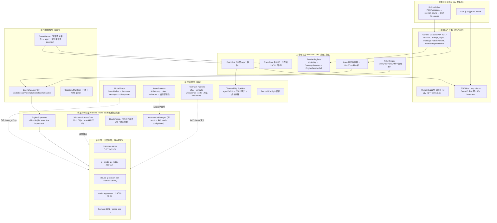

# 方案 D：Platform-first —— 把 Harness 当作"受管运行时"来运维的多引擎 Agent 网关

> 视角：平台工程 / SRE。核心命题不是"能不能接",而是**"评测方在一台干净的 Windows 沙箱里，用一条命令，能不能确定性地跑起来、跑得完、杀得干净、看得见"**。
> 目标读者：3 人团队、评测评委、以及三个月后要接第五个引擎的那个人。

---

## 1. 一句话定位与设计原则

### 1.1 一句话定位

**PNP Gateway 是一个"引擎运行时管理平面"：北向锁死赛题的 6217 契约永不变化，南向把每一个 Harness 降维成一个"可安装、可探活、可注入、可杀干净、可观测、可回滚"的受管进程单元（Managed Engine Runtime）。接入一个新引擎 = 写一份 `engine.manifest.yaml` + 一个不超过 400 行的 Adapter + 跑通四级一致性测试（CTS），一天内完成。**

与"先设计一套漂亮的多 Agent 编排抽象、再想办法把引擎塞进去"的路径相反，本方案的顺序是：**先保证每个引擎在 Windows 上确定性可运行，再谈能力归一，最后才谈编排与自进化**。理由很直接：赛题 70% 的客观分来自"引擎在 Windows 上把办公任务做完",而"引擎在评测机上起不来"是一个能把该轮次直接归零的失败模式——它的期望损失远大于任何架构优雅性带来的收益。

### 1.2 设计原则（每条注明来源与理由）

| # | 原则 | 来源 / 理由 |
|---|---|---|
| P1 | **北向契约是唯一北极星，绝不透传引擎语义** | G04 实测：赛题的 `prompt_async` 被重定义为"HTTP 阻塞到本轮结束才返回 204",而 opencode 原生 `prompt_async` 是**立即返回 204**。若直接透传，评测程序会秒收 204 然后去拉 message，判定"已完成"而实际任务尚未开始——这是能把所有用例判 0 分的致命坑。因此网关必须自己持有"完成判定"权。 |
| P2 | **部署确定性优先于功能丰富度** | G06：评测沙箱大概率无网/受限网络、无管理员权限、脚本化安装。任何"运行时 `npm install` / `pip install`"都是不可接受的赌博。全部依赖必须 vendored、版本钉死（含 sha256）、用户态安装。 |
| P3 | **进程树是隔离与回收的最小单位，Job Object 是硬性要求** | G06 已交叉验证的 Win32 事实：`TerminateProcess` **不会**级联终止子进程。不做 Job Object（`JOB_OBJECT_LIMIT_KILL_ON_JOB_CLOSE`）或 `taskkill /T /F`，长跑评测必然残留 `winword.exe`/`excel.exe`/`soffice.bin` 僵尸进程，导致下一个用例"文件被占用无法保存"的连锁失败。 |
| P4 | **所有模型流量经网关自有 ModelProxy，单一真源、双向翻译** | G02：引擎的 wire 协议分三类——硬编码 Anthropic Messages（Claude Code）、硬编码 Responses（Codex）、可配置（opencode/pi/Hermes/Goose/Qwen）。内部模型只会提供其中一种。让每个 adapter 各自处理协议差异会导致 N×M 复杂度；集中在一个代理里做，只需维护 1 套转换 + N 份注入模板。 |
| P5 | **能力用"资产投影"注入，不写进网关代码，更不针对用例硬编码** | G03 + 赛题第 6 节禁令。SKILL.md / AGENTS.md / MCP JSON 已是跨引擎事实标准（opencode 原生扫描 `.claude/skills`、`.agents/skills`），是"一次定义、多引擎投影"最现实的落点。 |
| P6 | **能力声明三态（supported / polyfilled / unsupported）+ CTS 认证，声明不等于支持** | T23：MCP/ACP/A2A 都只做协议层协商、不保证语义正确。没有可执行认证的 manifest 会沦为摆设。 |
| P7 | **稳定核心 / 演进外围二分：Gateway Core 冻结，Adapter+Asset+Policy 可演进** | 团队愿景"上层 harness 不变，只换执行内核"。落地方式是把"会变的东西"全部赶出核心：核心只认 `EngineAdapter` 接口与 `AgwEvent` 归一事件，引擎版本升级、新能力上线都不触碰核心代码。 |
| P8 | **内部事件 schema 用 `agw.*` 稳定命名，OTel `gen_ai.*` 只是导出映射** | T14：OTel GenAI semconv 仍处 Development 阶段，历史上已发生 `gen_ai.system` → `gen_ai.provider.name` 的破坏性改名。把外部不稳定 schema 直接当内部模型，等于把上游的抖动引进自己的数据面。 |
| P9 | **降级优于失败（Degradation Ladder），但降级必须可见** | 鲁棒性 5% + LLM-as-Judge 会读轨迹。每一次降级（无网络→跳过检索、无 Office→用 LibreOffice、审批超时→按策略默认）都要落一条 `agw.degraded` 事件，而不是静默失败。 |
| P10 | **不做静默换引擎的 fallback** | 赛题按引擎分轮次评测。若 `--engine pi` 启不来就偷偷用 opencode，属于违背评测意图。正确做法是：preflight 明确失败 + 引擎崩溃后**同引擎自愈重启**（这属于鲁棒性，不是作弊）。 |
| P11 | **每一个可疑结论都必须有一条本地可复现的验证任务** | G01 明确标注 opencode 官方"strongly recommend WSL"与硬约束冲突、多数第三方 Windows 资料置信度仅"中"。方案里所有"应该能跑"都必须转成 `pnp doctor` 的一条探测项 + CTS 的一条断言。 |

---

## 2. 总体架构

### 2.1 分层图



### 2.2 每层职责与"稳定 vs 演进"归属

| 层 | 职责 | 稳定性归属 | 变更触发条件 |
|---|---|---|---|
| ① 北向 API | 严格实现赛题契约；阻塞语义、状态机、错误模型、SSE 心跳与重放 | **稳定（冻结）** | 只有赛题规范变化才动 |
| ② Session Core | 业务键→会话→引擎会话三级映射；Lane 串行；Run/Turn 状态机；轨迹归一化存储；单一策略源 | **稳定（冻结）** | 只有"网关自身语义"变化才动；**接新引擎不允许改这一层**（这是架构评审的关键验收点） |
| ③ 引擎抽象层 | `EngineAdapter` 接口 + Capability Manifest + 事件映射表 | 半稳定：接口稳定，实现随引擎演进 | 新引擎 = 新增一个 adapter 目录，不改接口 |
| ④ 运行时平面 | 进程模型、进程树、健康、预热、崩溃恢复、工作区与配置目录隔离 | 演进（但对上层暴露稳定接口 `EngineRuntimeHandle`） | 新的进程形态（如未来的容器/WSL 后端）新增一个 supervisor 实现 |
| ⑤ 平台服务 | 模型代理、资产投影、工具依赖、可观测、自检 | 演进 | 新协议/新工具包/新导出后端 |
| ⑥ 引擎 | 外部制品 | 完全外部 | `engines.lock.json` 钉死版本 + CTS 回归通过才允许升级 |

**架构上最重要的一条纪律**：③④⑤ 三层的任何变更，都不得要求修改 ①②。CTS 里有一条元测试专门验证这一点——`git diff` 若同时触及 `core/` 与 `adapters/<new-engine>/`，CI 直接告警。这是"接入第 3/4 个引擎成本"这一评价指标的可执行化。

---

## 3. 核心抽象与数据模型

以下类型定义是 `packages/core/src/types.ts` 的规范来源。命名遵循 T23 建议的 `namespace:capability@version` 与 capability-inventory 的 `namespace.capability` 约定；术语按 capability-inventory 第 3 节的统一建议（禁止裸 `mode`、禁止用 `branch`、`session` 一律指网关自己的会话对象）。

### 3.1 引擎与运行时（本方案的核心创新点）

```ts
/** 引擎清单：声明式描述"这个 Harness 在 Windows 上怎么装、怎么起、怎么杀、怎么注入" */
export interface EngineManifest {
  id: string;                       // "opencode" | "pi" | "claude-code" | "codex" | "hermes"
  displayName: string;
  manifestVersion: "1.0";
  engineVersion: { pinned: string; probeCmd: string; probeRegex: string };

  /** ——— 安装面：离线优先 ——— */
  install: {
    strategy: "vendored-npm" | "vendored-binary" | "vendored-python" | "portable-zip";
    payload: { path: string; sha256: string; sizeBytes: number };   // vendor/ 下的相对路径
    postInstall?: string[];         // PowerShell 片段（幂等）
    requiresAdmin: false;           // 硬约束：恒为 false，CI 校验
    runtimeDeps: { node?: string; python?: string; git?: boolean; dotnet?: string };
  };

  /** ——— 进程面：三选一 ——— */
  process: {
    model: "child-stdio" | "local-service" | "in-proc-sdk";
    command: string;                // 相对 %LOCALAPPDATA%\PNP\runtime 的可执行文件
    args: string[];                 // 支持 ${port} ${cwd} ${configHome} 模板
    cwdStrategy: "session-workspace" | "engine-home";
    portStrategy?: "dynamic" | "fixed";   // local-service 才有
    startupTimeoutMs: number;
    readyProbe: ReadyProbe;
    shutdown: { graceful: "stdin-eof" | "sigint" | "http-delete"; graceMs: number };
  };

  /** ——— Windows 特有面（G01 的 7 项接入参数落到这里） ——— */
  windows: {
    shellBackend: "git-bash" | "powershell" | "cmd" | "native";
    configHome: string;             // "%LOCALAPPDATA%\\PNP\\engines\\opencode\\${tenant}"
    encodingFixups: Record<string, string>;  // PYTHONUTF8/PYTHONIOENCODING/NODE_OPTIONS...
    longPathSafe: boolean;          // 是否已验证 >260 字符路径
    childProcessKind: ("node"|"python"|"pwsh"|"soffice"|"office-com")[]; // 供进程树清理白名单
    knownZombies: string[];         // ["winword.exe","excel.exe","powerpnt.exe","soffice.bin"]
  };

  /** ——— 模型注入面（G02） ——— */
  model: {
    wireApi: "openai-chat" | "anthropic-messages" | "openai-responses" | "gemini";
    injection: ModelInjection[];    // env 或 config-file 模板，按顺序应用
  };

  /** ——— 资产注入面（G03/T24） ——— */
  assets: {
    skillDirs: string[];            // [".agents/skills", ".opencode/skills"]
    rulesFile: "AGENTS.md" | "CLAUDE.md" | "GEMINI.md" | null;
    mcpConfig: { file: string; jsonPath: string; schema: "claude" | "opencode" | "codex-toml" };
    projection: "copy" | "symlink";  // Windows 默认 copy（软链需开发者模式）
  };

  capabilities: CapabilityDecl[];
  ctsProfile: string;               // "cts/profiles/opencode.yaml"
}

export type ReadyProbe =
  | { kind: "http"; path: string; expectStatus: number; intervalMs: number }
  | { kind: "stdout-regex"; pattern: string }
  | { kind: "stdio-handshake"; send: unknown; expectJsonPath: string };

export type ModelInjection =
  | { kind: "env"; vars: Record<string, string> }
  | { kind: "file"; path: string; format: "json"|"toml"|"yaml"; merge: unknown };
```

`EngineManifest` 是本方案最关键的抽象：**它把 G01/G02/G03 三份调研的所有"每引擎差异"收敛成一份声明式数据**，网关代码里不存在任何 `if (engine === "opencode")` 分支。新引擎接入的第一步就是填这张表；填不出来的字段就是需要实测的未知项。

```ts
/** 运行时句柄：Supervisor 对上层暴露的唯一接口，屏蔽三种进程模型 */
export interface EngineRuntimeHandle {
  readonly instanceId: string;
  readonly engineId: string;
  readonly state: "starting"|"ready"|"busy"|"degraded"|"crashed"|"stopping"|"stopped";
  readonly endpoint?: { host: string; port: number };   // local-service
  readonly stdio?: { write(line: string): void };        // child-stdio
  readonly pid?: number;
  readonly jobHandle?: unknown;                          // Windows Job Object
  restartCount: number;
  kill(reason: string): Promise<void>;                   // 保证整棵进程树消失
  onExit(cb: (code: number|null, signal: string|null) => void): void;
}
```

### 3.2 能力模型

```ts
export type CapabilityStatus = "supported" | "polyfilled" | "unsupported" | "claimed";
export type CapabilityTier = "core" | "standard" | "extension" | "experimental";

export interface CapabilityDecl {
  id: string;                 // "gateway:session.create@1" | "opencode.dev:session.share@1"
  tier: CapabilityTier;
  status: CapabilityStatus;   // claimed = 声明了但未过 CTS，运行时不可用
  paramsSchema?: object;      // JSON Schema，供编排层节点配置使用
  dependsOn?: string[];
  ctsRef?: string;            // 指向可执行断言；无 ctsRef 的 supported 在 CI 中报错
  costProfile?: { latencyP50Ms?: number; tokenOverhead?: "low"|"mid"|"high" };
  degradeTo?: string;         // 不支持时降级到哪个能力（如 turn.steer → turn.queue.followup）
}
```

**三态 + `claimed` 第四态是本方案对 T23 建议的强化**：CI 强制"没有 `ctsRef` 或 CTS 未通过的能力，最高只能是 `claimed`",运行时遇到 `claimed` 能力一律走 polyfill 或降级。这从机制上消灭了"文档说支持、实际跑不通"这一类问题。

### 3.3 会话、运行与轨迹

```ts
export interface GatewaySession {
  id: string;                       // "ses_xxx"，对外
  routeKey: string;                 // "tenant:channel:group:<gid>[:user:<uid>]"，业务侧稳定键
  title: string;
  directory: string;                // 赛题必需：任务工作目录（绝对路径，已规范化）
  workspace: WorkspaceContext;
  engineId: string;
  engineSessionRef: EngineSessionRef;
  status: "idle" | "busy";          // 对外只有两态（赛题约束）
  substatus?: "retry" | "awaiting-permission" | "awaiting-question" | "recovering"; // 内部细化
  createdAt: string; updatedAt: string;
  policyProfile: string;
  assetBundleId: string;            // 本会话投影了哪一版资产
  runtimeInstanceId?: string;
}

export interface WorkspaceContext {
  cwd: string;                      // = session.directory
  configHome: string;               // 每会话独立引擎配置目录（Claude: CLAUDE_CONFIG_DIR）
  tmpDir: string;                   // 每会话独立临时目录，防同名文件互相覆盖
  artifactsDir: string;             // 产物与校验快照
  additionalDirs: string[];
}

export type EngineSessionRef =
  | { kind: "opencode"; sessionId: string; directory: string }
  | { kind: "pi"; sessionPath: string; leafId?: string }
  | { kind: "claude-code"; sessionId: string; configDir: string }
  | { kind: "codex"; threadId: string }
  | { kind: "hermes"; sessionKey: string; sessionId: string }
  | { kind: "acp"; sessionId: string };

/** Run = 一次 prompt_async 调用的完整生命周期（赛题的"一轮"） */
export interface Run {
  id: string; sessionId: string;
  state: "queued"|"running"|"aborting"|"done"|"error"|"timeout";
  startedAt: string; finishedAt?: string;
  finish?: "stop"|"tool-calls"|"length"|"content-filter"|"error"|"unknown"; // 覆盖 opencode 全部 6 值
  abortReason?: "client"|"timeout"|"supervisor"|"policy";
  budget: { maxWallMs: number; maxToolCalls?: number; maxCostUsd?: number };
  usage: Usage; degradations: Degradation[];
}

/** Turn/Step/Part：归一化轨迹模型，按 opencode 超集设计（G04 建议） */
export interface Message { id: string; role: "user"|"assistant"|"system";
  info: { finish?: Run["finish"]; model?: string; usage?: Usage; seq: number };
  parts: Part[]; }
export type Part =
  | { type: "text"; text: string }
  | { type: "tool"; callId: string; tool: string;
      state: { status: "pending"|"running"|"completed"|"error";
               input?: unknown; output?: unknown; timeStart: string; timeEnd?: string } }
  | { type: "step-start" }
  | { type: "step-finish"; reason: Run["finish"]; usage: Usage }
  | { type: "artifact"; path: string; kind: "docx"|"xlsx"|"pptx"|"md"|"image"|"other";
      verification?: { method: "reopen"|"render-pdf"|"hash"; ok: boolean; snapshot?: string } }
  | { type: "raw"; engineType: string; payload: unknown };   // 前向兼容逃生舱
```

`{ type: "artifact" }` 与 `{ type: "raw" }` 是两个刻意加入的扩展位：前者让 LLM-as-Judge 能直接定位产物文件与自检快照（G06 强调"工具调用与结果要能关联到具体产物文件路径"）；后者保证**引擎升级新增事件类型时轨迹不丢信息、上层不崩溃**（第 7 节详述）。

### 3.4 事件、策略、资产、编排节点

```ts
export interface AgwEvent {
  seq: number;                      // 网关全局单调序号（T14：多数引擎无 sequence，必须自己打）
  ts: string; id: string;
  type: `agw.${string}`;            // agw.session.status | agw.message.part.updated | agw.tool.* | agw.degraded | agw.engine.*
  sessionId?: string; runId?: string; engineId: string;
  payload: unknown;
  raw?: { engineType: string; body: unknown };  // 保留原始，便于事后归因
}

export interface PolicyRule { effect: "allow"|"deny"|"ask"; tool: string;
  argPattern?: string; scope?: "session"|"routeKey"|"global"; reason?: string; }
export interface PolicyProfile { id: string; rules: PolicyRule[];
  defaultEffect: "allow"|"deny"|"ask";
  askFallback: "deny"|"allow"; askTimeoutMs: number; }   // 无人值守超时后的确定性行为

export interface Asset {
  id: string; kind: "skill"|"mcp"|"rules"|"toolpack"|"prompt";
  version: string; source: string;
  requires?: { toolpacks?: string[]; env?: string[] };
  projection: Record<string /*engineId*/, { path: string; transform?: string }>;
}

/** v2 编排：节点 = 引擎 + 能力配置（团队愿景的落点，MVP 不实现，但类型先定） */
export interface WorkflowNode {
  id: string; kind: "agent"|"tool"|"gate"|"parallel"|"meta-route";
  engine?: { id: string; capabilities: Record<string, unknown> };  // 能力级配置
  policyProfile?: string; budget?: Run["budget"];
  assets?: string[]; input?: unknown; next?: string[] | { llmRouter: string };
}
```

**为什么在 MVP 阶段就把 `WorkflowNode` 的类型定下来但不实现**：这正是"MVP 与愿景共用一套抽象而不互相拖累"的关键手法——`Run` 本质上就是一个只有单节点的 `WorkflowNode` 执行；MVP 里 `prompt_async` 走的是 `executeNode(singleAgentNode)` 这条路径。v2 加编排时，只是让上面多一个 planner 产出多节点图，`executeNode` 一行不改。类型先行、实现后补，成本几乎为零，但避免了 v2 时的大重构。

