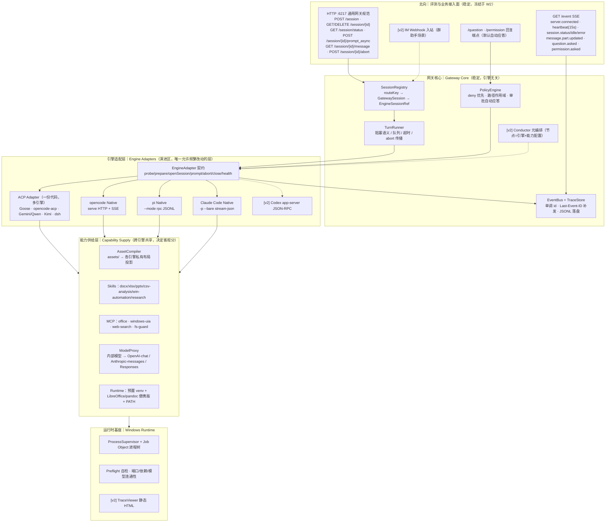

# 方案 E：务实夺冠视角（Pragmatic-Competition）

> 角度：拿过多次黑客松/技术比赛奖项的工程负责人，同时是严厉的"过度设计"批评者。
> 回答的问题只有一个：**3 个人在 4–6 周内，怎样做出既能拿满评测分、又让评委眼前一亮的系统。**
> 全文每一处设计都标注 `[MVP]` / `[v2]` / `[展望]`，标注是承诺：`[MVP]` 是必须在 W4 结束前跑通的，`[v2]` 是 W5–W6 的增量，`[展望]` 是写进文档、画进图、但**不写代码**的部分。
>
> 编写日期 2026-09-04。素材来源：`docs/competition-baseline.md`、`docs/gateway-api-baseline.md`、`docs/evaluation-cases.md`，以及 T01–T30 / G01–G06 共 31 份调研报告。

---

## 1. 一句话定位与设计原则

### 1.1 一句话定位

**PNP = 一个自研的 6217 通用 Agent 网关（稳定北向） + 一层"ACP 优先、Native 兜底"的双通道引擎适配层（可换内核） + 一套编译期统一资产层（同一箱工具装进每个引擎）。**

再补一句给评委听的话：**"我们不是把一个 Agent 包装成 HTTP 服务，而是把'引擎'做成了可插拔零件——第 1、2 个引擎我们写了适配器，第 3 个引擎我们只写了配置，第 4 个引擎我们只跑了一条探测命令。"**

### 1.2 七条设计原则（每条给出来源与理由）

| # | 原则 | 来源 / 理由 |
|---|---|---|
| P1 | **北向契约与引擎零耦合**：HTTP 层只是 codec，内部一律用 `GatewaySession / Turn / TraceEvent` 统一模型 | `gateway-api-baseline.md` §4 已明确建议；G04 实测发现赛题规范与 opencode 原生契约有 5 处语义落差（`directory` 位置、`prompt_async` 阻塞语义、permission 路径、`finish` 枚举、Part 种类），**任何透传都会踩坑** |
| P2 | **阻塞语义由网关自己实现，绝不透传引擎**：`prompt_async` 的"HTTP 挂起到本轮结束"必须由网关订阅内部事件总线、等到 turn 终态才返回 204 | G04 关键事实：opencode 原生 `prompt_async` **立即返回 204**。透传 = 评测器立刻去拉 message，误判完成，10 个用例全部 0 分。这是本赛题**最大的单点失败风险** |
| P3 | **公共能力做归一化，扩展能力做命名空间透传，不做"最小公分母阉割"**：统一模型按 opencode 超集设计（12 种 Part、6 种 finish），弱引擎向上映射而不是强引擎向下阉割 | G04 建议；T23 的四层 tier（core/standard/extension/experimental）分级 |
| P4 | **能力靠"注入"而不是靠"挑选"**：10 个评测用例考的是 Office/文件/GUI/检索能力，这些能力**没有一个引擎原生具备**，全部由网关的统一资产层（SKILL.md + MCP + AGENTS.md + 预装 venv）注入 | G03 核心结论：Office 处理走 python-docx/openpyxl/python-pptx + LibreOffice 校验；各引擎自带 WebSearch 在"内部模型端点"下**大概率失效**，必须统一退化到通用 MCP 搜索。**这是 70% 客观分的主杠杆** |
| P5 | **引擎数量按"记分卡边际收益"决定，不按"多多益善"决定**：客观分是"每个用例取所有引擎最高分求和"，引擎越多覆盖越广，但部署失败风险线性增长 | `competition-baseline.md` §5.3。策略：**3 个主力（认真调优、逐用例回归）+ 1–2 个 ACP 白嫖位（零适配代码，能启动就有可能在某用例上刷高分）** |
| P6 | **一切"人在环"路径默认自动化，但保留真实通道**：`/question`、`/permission` 默认自动应答（赛题允许"默认不询问 / 默认允许"），但网关必须**真的实现**这两条事件+回复链路，只是策略层配成 auto | `competition-baseline.md` §7："自动评测不能依赖人工操作"；同时 G05 指出 Goose headless 下人工确认根本走不通、G01 指出 Gemini headless 下 `ask_user` 强制降级为 `deny`——不自动化就是静默失败 |
| P7 | **Windows 是一等公民，不是移植目标**：进程树用 Job Object 管理、路径全绝对化、编码显式 UTF-8、依赖离线 vendor、无管理员权限、无 WSL | G06 [已交叉验证]：`TerminateProcess` 不级联杀子进程；G01：opencode 官方"strongly recommend WSL"与硬约束正面冲突；G06：评测沙箱可能无网络/无管理员权限 |

### 1.3 我明确**不做**的事（反过度设计声明）

这份方案的价值一半在于"做什么"，另一半在于"敢不做什么"。以下能力在架构图里有位置、在类型定义里有字段，但 **MVP 不写实现**：

- 跨引擎 session 同步 / 上下文迁移（赛题明确"可选不实现"）
- 持久化数据库（赛题明确"会话可以只存在内存"→ 我们只做 JSONL 落盘，因为 trace 要给评委看）
- 多 Agent Team / Room / agent 间直连通信（赛题明确"可选不实现"；T29 结论：**没有任何引擎原生提供 Room，全是应用层自建**）
- 自进化（T19：Snyk ToxicSkills 研究显示技能市场 36.82% 有安全缺陷，比赛场景下收益为负）
- 热切换引擎（赛题明确"不要求同一进程运行期间动态热切换"）
- OTel Collector / Grafana 全家桶（`[v2]` 才接，MVP 只做一个零依赖静态 HTML trace viewer）

---

## 2. 总体架构

### 2.1 分层图



### 2.2 每层职责与"稳定 vs 演进"归属

| 层 | 职责 | 稳定性承诺 | 谁在改 |
|---|---|---|---|
| 北向接入面 | 只做 HTTP/SSE 编解码 + 参数校验 + 错误码映射。**不含任何业务逻辑，不 import 任何 engine-* 包** | **冻结**（W2 后只补 bug）。赛题两套规范都能挂在同一 Core 上 | 无人（W2 后） |
| Gateway Core | 会话注册、轮次状态机、事件总线、策略、trace | **稳定**。接入新引擎不允许改 Core，改了就是架构失败 | 无人（除 bug） |
| 引擎适配层 | 把引擎原生协议翻译成 `EngineAdapter` 契约 | **演进区**。引擎版本漂移、事件改名、新引擎接入全部收敛在这里 | 每周都在改 |
| 能力供给层 | 资产编译、模型代理、运行时依赖 | 半稳定。加一个 Skill/MCP 不需要改任何代码，只改 `assets/` | 按用例回归结果迭代 |
| Windows 基座 | 进程树、自检、观测 | 稳定 | 无人 |

**一句话检验标准**：接入第 N 个引擎时，`git diff --stat` 里只应该出现 `packages/engine-<new>/`、`assets/targets/<new>.yaml`、`registry.json` 三处。如果出现了 `packages/gateway-core/`，架构就没做对。

### 2.3 数据平面（一次 prompt 的横切面）

```
评测器                网关北向            Gateway Core                适配器                引擎进程
  │                     │                    │                        │                     │
  ├ POST /session ─────►│─ create ──────────►│ SessionRegistry         │                     │
  │                     │                    │ 分配 directory/policy   │                     │
  │◄─ 200 {id,status} ──┤                    │                        │                     │
  ├ GET /event (SSE) ──►│◄══ EventBus 订阅 ══╡                        │                     │
  │                     │                    │                        │                     │
  ├ POST prompt_async ─►│─ enqueue ─────────►│ TurnRunner.start(turn)  │                     │
  │   （HTTP 挂起）      │                    │──────── prompt() ──────►│─ spawn/复用 ───────►│
  │◄══ session.status:busy ══════════════════╡                        │◄─ 原生事件流 ───────┤
  │◄══ message.part.updated (delta) ═════════╡◄── TraceEvent ─────────┤                     │
  │◄══ permission.asked（若有）══════════════╡◄── approval.asked ─────┤                     │
  │                     │                    │─ PolicyEngine 自动应答 ─►│──── reply ─────────►│
  │◄══ session.status:idle ══════════════════╡◄── turn.end(stop) ─────┤                     │
  │◄─ 204 No Content ───┤◄─ TurnRunner resolve                        │                     │
  ├ GET /message ──────►│─ TraceStore.render(session) → MessageEnvelope[]                    │
  │◄─ 200 [{info,parts}]┤                    │                        │                     │
  ├ POST /abort ───────►│───────────────────►│ TurnRunner.abort ──────►│─ 引擎 cancel ──────►│
  │                     │                    │                        │─ JobObject.kill ───►│（兜底）
```

**三个关键工程点（全部 `[MVP]`）**：

1. **`prompt_async` 的挂起** = `TurnRunner` 内部的 `Promise`，由 `turn.end` / `turn.error` / `turn.aborted` / 超时四选一 resolve。北向 handler 只是 `await runner.run(...)` 后 `res.status(204).end()`。
2. **`GET /message` 从 TraceStore 渲染，不从引擎回读**。理由：引擎的历史格式各不相同且官方声明不稳定（Claude Code 的 JSONL 明确"勿解析"），而我们本来就把每一帧都记了。渲染即"把 TraceEvent 流按 messageId 折叠成 `{info, parts}`"。**这一条同时解决了"完整轨迹"和"跨引擎一致"两个要求。**
3. **abort 双保险**：先调引擎原生 cancel（ACP `session/cancel` / opencode `POST /abort` / pi `abort` / Claude Code SIGINT），200ms 内若引擎未进入终态，再对该 session 的 Job Object 执行 `TerminateJobObject`。G06 已交叉验证：Windows 上 `TerminateProcess` 不级联杀子进程，不用 Job Object 就会残留 `winword.exe` / `python.exe`，下一个用例直接"文件被占用"连锁失败。

---

## 3. 核心抽象与数据模型

以下类型定义即 `packages/engine-contract/src/types.ts` 的真实内容骨架（TypeScript，Node 22 + TS 5.x）。

### 3.1 引擎与能力 `[MVP]`

```ts
export type EngineId = string;                       // 'opencode' | 'pi' | 'claude-code' | 'goose' | 'codex' | ...
export type AdapterKind = 'acp' | 'http' | 'rpc-stdio' | 'stream-json';

export type CapTier   = 'core' | 'standard' | 'extension' | 'experimental';
export type CapStatus = 'native' | 'polyfilled' | 'unsupported';

/** 单条能力声明。id 采用 T23 建议的 namespace.capability 命名法，避免 mode/memory 等泛词碰撞 */
export interface CapabilityDecl {
  id: string;                     // 'session.resume' | 'turn.cancel' | 'x-claude.dynamic_workflow'
  tier: CapTier;
  status: CapStatus;
  /** 该能力可被编排层调节的参数（JSON Schema），extension 能力此处即"怎么配"的说明 */
  paramsSchema?: object;
  /** 探测证据：命令输出片段 / 端点响应字段，用于人工复核与回归 */
  evidence?: string;
  notes?: string;
}

/** 引擎能力清单：由 `pnp probe --engine X` 在真实机器上生成，落盘为 registry/<engine>.manifest.json */
export interface EngineManifest {
  engine: EngineId;
  engineVersion: string;          // `opencode --version` 等实测值，不允许硬编码
  adapter: AdapterKind;
  probedAt: string;               // ISO8601
  host: { os: 'win32'; osVersion: string; node?: string; python?: string };
  capabilities: Record<string, CapabilityDecl>;
  /** 模型注入方式：本引擎说哪种 wire 协议、注入到 env 还是配置文件 */
  model: {
    wire: 'openai-chat' | 'anthropic-messages' | 'openai-responses' | 'gemini-generate';
    inject: 'env' | 'file';
    template: string;             // assets/targets/<engine>.model.tmpl
  };
  /** 资产投影目标：AssetCompiler 据此把 assets/ 落到引擎私有路径 */
  assetTargets: AssetTarget[];
  limits: { maxConcurrentSessions: number; startupTimeoutMs: number; promptTimeoutMs: number };
  /** 已知坑，直接写进 manifest 供适配器与人共同消费 */
  quirks: string[];               // e.g. ["prompt_async returns 204 immediately", "permission event renamed to permission.updated"]
}
```

**为什么 manifest 是"探测生成"而不是"手写常量"**：T01 指出 Claude Code 大量能力标注"v2.1.2xx 起"；T04 指出 Hermes 一个月发 7 个版本；T05 指出 dsh 日更且明确会破坏兼容。硬编码能力表 = 每次引擎升级都炸。`probe()` 的成本是一次性写 30 行代码，收益是引擎升级只需重跑一条命令。

### 3.2 会话、轮次与引用 `[MVP]`

```ts
export interface GatewaySession {
  id: string;                      // 'ses_' + nanoid，北向暴露
  routeKey: string;                // 业务稳定键：'eval:office_011' | 'im:feishu:oc_xxx'
  title: string;
  directory: string;               // 绝对路径。既是工作目录，也是文件隔离边界（G04 强调的双重角色）
  status: 'idle' | 'busy';
  engine: EngineId;
  engineRef?: EngineSessionRef;    // 懒创建：首次 prompt 时才真正拉起引擎会话
  policyRef: string;               // PolicyProfile.id
  memoryScopeKey?: string;         // [v2] 借鉴 Hermes"两个 id 分离"：transcript 句柄 ≠ 记忆作用域
  createdAt: string;
  lastTurnAt?: string;
}

/** 引擎侧句柄：判别联合，新增引擎只加一个变体，不动上层 */
export type EngineSessionRef =
  | { kind: 'acp';          sessionId: string; pid: number; cwd: string }
  | { kind: 'opencode';     sessionId: string; baseUrl: string; directory: string }
  | { kind: 'pi';           sessionFile: string; pid: number; cwd: string }
  | { kind: 'claude-code';  sessionId: string; pid: number; configDir: string; cwd: string }
  | { kind: 'codex';        threadId: string; pid: number; cwd: string };

export type FinishReason =
  | 'stop' | 'tool-calls' | 'length' | 'content-filter' | 'error' | 'aborted' | 'unknown';
  // 6 值来自 G04 实测的 opencode FinishReason 超集，另加网关自有的 'aborted'

export interface Turn {
  id: string;                      // 'run_' + nanoid
  sessionId: string;
  seq: number;
  state: 'queued' | 'running' | 'done' | 'aborted' | 'error';
  finish?: FinishReason;
  startedAt: string;
  endedAt?: string;
  usage?: Usage;
  error?: GatewayError;
}

export interface Usage {
  input: number; output: number; reasoning?: number;
  cache?: { read: number; write: number };
  cost?: number;
  costSource: 'engine' | 'gateway-pricing';   // T14：Codex/Gemini 无原生 cost，网关补算须标注来源
}

export interface GatewayError { code: string; message: string; engine?: EngineId; retriable?: boolean }
```

### 3.3 统一事件模型 `[MVP]`

内部只有一条 `TraceEvent` 流；北向 SSE 与 `GET /message` 都是它的两种投影。

```ts
export type TraceKind =
  | 'turn.start' | 'turn.end'
  | 'step.start' | 'step.finish'
  | 'message.delta' | 'message.part'
  | 'tool.call' | 'tool.result'
  | 'approval.asked' | 'approval.decided'
  | 'question.asked' | 'question.answered'
  | 'usage' | 'engine.log' | 'engine.error' | 'gateway.note';

export interface TraceEvent {
  id: number;                      // 全局单调递增 → 直接用作 SSE 的 id:，支持 Last-Event-ID 补发
  ts: string;
  engine: EngineId;
  sessionId: string;
  turnId?: string;
  stepId?: string;
  messageId?: string;
  kind: TraceKind;
  payload: unknown;                // 按 kind 判别的结构化载荷
  raw?: unknown;                   // 引擎原始帧（TRACE_RAW=1 时保留，默认关闭以省磁盘）
}
```

事件词表的选择理由：直接取 dsh 的 `SessionEvent` 词汇（`turn/*`、`step/*`、`tool/*`、`approval/*`），因为 T05 指出它是候选引擎里**唯一带完备性运行时断言**的事件溯源模型；同时它与 OTel GenAI 语义（`invoke_agent` / `chat` / `execute_tool`）天然对齐，`[v2]` 接 OTel 时零重构。

### 3.4 北向消息投影 `[MVP]`

```ts
export type Part =
  | { type: 'text';        text: string }
  | { type: 'reasoning';   text: string }
  | { type: 'file';        path: string; mime?: string }
  | { type: 'tool';        callID: string; tool: string;
      state: { status: 'pending'|'running'|'completed'|'error';
               input?: unknown; output?: unknown; time?: { start: number; end?: number } } }
  | { type: 'step-start' }
  | { type: 'step-finish'; reason: FinishReason; tokens?: Usage; cost?: number }
  | { type: 'agent';       name: string }           // 子代理归属标注
  | { type: 'snapshot';    ref: string };           // [v2] 文件快照

export interface MessageEnvelope {
  info: { id: string; role: 'user'|'assistant'; sessionID: string;
          time: { created: number; completed?: number };
          finish?: FinishReason; tokens?: Usage; cost?: number };
  parts: Part[];
}
```

按 P3 原则，这是 **opencode 超集**：赛题只要求 text/tool/step-finish，我们多给 reasoning/file/agent/snapshot。弱引擎（pi 没有 step 概念）由适配器合成 `step-start`/`step-finish`，保证**任何引擎跑出来的轨迹结构完全一致**——这正是评委在"架构合理性 20%"里最容易看懂的证据。

### 3.5 EngineAdapter 契约（整个架构的核心接口）`[MVP]`

```ts
export interface EngineAdapter {
  readonly id: EngineId;

  /** 1. 能力识别：跑真实命令/端点，产出 manifest。不得读硬编码常量表 */
  probe(env: HostEnv): Promise<EngineManifest>;

  /** 2. 适配：把 assets/ + policy + model 注入到引擎私有配置（编译期 + 每次启动前） */
  prepare(ctx: PrepareCtx): Promise<PreparedRuntime>;

  /** 3. 会话：懒创建。directory 必须是绝对路径 */
  openSession(req: { sessionId: string; directory: string; title?: string;
                     policy: PolicyProfile; assets: AssetBundle }): Promise<EngineSessionRef>;

  /** 4. 轮次：必须在"本轮真正结束"时 resolve，这是网关阻塞语义的唯一真源 */
  prompt(ref: EngineSessionRef, req: PromptReq, sink: TraceSink): Promise<TurnResult>;

  /** 5. 中止：必须传播到底层 run；返回后调用方仍会做 JobObject 兜底 */
  abort(ref: EngineSessionRef): Promise<void>;

  close(ref: EngineSessionRef, mode: 'close' | 'delete'): Promise<void>;
  health(): Promise<{ ok: boolean; detail?: string }>;

  /** 6. 扩展能力逃生舱：引擎独有能力在此按 'x-<engine>.<cap>' 暴露，Core 只透传不解释 */
  extensions?: Record<string, (args: unknown, ref: EngineSessionRef) => Promise<unknown>>;
}

export type TraceSink = (ev: Omit<TraceEvent, 'id' | 'ts' | 'engine'>) => void;
export interface TurnResult { finish: FinishReason; usage?: Usage; error?: GatewayError }
```

**六个方法，一个逃生舱。** 这是我对"接入成本"的量化承诺：接一个新引擎 = 实现 6 个方法 + 写一份 `targets/<engine>.yaml`。ACP 引擎连这 6 个方法都不用写（复用 `engine-acp`），只需登记一行 registry。

### 3.6 策略与资产 `[MVP]`

```ts
export interface PolicyProfile {
  id: string;                                     // 'eval-default' | 'im-group' | 'destructive'
  mode: 'readonly' | 'ask' | 'auto';              // 三档最小公分母，细分档位进 engineOptions
  deny:  RuleMatcher[];                           // 永远最高优先级（跨引擎语义唯一确定的一档）
  allow: RuleMatcher[];
  ask:   RuleMatcher[];
  pathScope: { root: string; allowOutside: string[] };   // 绝对路径白名单
  onAsk: 'auto_allow' | 'auto_deny' | 'forward';  // 评测模式 = auto_allow；[v2] 群助手 = forward
  engineOptions?: Record<EngineId, unknown>;      // 各引擎原生细档位（Claude 6 档、Qwen 5 档…）
}
export interface RuleMatcher { tool?: string; argGlob?: string; pathGlob?: string }

export interface AssetBundle {
  skills: SkillAsset[];                           // SKILL.md（agentskills.io 事实标准）
  mcp: McpServerDecl[];
  instructions: { agentsMd: string };             // 规范源用 AGENTS.md，Claude Code 编译期生成 CLAUDE.md
  runtime: { pythonExe: string; extraPath: string[]; env: Record<string,string> };
}
export interface McpServerDecl {
  name: string; transport: 'stdio' | 'http'; enabled: boolean;
  command?: string; args?: string[]; env?: Record<string,string>; url?: string;
}
export interface AssetTarget {
  engine: EngineId;
  skillsDir: string;                              // '.opencode/skills' | '.claude/skills' | '~/.hermes/skills'
  instructionsFile: string;                       // 'AGENTS.md' | 'CLAUDE.md'
  mcpConfig: { path: string; format: 'claude-mcp-json' | 'opencode-json' | 'codex-toml' | 'acp-inline' };
}
```

**关键取舍**：权限模型只归一到 `readonly / ask / auto` 三档 + deny 名单。理由见能力清单 §1.3：Claude 6 档、Qwen 5 档、Codex 4 档、Goose 4 档，语义完全不对齐，且冲突消解方向相反（Claude 首个命中生效，opencode 最后命中生效）。**强行做细粒度归一化是典型过度设计**；只保证"deny 一定生效 + 路径作用域一定生效"这两条硬承诺，其余进 `engineOptions` 原样透传。

### 3.7 编排节点（`[v2]` 定义，`[展望]` 实现完整语义）

```ts
export interface NodeSpec {
  id: string;
  intent: string;                                 // 自然语言子目标
  engine: EngineId | 'auto';                      // 'auto' 交给 Conductor 按 manifest 选
  capabilities: { required: string[]; optional?: string[] };   // 引用 CapabilityDecl.id
  policyRef: string;
  budget: { maxWallMs: number; maxToolCalls?: number; maxTurns?: number };
  assets?: { skills?: string[]; mcp?: string[] };
  output?: { schema?: object };
  extensions?: Record<string, unknown>;           // 'x-claude.dynamic_workflow': {...}
}
export interface WorkflowRun { id: string; nodes: NodeSpec[]; edges: [string,string][]; state: 'running'|'done'|'failed' }
```

这是**团队愿景与 MVP 的接缝**：`NodeSpec` 在 MVP 里退化为"一个 session 一个节点"（`nodes.length === 1`），北向的每次 `prompt_async` 就是执行一个匿名 NodeSpec。`[v2]` 把 Conductor 接上去时，Core 一行不用改——因为 `TurnRunner` 消费的本来就是 NodeSpec。**这是"MVP 与愿景共用同一套抽象而不互相拖累"的具体实现方式，也是我方案里最值得向评委讲的一段。**

