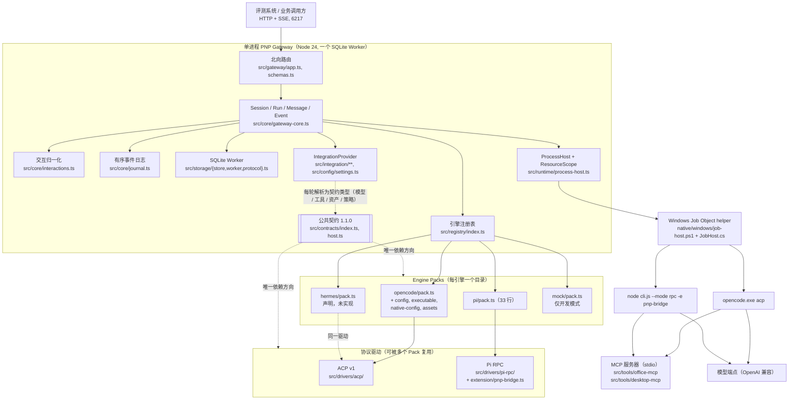

# PNP 架构说明：多 Agent 引擎可替换网关

> 面向评审的设计记录。本文只陈述代码里存在的结构，每一条结构性论断都给出源码路径；路径以 `code/` 为根（交付包内为 `solution/code/`）。行为细则见同目录的 [`spec/contracts.md`](spec/contracts.md)、[`spec/architecture.md`](spec/architecture.md)，各引擎逐项证据见 [`engines/opencode.md`](engines/opencode.md)、[`engines/pi.md`](engines/pi.md)。
>
> 证据等级沿用仓库既有约定（`config/engines/*.json` 的 `capabilityEvidence` 字段）：**declared** 只有文档或静态代码依据；**probed** 在真实二进制上观察到过；**verified** 在赛题目标（Windows 原生 + 内网真实模型）上观察到过。第 10 节逐项标注，本文其余部分凡说"已验证"均指 probed，不指 verified。

## 1. 结论

PNP 是一个 **Agent 网关 + 可替换 Harness** 的实现。北向是赛题的通用网关规范（端口 6217），南向同时接入两种真实 Harness，并且**用的是两种不同的协议**：

| 引擎 | 锁定版本 | 南向协议 | 驱动 | 权限来源 |
|---|---|---|---|---|
| OpenCode | `opencode-windows-x64@1.18.29` | ACP（stdio JSON-RPC） | `src/drivers/acp/` | 引擎原生 `session/request_permission` |
| Pi | `@earendil-works/pi-coding-agent@0.85.1` | Pi RPC（`--mode rpc` JSONL） | `src/drivers/pi-rpc/` | 网关注入的扩展钩子（Pi 自身没有权限系统） |

两者的版本与 npm tarball SHA-256 钉在 `engines.lock.json`，打包脚本 `scripts/package-release.mjs --bundle` 在装包时重新计算并与之比对。

"可替换"在本仓库里不是口号，而是四个可核查的事实：

1. **引擎标识只在一个文件绑定**：`src/registry/index.ts`（28 行）。`src/core`、`src/gateway`、`src/storage`、`src/runtime`、`src/integration` 中没有任何 `"opencode"`/`"pi"`/`"hermes"` 字面量（已 grep 核对）。
2. **边界由脚本强制**：`scripts/check-boundaries.mjs` 禁止适配器（`src/engines`、`src/drivers`、`src/integration`）导入 Fastify、`node:sqlite`、`GatewayCore`、`src/storage`、`src/gateway`、`node:child_process` 与 `src/config`；禁止 Core/Gateway 导入任何引擎或协议 SDK。本文撰写时该脚本输出 `Architecture import boundaries: PASS`。
3. **工具层与引擎无关**：两个 MCP 服务器（`src/tools/office-mcp/` 16 个工具，`src/tools/desktop-mcp/` 2 个工具）只在 `config/settings.json` 登记一次，两个引擎各自通过自己的原生路径拿到同一份工具。2026-09-09 新增 desktop 服务器时，`src/engines/**` 与 `src/drivers/**` 没有为它改动一行，随后 OpenCode 与 Pi 的真实引擎端到端各 21 步中 20 通过、1 跳过（第 5.4 节）。
4. **完成语义在 Core 里，不在引擎里**：204、`finish=stop`、`step-finish`、`session.idle` 全部由 `src/core/gateway-core.ts` 依据驱动返回的 `EngineResult` 判定，引擎只提供停止原因与停止证据（第 7 节）。

赛题给出的可选第三引擎 `hermes` 在本仓库里是一个**声明而未实现**的 Pack：`src/engines/hermes/pack.ts` 的 `implementationProvided: false`，`open()` 抛 `ENGINE_UNAVAILABLE`。它存在的意义是展示扩展点的形状（第 5 节），不是第三个可用引擎。

## 2. 分层与接缝



图中的模块是代码职责，不是部署单元；整个网关是一个进程、一个 SQLite 文件、按需驻留的引擎子进程。

### 2.1 每一层知道什么、不知道什么

| 层 | 路径 | 知道 | 不知道 |
|---|---|---|---|
| 北向路由 | `src/gateway/app.ts`、`schemas.ts` | 赛题规范的路径、状态码、SSE 帧、错误 `{code,message}` | 引擎、协议、存储；只调用 `GatewayCore` 的方法 |
| Core | `src/core/gateway-core.ts` | Session/Run 状态机、单执行槽 + 有界队列、幂等、终态判定、消息投影、围栏 | 任何引擎 SDK；只看到 `EnginePack`/`EngineSessionChannel`/`DriverEvent` |
| 交互 | `src/core/interactions.ts` | question/permission 的持久化、策略裁决、回复端点、超时、`always` 的会话级记忆 | 引擎的原生权限载荷形状（只作为 `payload` 透传） |
| 存储 | `src/storage/` | 5 张表（sessions/runs/messages/events/interactions），`PRAGMA user_version`，WAL + FULL 同步 | 引擎；Schema 中没有引擎特定列 |
| 集成 | `src/integration/`、`src/config/settings.ts` | `config/settings.json` → `ResolvedModel`、`ToolBinding[]`、`AssetBinding[]`、`PermissionPolicy`、`authorize()` | 引擎原生配置格式；输出的是契约类型 |
| 注册表 | `src/registry/index.ts` | 引擎 id → Pack 工厂；`AGENT_ENGINE` 与 `--engine` 的冲突判定 | 协议 |
| Engine Pack | `src/engines/<id>/` | **这个引擎**怎么找到可执行文件、怎么写私有配置、怎么投影资产 | HTTP、SQLite、Core |
| 驱动 | `src/drivers/<protocol>/` | **这种协议**怎么握手、发 Prompt、收事件、判终态、取消 | 引擎安装布局；由 Pack 通过定义对象告知 |
| 进程宿主 | `src/runtime/process-host.ts`、`native/windows/` | 启动、归属记录、Job Object、终止证据、崩溃后核验 | 协议内容；只搬运帧 |
| 工具 | `src/tools/*-mcp/` | 标准 MCP，`tools/list` + `tools/call` | 哪个引擎在调用它 |

### 2.2 为什么接缝在这些位置

**接缝 A：Core ↔ EnginePack / EngineSessionChannel。** 不同 Harness 之间真正变化的是协议、启动方式、配置格式、权限模型；不允许变化的是会话身份、持久化、终态语义和北向响应。契约（`src/contracts/index.ts`）因此只要求引擎回答四个问题：怎么打开一个独立会话通道（`open`）、一轮怎么跑完并给出停止原因与停止证据（`run` → `EngineResult`）、怎么取消（`cancel`，ACK 不算停止）、怎么终止并证明（`terminate`/`close` → `StopEvidence`）。Core 不知道 ACP 或 RPC 的存在，`tests/kit/engine-contract.ts` 用同一段断言跑每一个 Pack。

**接缝 B：EnginePack ↔ Driver。** 把"这个引擎"与"这种协议"分开，是为了让第二个 ACP 引擎不复制驱动。`src/drivers/acp/channel.ts` 暴露 `AcpEngineDefinition`——`engineId`、`channelId`、`engineVersion`、`model` 策略、`launch()`、`projectAssets()`、超时——OpenCode Pack 填这个对象然后调用 `openAcpChannel()`；Hermes Pack 声明在同一个 `acp` 通道上。Pi 走另一条协议，所以它的 Pack 只有 33 行，全部实现在 `src/drivers/pi-rpc/`。

**接缝 C：Core ↔ IntegrationProvider。** 模型端点、凭据、工具、指令、权限策略每轮由 `prepare()` 解析成契约类型交给 Core，Core 再原样交给通道。引擎适配器**不得**读设置文件（边界脚本明确禁止导入 `src/config/`），只从 `IntegrationContext` 取值。结果是：换引擎不需要换配置，换配置不需要碰引擎。

**接缝 D：适配器 ↔ ProcessHost。** 适配器不 `spawn`，只返回 `LaunchSpec` 交给注入的 `input.host.start()`。归属记录、Job Object、终止证据、崩溃后的核验因此对所有引擎一致，第三个引擎不需要自己处理 Windows 进程树。

**接缝 E：引擎 ↔ 工具。** 工具边界固定为标准 MCP（`spec/mcp-integration-profile.md`）。OpenCode 自带 MCP 客户端，驱动把 `ToolBinding[]` 投影成 ACP `session/new` 的 `mcpServers`；Pi 没有 MCP 客户端，驱动把一个扩展（`pnp-bridge.ts`）装进 Pi 进程，用 MCP SDK 连接同一批服务器并 `registerTool`。工具作者两边都不需要知道。

## 3. 一次请求的生命周期（引擎无关部分）

以下全部在 `src/core/gateway-core.ts#run()` 中，任何引擎都走同一条路：

1. `POST /session/:id/prompt_async`（`app.ts`）校验请求体，把 `parts`/`model` 投影成 `PromptRequest`；`model` 可以是对象、`"provider/model"` 字符串或缺省。
2. 幂等键检查；`admit()` 取全局唯一执行槽，同会话第二个请求立即 409 `SESSION_BUSY`，跨会话进入有界队列（默认 8，`PNP_RUN_QUEUE_LIMIT`），队列满 409 `GATEWAY_BUSY` 带 `Retry-After`。
3. `integration.prepare()` 解析本轮模型、工具、资产、策略；发布 `model.resolved`（记录请求的 `providerID/modelID` 与实际选中的模型，只有选择标识，没有端点或凭据）。
4. 事务写入用户消息 + Run（`startRun`）；发布 `session.status{busy}`。
5. 没有驻留通道时打开一个：驻留上限 16（`PNP_MAX_RESIDENT_SESSIONS`），满额淘汰最久未用的空闲通道；原生数据目录固定为 `data/native/<engineId>/<channelId>/<sessionId>`；`engine.open()` 返回后校验 `channelId` 一致并 `bindNative`。
6. `channel.run({request, integration, services, signal})`。`services.events.emit()` 把 `DriverEvent` 投影为公共事件：`text.delta` → 合并检查点后 `message.part.updated`；`tool.started/updated/finished` 与 `tool.observed` → 工具 part 与 `role=tool` 消息；`usage` → `run.usage`；`native` → `engine.extension`（带命名空间）。每个 `emit()` 都被等待，拒绝即终止本轮。
7. 交互：驱动调用 `services.interact()`，`InteractionBroker` 先问组织策略（`allow`/`deny` 直接裁决并记录），`ask` 才发布 `permission.asked`/`question.asked` 并等待 `POST /permission/:id/reply` 或 `/question/:id/reply`；无人值守下 question 默认由网关自答（`PNP_QUESTION_POLICY=auto`，仍然记录并发布）。
8. 驱动返回 `EngineResult{state, finish, quiescent, finalText, nativeStopReason}`。
9. 收尾：尚未终态的工具调用追加 `gateway-observation` + `result_unknown`（不伪造工具结果）；最终 assistant 消息 `info.finish` 取驱动的 `finish`，**只有** `state=completed && finish=stop` 时追加 `{"type":"step-finish"}`；`finishRun` 一个事务写终态消息、Run 终态、Session 状态；提交后才发布 parts、`session.status{idle}`、`session.idle`（停止未证实则发布 `session.error{EXECUTION_UNCERTAIN}` 并 503）。
10. HTTP 返回 204。

第 1–5 步与第 9–10 步没有任何引擎参与；第 6–8 步引擎只能通过 `DriverEvent` 与 `EngineResult` 两个类型影响结果。

### 3.1 取消与异常路径

同样在 Core 内、对所有引擎一致：

| 触发 | Core 的动作 | 调用方看到 |
|---|---|---|
| `POST /session/:id/abort` | `channel.cancel("user")`，继续接收有效收尾事件，宽限期（默认 15 秒，`PNP_CANCEL_GRACE_MS`）内等 `run()` 落定；否则 `terminate()` | abort 返回 `{ok:true}`；被中止的 `prompt_async` 返回 **204**，轨迹 `finish:"cancelled"`、无 `step-finish`，`session.idle` 照常 |
| 运行 deadline（默认 15 分钟，`PNP_RUN_TIMEOUT_MS`） | 同上，原因为 `deadline` | 504 `EXECUTION_TIMEOUT` |
| 关机排空 | 同上，原因为 `shutdown`；排队中的请求直接结束 | 503 `SERVICE_UNAVAILABLE` |
| 停止无法证实 | Run 记 `interrupted`，会话置 `blocked` 并从驻留表摘除，发布 `session.error{EXECUTION_UNCERTAIN}` | 503 `EXECUTION_UNCERTAIN`；该会话后续 `prompt_async` 409，`DELETE` 可解除；其他会话与 `/health/ready` 不受影响 |
| 驱动 `run()` reject（进程退出、协议损坏） | 通道销毁，会话置 `needs-native-resume`；下一轮 `open()` 收到原生引用后由驱动决定恢复或新建并发布 `session.restored` / `session.context-lost` | 本轮按错误码返回；下一轮不被拒绝 |
| SSE 客户端断开 | 只销毁该连接，不中止任务；重连带 `Last-Event-ID` 时按序号补发已提交事件（单次上限 4096 条） | 消息快照 `GET /session/:id/message` 始终是事实源 |

"不确定只隔离到会话，永不污染进程"是这里的固定原则：`/health/ready` 只在存储不可用或关机排空时为 503。

## 4. 两条真实南向通道

### 4.1 OpenCode over ACP

Pack（`src/engines/opencode/`）负责"这个引擎"：

- `config.ts` 装载并校验 `config/engines/opencode.json`（分发形态、可执行文件候选路径、ACP 子命令、XDG 重定向、模型策略、超时）。
- `executable.ts` 解析真实的 `opencode.exe`：`PNP_OPENCODE_EXE_PATH` 或 `%APPDATA%\npm\node_modules\{opencode-ai,opencode-windows-x64,…}\bin\opencode.exe` 等已知落点；拒绝 `.cmd` 垫片。
- `native-config.ts` 为每个会话写一份**私有** `opencode.json`：`provider.<id>.options.baseURL`、以 `{env:VAR}` 引用的请求头（真实值只进子进程环境，不落盘）、`model` 钉死为本轮模型、`permission` 块由 `IntegrationContext.permissions` 投影（`external_directory` 在默认 allow 时显式写 allow，否则无人值守会卡在引擎的默认 ask）、`instructions[]` 指向投影后的指令文件绝对路径。通过 `OPENCODE_CONFIG`、`OPENCODE_CONFIG_DIR` 与四个 `XDG_*_HOME` 把引擎的配置、数据、缓存、状态全部重定向到会话私有目录，不碰操作者的全局配置。
- `assets.ts` 把 `kind=skill/instruction` 的资产复制到私有目录。
- `pack.ts` 把以上装进 `AcpEngineDefinition`，调用 `openAcpChannel()`。

驱动（`src/drivers/acp/`，基于 `@agentclientprotocol/sdk` 1.4.0）负责"这种协议"：

- `channel.ts`：`initialize` → 建立能力账本（`capabilities.ts`）；`session/new`（或带原生引用时 `session/load`）携带 `mcpServersFor(integration.tools)` 投影出的 MCP 服务器数组；`session/prompt` 的响应 `stopReason` 是完成证据，经 `updates.ts#finishFor` 映射（`end_turn→stop`、`max_tokens→length`、`refusal→content-filter`、`cancelled→cancelled`、其余 `unknown`）；`session/cancel` 只是 ACK，之后等待 prompt 响应到宽限期。
- `session/request_permission` → `services.interact({kind:"permission", operation, payload})`，operation 取名顺序为映射器已锁定的调用名 → `name` → `kind` → `title` → `toolCallId`（OpenCode 1.18.29 的编辑请求只带 `kind` 与文件路径 title，所以策略必须按工具名而不是按文件匹配）；网关裁决后只选 `allow_once` 或 `reject_once`，`always` 永不下发给引擎。
- 同一会话后续轮次工具/资产指纹变化 → 409 `ENGINE_BINDINGS_CHANGED`；`launch` 模型策略下请求别的模型 → 409 `ENGINE_MODEL_SWITCH_UNSUPPORTED`。两者都在发 Prompt 之前拒绝，不静默换绑定。

### 4.2 Pi over RPC

Pack（`src/engines/pi/pack.ts`，33 行）只做两件事：`open()` 委托 `openPiSession()`；`purge()` 删除会话私有的工具 sidecar 与配置根。

驱动（`src/drivers/pi-rpc/`）：

- `launch.ts`：命令行 `node cli.js --mode rpc --session <私有 session.jsonl> --session-dir … --no-approve --provider <id> --model <id> [--append-system-prompt <指令文本>] -e <pnp-bridge>`；`PI_CODING_AGENT_DIR` 指向会话私有目录，其中 `models.json` 声明自定义 provider（`baseUrl`、`apiKey: "$PNP_PI_MODEL_API_KEY"`、`headers: {"X": "$PNP_PI_MODEL_HEADER_1"}`），**文件里只有变量名**，值在 `LaunchSpec.env`；Windows 上写 `settings.json` 把 `defaultTools` 换成含 `powershell` 的列表（没有 Git Bash 时 Pi 的 `bash` 工具不可用）。
- `client.ts`/`protocol.ts`：JSONL 命令与 `{"type":"response"}` 的 id 关联；响应只是受理证据。
- `channel.ts`：`message_update` → `text.delta`；`tool_execution_start/update/end` → 工具事件；`agent_end` 的 stopReason → `mapFinish`；`extension_ui_request` 且 title 为 `pnp:<operation>` → `services.interact()`；`abort` 命令不是停止证据，`run()` 只在 `agent_end`/进程退出时落定。工具或模型指纹变化同样 409 `ENGINE_BINDINGS_CHANGED`（Pi 的 `set_model` 存在，但凭据变量在进程启动时已固定）。
- `tool-bridge.ts`：把 `ToolBinding[]` 写成 sidecar `pnp-tools.json`（`mcp-stdio`/`mcp-http`；`cli`/`native` 绑定被丢弃并以 `tools.unsupported-transport` 原生事件报告，不改道）。
- `extension/pnp-bridge.ts`（359 行，运行在 **Pi 进程内**）：读 sidecar，用 `@modelcontextprotocol/sdk` 连接每个服务器，`tools/list` 后逐个 `registerTool`（名字净化为 `[A-Za-z0-9_-]{1,64}`）；注册 `tool_call` 钩子，把 Pi 内建工具映射到网关的操作类（`bash/powershell→shell`，`write/edit→write`，`read/grep/find/ls→read`），`read` 直接放行，其余通过 `ctx.ui.confirm("pnp:<operation>", …)` 问网关，否定或异常一律阻断；注册 `before_provider_request` 把纯文本 content 数组规范成字符串（某些 OpenAI 兼容端点忽略数组形式）；注册 `session_shutdown` 关闭 MCP 客户端，使进程树能被证明静默。

### 4.3 差异对照

| 维度 | OpenCode / ACP | Pi / RPC |
|---|---|---|
| 启动目标 | Bun 编译的独立 `opencode.exe acp` | `node dist/bundle/cli.js --mode rpc` |
| 模型注入 | 私有 `opencode.json` 的 provider + `{env:VAR}` | 私有 `models.json` 的 provider + `$VAR` |
| 工具注入 | `session/new.mcpServers`（引擎自带 MCP 客户端） | 扩展内 MCP 客户端桥 |
| 指令注入 | `instructions[]` 绝对路径 | `--append-system-prompt` |
| 权限来源 | 引擎原生 `session/request_permission` | 扩展 `tool_call` 钩子 + `ctx.ui.confirm` |
| 完成证据 | `session/prompt` 响应的 `stopReason` | `agent_end` 事件 |
| 取消 | `session/cancel` 通知 + 等待 prompt 响应 | `abort` 命令 + 等待 `agent_end` |
| 原生恢复 | `session/load`（引擎声明 `loadSession`） | `--session` 指向同一 session.jsonl |
| 绑定变化 | 409 `ENGINE_BINDINGS_CHANGED` | 409 `ENGINE_BINDINGS_CHANGED` |

两列的差异全部在 `src/engines/` 与 `src/drivers/` 内消化；北向看到的是同一套事件与消息。

## 5. 接入第 3 个引擎的成本

这是赛题的核心命题，下面按三种情形如实列出要写什么、不用碰什么。

### 5.1 情形一：引擎会说 ACP（例如 Hermes、Gemini CLI 一类）

需要新建或修改：

| 文件 | 内容 | 参照 |
|---|---|---|
| `src/engines/<id>/pack.ts` | 填一个 `AcpEngineDefinition`：`launch()` 返回可执行文件、参数、cwd、env；`projectAssets()` 把指令/技能放到引擎会扫描的位置；`model` 策略选 `launch` 或 `session-config` | `src/engines/opencode/pack.ts`（129 行） |
| `src/engines/<id>/*.ts` | 这个引擎特有的事实：可执行文件在哪、私有配置长什么样、模型端点与请求头怎么注入、权限块怎么写、全局配置怎么隔离 | OpenCode 的 `config.ts` 207 行、`executable.ts` 172 行、`native-config.ts` 430 行、`assets.ts` 94 行 |
| `src/registry/index.ts` | 一行：`<id>: async () => new (await import("../engines/<id>/pack.ts")).<Id>Pack()` | 现有 4 行 |
| `config/engines/<id>.json` | 版本、分发形态、路径候选、超时、`capabilityEvidence` | `config/engines/opencode.json` |
| `engines.lock.json` | 版本 + tarball SHA-256 | 现有 2 条 |
| `tests/adapters/<id>/` | Pack 单测 + 用 `tests/kit/engine-contract.ts` 跑公共契约 | `tests/adapters/opencode/`（6 个文件） |
| `docs/engines/<id>.md` | 逐项证据表 | `docs/engines/opencode.md` |

**协议层零改动**：`src/drivers/acp/` 763 行的 `channel.ts`、能力账本、更新映射、传输层原样复用。Hermes Pack 已经以这个形状存在（`src/engines/hermes/pack.ts` 声明 `channelId: "acp"`），只是 `open()` 尚未实现。把它变成可用引擎，`pack.ts` 的骨架是下面这样（示意，按 `src/engines/opencode/pack.ts` 的真实结构缩写，**不是仓库里已有的代码**）：

```ts
export class HermesPack implements EnginePack {
  readonly descriptor = { id: "hermes", channelId: "acp", transport: "acp",
    contractVersion: CONTRACT_VERSION, developmentOnly: false, implementationProvided: true };
  async open(input: EngineOpenInput): Promise<EngineSessionChannel> {
    const definition: AcpEngineDefinition = {
      engineId: "hermes", channelId: "acp", engineVersion: "<锁定版本>",
      model: { kind: "launch", modelID: `${input.integration.model.selection.providerID}/${input.integration.model.selection.modelID}` },
      launch: async () => ({ executable: "<绝对路径>", args: ["acp"], cwd: input.session.directory,
        env: { /* 私有配置指针 + 模型端点/请求头的变量名→值；凭据只在这里 */ } }),
      projectAssets: async ({ assets, nativeDataDirectory }) => { /* 把 kind=instruction/skill 放到引擎会扫描的位置 */ return {}; },
    };
    return openAcpChannel(definition, input);
  }
}
```

`launch()` 与 `projectAssets()` 里的省略号就是"引擎部分"的全部工作量；其余（握手、`session/new`、MCP 投影、权限往返、取消、终态、恢复）由驱动完成。

诚实的成本估计：协议部分"接近一条配置"，**但引擎部分不是**。OpenCode 的四个非 pack 文件合计约 900 行，其中大部分在回答"怎么把内网模型端点和自定义请求头交给这个引擎而不把凭据写到磁盘、怎么让它不碰操作者的全局配置、怎么在无人值守时不卡在它自己的默认权限提示"。这些问题每个引擎都要重新回答一次，答案只能靠对真实二进制的探测得到，`docs/engines/opencode.md` 记录了这个过程（包括推翻过的旧假设）。

### 5.2 情形二：引擎有自己的进程协议（Pi 就是这种）

在情形一之上，新增 `src/drivers/<protocol>/`，实现 `EngineSessionChannel` 的 `run/cancel/terminate/close` 与 `capabilities`。规模参照 Pi：`channel.ts` 385 行、`launch.ts` 370 行、`protocol.ts` 180 行、`client.ts` 84 行、`tool-bridge.ts` 109 行。驱动必须遵守的规则在 `spec/contracts.md` 第 2、4 节：`run()` 返回前必须完成终态判定，请求 ACK 不是完成，取消 ACK 不是静默，`quiescent=true` 只能来自协议终态、进程树核验或从未启动。

### 5.3 情形三：引擎缺少网关需要的能力

Pi 没有权限系统、没有 MCP 客户端、没有额外指令文件的配置项。解决方式不是降低网关要求，而是把缺的部分作为引擎原生扩展装进引擎进程（`pnp-bridge.ts`，走 Pi 文档化的 `-e` 扩展加载与 `tool_call`/`before_provider_request`/`session_shutdown` 钩子）。网关侧的 `InteractionBroker`、策略、`GET /permission`、回复端点一行未改。第三个引擎若有同类缺口，模式相同。

### 5.4 不需要碰的文件

接入新引擎时以下文件**一行都不用改**，这是边界脚本与 grep 双重核对过的：

- 北向：`src/gateway/app.ts`、`src/gateway/schemas.ts`
- Core：`src/core/gateway-core.ts`、`interactions.ts`、`journal.ts`、`errors.ts`
- 存储：`src/storage/*`（Schema `user_version=1` 无引擎列）
- 集成与配置：`src/integration/*`、`src/config/settings.ts`、`config/settings.json`（同一份模型/工具/策略配置服务所有引擎；需要按引擎覆盖时用 `cores.<id>` 段，不改代码）
- 工具：`src/tools/office-mcp/*`、`src/tools/desktop-mcp/*`
- 进程与 Windows：`src/runtime/*`、`native/windows/*`
- 契约：`src/contracts/index.ts`（除非契约本身升版；当前 1.1.0）
- 端到端套件：`scripts/e2e/run-e2e.mjs` 的 21 步对每个引擎同一份，不改；编排脚本 `ci-smoke.mjs` 需要把新引擎加进 `SUPPORTED_ENGINES` 与引擎位置变量列表，并补一段定位其可执行文件的逻辑（现有 OpenCode 的那段约 10 行）

反向证据同样成立。2026-09-09 把 `src/tools/desktop-mcp/` 登记为第二个 MCP 服务器，改动只有 `config/settings.json` 的一条 `common.mcp.servers.desktop`（外加 `config/instructions/competition.md` 里一段给模型的使用说明——它是投影到两个引擎的指令资产，不是引擎代码）。随后对真实引擎的端到端（`runtime/logs/audit-final-{opencode,pi}/e2e-report.json`，2026-09-09 06:49 与 06:51）：

| 引擎 | 总步数 | 通过 | 跳过 | 含工具步骤 |
|---|---|---|---|---|
| OpenCode 1.18.29 | 21 | 20 | 1 | `mcp/csv-read`、`mcp/missing-file`、`mcp/desktop-discovery` 全部通过 |
| Pi 0.85.1 | 21 | 20 | 1 | 同上 |

两份报告的 21 个步骤标签逐一相同（`health-ready`、`event-stream-open`、`create-session`、`create-session-missing-directory`、`case1/prompt-without-model`、`case1/hello-trace`、`case2/write-file`、`case2b/permission-rejected`、`mcp/*`×3、`case3/abort`、`question-and-permission`、`session-lifecycle`、`second-session/*`×3、`concurrency/*`×3、`event-sequence`）；唯一跳过的 `concurrency/same-session-busy` 在真实引擎上因轮次太短无法稳定制造同会话冲突，由 mock 引擎腿覆盖。模型是本地 Chat Completions 模拟服务（回显真实工具回包），所以这组报告证明的是"网关 → 进程宿主 → 驱动 → 真实引擎 → 真实 MCP 服务器"整条链路在 Windows 原生上对两个引擎都通，不证明真实模型下的任务效果（后者见第 10 节）。

### 5.5 配置模型：一份 settings 服务所有引擎

`config/settings.json` 的结构是 `common + cores.<engineId>`，由 `src/config/settings.ts` 解析、`src/integration/index.ts` 转成契约类型。交付时的 MCP 段原文如下（`${PNP_NODE}` 展开为包内 Node，`${PNP_CODE_ROOT}` 展开为 `code/` 绝对路径，所以换解压目录不需要改配置）：

```json
"mcp": {
  "servers": {
    "office":  { "transport": "stdio", "command": "${PNP_NODE}",
                 "args": ["${PNP_CODE_ROOT}/dist/tools/office-mcp/main.js"],
                 "sideEffect": "write", "enabled": true },
    "desktop": { "transport": "stdio", "command": "${PNP_NODE}",
                 "args": ["${PNP_CODE_ROOT}/dist/tools/desktop-mcp/main.js"],
                 "sideEffect": "external", "timeoutMs": 15000, "enabled": true }
  }
}
```

合并规则（`config/SETTINGS.md`）：模型按 `providerID/modelID` 覆盖，默认模型与权限默认值按引擎覆盖，权限 operation 按名合并，指令列表按引擎整体替换，MCP 服务器按 id 部分覆盖（例如 `cores.pi.mcp.servers.office.enabled=false` 只对 Pi 关掉 office）。凭据、端点、远端 MCP 地址一律以**变量名**出现（`PNP_MODEL_API_KEY`、`PNP_MODEL_HEADERS`、`urlEnvironment`、`headerEnvironment`），值在进程环境或 `runtime/local.env`，启动时缺失即以变量名报错，不在第一条任务时才发现。

`sideEffect`（`read`/`write`/`external`，缺省按 `external`）是策略输入：`IntegrationContext.permissions` 与 `authorize()` 据此裁决，OpenCode Pack 把它投影成原生 `permission` 块，Pi 桥把它映射成操作类。MCP 自身的 annotations（`readOnlyHint` 等）只是提示，不是授权依据。

同一策略在两个引擎上的提问点并不相同，这是保留原生权限模型的直接后果，报告里看得到：`mcp/csv-read` 一步，Pi 桥按 `office` 服务器级的 `sideEffect: "write"` 把 `office_csv_read` 归为 `write` 并向网关提问（报告记录 `permission: "write"`、`patterns` 含目标 CSV 路径，e2e 以 `once` 应答后通过）；OpenCode 对同一调用没有提问（`permissions: []`），因为它的原生权限键是 `edit`/`bash` 这类操作分类，MCP 工具不在其中。两者在 `case2/write-file` 上都以 `write` 提问。网关没有把两者拉平，只保证提问一旦发生，形状、端点与裁决来源一致。

### 5.6 新引擎免费获得的能力

| 能力 | 提供者 | 新引擎的义务 |
|---|---|---|
| 会话创建/查询/删除、消息快照、SSE、幂等、并发控制 | `src/gateway`、`src/core` | 无 |
| 持久化与崩溃后恢复、`needs-native-resume`/`blocked` 状态 | `src/storage`、`src/runtime/recovery.ts` | 在 `open()` 收到 `session.native` 时决定恢复或新建 |
| question/permission 端点、策略裁决、超时、`always` 记忆 | `src/core/interactions.ts` | 把原生请求转成 `services.interact()` 调用 |
| 模型端点/凭据/请求头/CA/代理解析 | `src/integration`、`src/config/settings.ts` | 把 `ResolvedModel` 投影成引擎原生配置，值只进 env |
| MCP 工具登记与 sideEffect 分类 | `config/settings.json` + `src/integration` | 把 `ToolBinding[]` 投影成引擎能接受的形状，投影不了的如实报告 |
| 进程启动、Job Object、归属记录、终止证据 | `src/runtime/process-host.ts` | 返回 `LaunchSpec`，调用 `input.host.start()` |
| 脱敏、事件大小与输出上限、检查点合并 | `src/core`、`src/security` | 无 |
| 公共契约测试、边界检查、端到端 21 步 | `tests/kit`、`scripts/check-boundaries.mjs`、`scripts/e2e` | 提供夹具或真实二进制位置 |

## 6. 原生能力保留，而不是最小公分母

网关只归一化北向必须看到的那一小部分（文本增量、工具调用与结果、停止原因、权限/反问请求的形状、停止证据）；其余按引擎原样保留，具体机制：

- **能力有证据等级，不是布尔矩阵。** `EngineCapabilities.extensions: Capability[]` 每项带 `evidence: declared|probed|verified`。ACP 驱动的 `AcpCapabilityLedger` 从 `initialize` 建立 17 条记录（`acp.session.load/resume/close/delete/fork/list`、`acp.prompt.image/audio/embedded_context`、`acp.mcp.stdio/http/sse`、`acp.session.update/cancel/permission/config_option` 等），`observe()` 只升不降：驱动实际用过才到 `probed`，观察到承诺的效果才到 `verified`。Pi 通道声明 `pi.mcp-bridge` 为 `probed`。
- **原生事件透传。** `DriverEvent.native{namespace, eventName, payload}` 原样发布为公共事件 `engine.extension`，带命名空间（ACP 的 `acp`，含 `permission.resolved`、`turn.settled`、`updates.unattributed` 等）。两份 e2e 报告的 `event_types` 都含 `engine.extension`。
- **工具观察如实记录来源。** 契约 1.1.0 的 `tool.observed.nameSource` 区分 `name`（引擎的程序化字段）与 `announced-title`（宣告时的 title）。OpenCode 的调用只带 title，网关就记 `announced-title`，不把它改写成别的名字，也不因为缺 `name` 丢掉观察。
- **模型策略按引擎选。** OpenCode 的 `config/engines/opencode.json#model.policy` 可在 `launch`（钉死在私有配置）与 `session-config`（ACP 会话配置项切换）之间切换，`pack.ts` 已分支；两条路都在真实 1.18.29 上观察到过。Pi 的 `set_model` 存在但凭据变量在启动时固定，所以驱动选择拒绝（409）而不是假装切换。
- **传输能力按声明投影。** `mcpServersFor()` 只在引擎 `initialize` 声明 `mcpCapabilities.http` 时投影 `mcp-http` 绑定；否则丢弃并报告原因（`agentCapabilities.mcpCapabilities.http was not declared`），不会给引擎一个它不认识的服务器。Pi 桥同理丢弃 `cli`/`native` 绑定并报告。
- **补能力不删能力。** Pi 桥给 Pi 加了权限门与 MCP 客户端，但 Pi 的内建工具（`read/write/edit/grep/find/ls/bash|powershell`）全部保留，`read` 类甚至不经网关往返。
- **指令走各自的原生路径。** OpenCode 用 `instructions[]`，Pi 用 `--append-system-prompt`；网关不把两者压成同一种"Skill 格式"。

## 7. 北向完成契约如何保持引擎无关

评测方判定"一轮结束"依据三件事：`prompt_async` 返回 204；事件流出现 `session.status{idle}` 与 `session.idle`；轨迹最后一条 assistant 消息 `info.finish="stop"` 且 `parts` 含 `step-finish`。这三件事的产生位置全部在 `src/core/gateway-core.ts`，引擎只能通过两个输入影响它们：

| 引擎的输入 | Core 的用法 | 引擎做不到的事 |
|---|---|---|
| `EngineResult.finish` | 直接成为最终消息的 `info.finish`；`nativeStopReason` 另存 `info.nativeFinish` | 不能让 Core 在 `finish≠stop` 时加 `step-finish` |
| `EngineResult.state` | `completed` 且 `finish=stop` 才是成功；`failed`/`cancelled` 各自保留 | 不能把错误改写成 `stop`（驱动的映射表里 `error→error`、`max_tokens→length`） |
| `EngineResult.quiescent` | `true` 才发布 `session.idle` 并返回 204；`false` 则 Core 调用 `terminate()` 取进程级证据，仍为假就把 Run 记 `interrupted`、会话置 `blocked`、发布 `session.error{EXECUTION_UNCERTAIN}` 并 503 | 不能靠"没消息了"推定完成；契约禁止未核验返回 `true` |
| 未终态的工具调用 | Core 追加 `gateway-observation`/`result_unknown` 观察 part | 不能留下悬而未决的工具而报成功 |
| `run()` 迟迟不返回 | 运行 deadline（默认 15 分钟）→ 504 `EXECUTION_TIMEOUT`；取消宽限期（默认 15 秒）后 `terminate()` | 不能无限等待 |

两个驱动各自遵守同一条规则："受理不是完成"：ACP 驱动以 `session/prompt` 的响应而不是 `session/cancel` 的写入成功判终态；Pi 驱动的 `send()` 注释明言响应只是受理证据，落定在 `agent_end`。

`POST /session/:id/abort` 的返回是决定过的例外：调用方自己要求的停止且已证实 → `prompt_async` 返回 204，轨迹记 `finish:"cancelled"` 且**没有** `step-finish`，`session.idle` 照常发布；deadline、关机排空与引擎失败保持各自的状态码（`spec/contracts.md` 第 3.3 节）。

最终轨迹的形状对两个引擎一致（下例按 `INSTRUCTION.md` 第 6 步的样例缩写；工具名 `office_csv_read` 是 2026-09-09 两份 e2e 报告里 OpenCode 与 Pi 实际记录的名字——MCP 服务器 id 加工具名，由各引擎自己拼接，网关不改写）：

```json
{"role":"assistant","content":"","tool_calls":[{"id":"call_…","name":"office_csv_read","arguments":{"path":"D:\\test_data\\task.csv"}}],
 "info":{"role":"assistant","finish":"tool-calls"},
 "parts":[{"type":"tool","tool":"office_csv_read","callID":"call_…","state":{"status":"completed","title":"office_csv_read"}}]}
{"role":"tool","tool_call_id":"call_…","tool_name":"office_csv_read","content":"{…}"}
{"role":"assistant","content":"已生成 D:\\test_data\\task_违约风险分析.md",
 "info":{"role":"assistant","finish":"stop"},
 "parts":[{"type":"text","content":"已生成 …","text":"已生成 …"},{"type":"step-finish"}]}
```

`tests/kit/engine-contract.ts` 把这套语义固定为每个 Pack 都要过的断言：跑一轮后 `status=idle`、最后一条消息 `info.finish="stop"`、最后一个事件 `session.idle`、`native.nativeId` 已绑定、第二轮复用通道、删除后 404。OpenCode 与 Pi 的适配器测试都调用它（Pi 的用真实 `LocalProcessHost` 加假 Pi 进程夹具；真实二进制由 `scripts/e2e` 覆盖）。

## 8. Windows 与进程生命周期

赛题要求引擎在真实 Windows 环境执行任务，进程树的归属与清理是网关必须替所有引擎解决的问题：

- `src/runtime/process-host.ts#LocalProcessHost` 在 win32 上不直接 `spawn` 引擎，而是启动 `native/windows/job-host.ps1`（Windows PowerShell 5.1，`Add-Type` 编译 `JobHost.cs`，编译产物按源码哈希缓存），helper 通过 stdin JSONL 接受 `guard`/`inspect`/`launch` 三种操作。`launch` 用 `CreateProcess(... CREATE_SUSPENDED | CREATE_UNICODE_ENVIRONMENT | CREATE_NO_WINDOW)` 创建引擎进程，建 Job Object 并设 `JOB_OBJECT_LIMIT_KILL_ON_JOB_CLOSE`，`AssignProcessToJobObject` 后再 `ResumeThread`，因此引擎进程从第一条指令起就在 Job 里；helper 的 stdin EOF 或网关退出关闭 Job 句柄，整棵进程树随之结束。引擎自己拉起的 MCP 服务器（OpenCode 原生、Pi 桥的 MCP SDK stdio 传输）都是引擎的子进程，同在 Job 内。
- 每次启动前写归属记录到 `PNP_DATA_DIR/hosts/`（`LaunchSpec.sessionId` 必须是网关会话 id，`ownerToken` 非空）；下次启动在监听端口之后异步核验（`src/runtime/recovery.ts`，20 秒上限），六级证据从便宜到贵（`spec/architecture.md` 第 10.3 节），结论只作用于对应会话：自证静默的解除围栏，确实存活的保持 `blocked`，无法判定的移入 `hosts/quarantine/`。进程级就绪不受影响。
- `src/runtime/windows-host.ts` 的 `WindowsJobHost` 是 `LocalProcessHost` 的平台守卫子类（非 win32 抛 `PLATFORM_UNSUPPORTED`），用于单测；`src/main.ts` 直接使用 `LocalProcessHost`，两者在 win32 上走同一条 helper 路径。
- 子进程环境按 `baseEnvironment()` 的系统键白名单继承（`SystemRoot`、`PATH`、`APPDATA`、`USERPROFILE` 等），凭据不继承；模型请求头以引擎私有配置里的变量名引用，值由 Pack 放进 `LaunchSpec.env`。`USERPROFILE`/`APPDATA` 保持真实值，是为了模型启动的 Office/Outlook 能找到用户状态。
- 桌面应用刻意**不**在 Job 内：`desktop-mcp` 通过 Windows Shell 激活（`Shell.Application.ShellExecute`）请求打开 Notepad/Outlook，工具只报告 `activation_requested`；`scripts/e2e/desktop-smoke.mjs --open-notepad` 观察到 Notepad 在 MCP 服务器终止后存活（`runtime/logs/desktop-smoke/report.json`）。任务产物与用户应用不是 Harness 资源，会话删除不撤销它们。
- 会话工作目录（`POST /session.directory`）经 `src/security/workspace.ts` 校验：绝对路径、不在 `PNP_DATA_DIR` 内、不在 `SystemRoot`/`ProgramFiles` 下，不存在时创建并记 `directoryCreated`；删除会话从不删它。

## 9. 设计取舍

每条都写明放弃了什么，以及代码里对应的位置。

| 决定 | 放弃的替代方案 | 理由与落点 |
|---|---|---|
| Harness 直连模型端点，网关不做模型代理 | 网关统一转发模型请求 | 代理会成为第二个需要兼容每种 SDK 请求格式的层，并让"引擎原生能力"退化为代理支持的子集。网关只解析端点与请求头并投影成引擎原生配置（`native-config.ts`、`launch.ts`）。Pi 桥的 `before_provider_request` 是唯一的请求整形，且发生在引擎自己的扩展钩子里 |
| 不统一 Agent Loop | 把每个 Harness 改写成同一种循环 | 赛题要求"替换 Harness"而不是"替换模型"。契约只要求 `run()` 返回终态；OpenCode 与 Pi 各自的循环、上下文压缩、重试完全保留 |
| 工具边界固定为标准 MCP | 为每个引擎写一套工具适配 | 两个引擎都能当 MCP 客户端（一个原生，一个经扩展），工具作者只写一次；`spec/mcp-integration-profile.md` 把这条边界写成对内网工具提供方的交付契约 |
| 全局单执行槽 + 有界队列 | 并行执行多个 Run | 桌面类用例天然互斥（同一个用户桌面、同一批 Office 实例）；跨会话排队而非拒绝，队列满才 409。`gateway-core.ts#admit()`，`PNP_RUN_QUEUE_LIMIT` |
| 驻留通道有上限并淘汰 | 无界进程池 / 每轮重启引擎 | 引擎启动要十几秒到一分钟，重启会丢原生上下文；无界池会耗尽桌面资源。上限 16，LRU 淘汰空闲通道，`evictResidentChannel()` |
| SQLite 单 Worker 持久化 | 纯内存（赛题允许） | 这是项目要求（`spec/requirements.md` P02），不是赛题硬性条件。放在 Worker 里是因为 `node:sqlite` 是同步 API，不能占 HTTP 事件循环；单写入者避免锁竞争。`src/storage/store.ts` |
| 绑定变化时拒绝而不是重开 | 静默新建原生会话 | 静默重开会丢历史却让调用方以为在同一会话；静默沿用旧绑定会用错模型或工具。两个驱动都在发 Prompt 前 409 `ENGINE_BINDINGS_CHANGED` |
| 能力带证据等级 | 全 `true` 的能力矩阵 | 声明不等于可用。`Capability.evidence`、`AcpCapabilityLedger.observe()` 只升不降、`config/engines/*.json#capabilityEvidence` |
| 引擎切换靠重启，不做热切换 | 运行中切换引擎 | 赛题明确不要求；一个数据目录一个活着的拥有者（`src/runtime/instance-lock.ts`，`INSTANCE_LOCKED`），会话固定绑定引擎与通道，跨引擎不隐式迁移 |
| mock 引擎只在开发模式可用 | 允许任意模式加载 | `PNP_MODE=development` 之外加载 `mock` 以 `MOCK_FORBIDDEN` 拒绝启动（`src/registry/index.ts`），评测环境不可能误跑到假引擎 |
| `AGENT_ENGINE` 与 `--engine` 等价、冲突即失败 | 命令行覆盖环境变量 | 赛题按环境变量启动；若命令行默认值能覆盖它，评测方按变量启动却跑错引擎。`selectEngine()` 对不一致抛 `ENGINE_CONFIGURATION_CONFLICT`，空字符串视为未设置 |
| 凭据只在子进程环境 | 写进引擎配置文件 | 私有配置文件会随会话目录留存；两个引擎的配置文件里只有 `{env:VAR}` / `$VAR` 引用（`native-config.test.ts` 与 `launch.test.ts` 断言序列化文本不含明文） |
| 桌面应用不进 Job Object | 把模型打开的应用也当作受管进程 | 任务结果（打开的 Outlook）不是 Harness 资源，会话结束不得撤销它；`desktop-mcp` 走 Shell 激活，进程树归属由 `desktop-smoke.mjs` 独立观察 |

## 10. 已证明与已声明

按仓库的证据等级如实列出。来源：`config/engines/*.json`、`docs/engines/*.md`、`docs/team/handoff-settings-mcp-2026-09-09.md` 及 `runtime/logs/` 下的报告。

| 论断 | 等级 | 依据 | 未覆盖 |
|---|---|---|---|
| 两个真实引擎通过同一 6217 API，在 Windows 原生上跑通建会话→事件流→任务→工具→授权→拒绝→中止→删除→并发的 21 步 | probed（Windows，模拟模型，真实 MCP） | `audit-final-{opencode,pi}/e2e-report.json`，2026-09-09，各 20 通过 1 跳过 | 真实模型下的任务效果 |
| 两个引擎各自对真实公网模型（GLM-4-Flash）完成写文件、读回历史、中止、删除后文件保留 | probed（Windows，公网模型） | `audit-live-opencode/` 8/8，`audit-live-pi-fixed/` 8/8（同一交接记录） | 内网模型、appid 鉴权、内网证书——**not_run** |
| 引擎版本与 tarball 哈希锁定 | declared + 打包时复算 | `engines.lock.json`；`package-release.mjs --bundle` 比对 | — |
| OpenCode：ACP 握手、私有配置生效、`{env:VAR}` 展开、权限 ask/once/reject 回路、`instructions[]` 生效、XDG 重定向 | probed | `docs/engines/opencode.md` §7 逐项（Linux 与 Windows 各注明） | 该文档 §8 列出的仍需真机项；非 Bearer 鉴权头路线未验证 |
| Pi：`--mode rpc` 帧、`agent_end` 位置、`models.json`+`PI_CODING_AGENT_DIR` 注入、`$VAR` 解析、`-e` 加载扩展、桥内注册 MCP 工具、`tool_call` 钩子阻断内建 `bash` | probed | `docs/engines/pi.md` B08 命令记录；`config/engines/pi.json#notes` | 同文件明言：内网端点、真实 Pi 二进制的持续 CI 未固化 |
| Windows Job Object：真实 helper、暂停入 Job、终止证据 | probed | 真实引擎 e2e 经 `LocalProcessHost` 走 helper；`tests/adapters/pi/engine-contract.test.ts` 用真实 host + 夹具进程 | 网关被强杀后的树清理没有独立报告，`dfx-and-testing.md` F12 仍列为必测项 |
| 公共单测/适配器测试 469 项（467 通过 2 跳过）、HTTP 契约 9 项、类型、边界、strip-only、PowerShell 编码检查通过 | probed（Windows，Node 24.19.0） | 交接记录 `audit-final-check.log`、`audit-foundation.log` | — |
| 边界脚本 PASS | probed | 本文撰写时执行 `node scripts/check-boundaries.mjs` | 脚本只查 import 目标，不查动态 `require` |
| 崩溃后归属核验的六级证据、隔离目录 | declared + 单测 | `spec/architecture.md` §10；`tests/unit/runtime.test.ts` 覆盖 `reconcile` 的静默/`helperPid=0`/空 `ownerToken` 判定、无主记录隔离、阻断会话确认 | F16 的真机六类记录矩阵未见报告 |
| 原生会话恢复（OpenCode `session/load`、Pi `--session` 重开） | declared | 代码路径存在；ACP 账本记录 `loadSession` 声明 | 21 步 e2e 不含"重启网关后续跑"步骤；恢复后上下文连续性未在真实引擎上观察 |
| Streamable HTTP 远端 MCP、Anthropic Messages 协议 | declared + 单测 | `mcpServersFor` 与 `buildPiModelBinding` 的投影测试 | 无远端服务实跑（交接记录 not_run） |
| Hermes | 未实现 | `implementationProvided: false`，`open()` 抛 `ENGINE_UNAVAILABLE`；`config/engines/hermes.json` `capabilityEvidence: "unverified"` | 全部 |
| `spec/contracts.md` 第 10 节的能力包（`pack.json` 清单、探测、`pack.projected` 事件） | 设计文档，未实现 | `assets/packs/` 只有 README 与目录骨架；`src/` 中没有清单加载器（已 grep） | 当前工具与指令都直接经 `config/settings.json` 接入，这条路径是实现过且测过的 |
| `internal` IntegrationProvider | 可选中但未实现 | `src/integration/index.ts`：显式选择时失败 | 内网员工助手工具 |
| 发布门禁 | 未通过 | `npm run release:check` 退出 1：两个必过引擎缺正式内网验收证据 | 这是仓库自己的门禁在拒绝把 probed 当 verified |

`docs/engines/opencode.md` 的第 0 节按其自己的定义写着"本文档没有任何一项是 verified"，本文沿用同一尺度：**截至本文撰写，没有一条论断达到 verified**。Windows 原生 + 真实模型这一层已有公网模型证据；内网模型、内网工具、组织权限的证据必须在评测环境或内网联调中补齐。

## 11. 文件索引

| 路径 | 作用 |
|---|---|
| `src/contracts/index.ts`、`host.ts` | 公共契约 1.1.0：`EnginePack`、`EngineSessionChannel`、`DriverEvent`、`EngineResult`、`IntegrationProvider`、`ToolBinding`、`ProcessHost` |
| `src/registry/index.ts` | 引擎 id → Pack；`selectEngine(--engine, AGENT_ENGINE)`，冲突 `ENGINE_CONFIGURATION_CONFLICT`，缺省 `ENGINE_NOT_FOUND` |
| `src/main.ts` | 启动顺序：local.env → 选引擎 → 集成探测 → 实例锁 → 存储 → Core → 监听 → 异步归属核验 |
| `src/gateway/app.ts` | 全部北向路由与 SSE（含 `Last-Event-ID` 补发、背压） |
| `src/core/gateway-core.ts` | Session/Run 状态机、执行槽与队列、事件投影、终态判定、围栏 |
| `src/core/interactions.ts` | question/permission 归一化与回复 |
| `src/storage/worker.ts` | SQLite Schema 与事务 |
| `src/integration/index.ts`、`configured/provider.ts`、`src/config/settings.ts` | `config/settings.json` → 契约类型 |
| `src/engines/opencode/`、`src/engines/pi/`、`src/engines/hermes/` | 引擎 Pack |
| `src/drivers/acp/`、`src/drivers/pi-rpc/` | 协议驱动；`pi-rpc/extension/pnp-bridge.ts` 运行在 Pi 进程内 |
| `src/runtime/process-host.ts`、`native/windows/` | 进程宿主与 Windows Job Object helper |
| `src/tools/office-mcp/`、`src/tools/desktop-mcp/` | 引擎无关的 MCP 工具服务器 |
| `config/settings.json`、`config/engines/*.json`、`engines.lock.json` | 统一配置、引擎事实、版本锁 |
| `scripts/check-boundaries.mjs` | 分层边界检查 |
| `scripts/e2e/run-e2e.mjs`、`ci-smoke.mjs`、`live-check.mjs` | 对任一引擎跑同一套北向用例 |
| `tests/kit/engine-contract.ts` | 每个 Pack 必须通过的公共契约断言 |
| `docs/spec/contracts.md`、`architecture.md`、`dfx-and-testing.md` | 行为契约、设计细则、故障矩阵与门禁 |
| `docs/engines/opencode.md`、`pi.md` | 逐项证据表与真机探测记录 |
