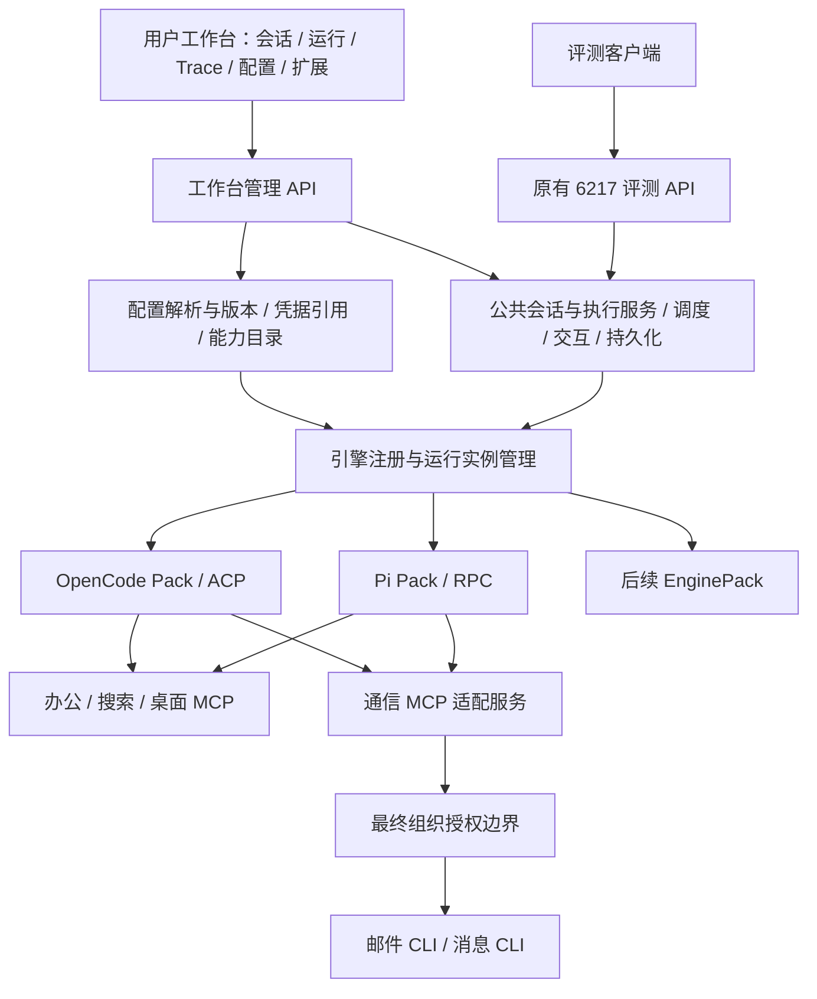

# PNP 当前交付件评审：多引擎工作台、配置与办公扩展

日期：2026-09-09。评审对象：`D:\Projects\PNP` 当前工作树，基于 `c3403b9015f7107cf169c1fbf25f6a11c8293511`，包含评审开始前已有的未提交修改。

本文是当前实现的评审及后续设计建议，不修改 `docs/spec/` 的生效契约，也不替代历史研究。新增产品范围来自本次用户要求：会话界面、运行中的智能体、Trace/SSE、页面配置、通用与单引擎配置，以及办公 Harness 扩展、邮件和消息 CLI 接入。本次没有修改产品实现、提交代码或发送邮件/消息。

## 1. 评审结论

**保留现有网关与适配器底座，补齐面向用户的控制与管理能力。当前交付可作为多引擎网关工程基线，但尚不足以作为完整的多引擎智能体工作台交付，也尚未达到仓库自己的正式发布条件。**

这三个判断应分别呈现：

| 评价维度 | 结论 | 依据 |
|---|---|---|
| 多 Harness 接入架构 | 方向成立，有真实实现 | OpenCode/ACP 与 Pi/RPC 接入同一 Core；公共契约、持久化、进程归属、取消与交互均有实现和测试 |
| 比赛交付准备 | 有条件通过工程审查，正式发布仍阻断 | 两个必过引擎均缺内网联合验收证据；本次 `release:check` 退出 1 |
| 用户可用产品 | 关键链路尚未交付 | 无工作台；配置依赖文件/环境变量；单次启动绑定一个引擎；缺运行查询、智能体身份与完整配置生命周期 |

评测样例只用于发现通用能力需求。赛题核心是稳定网关下的 Harness 替换与真实任务执行，不能把已知十条办公样例当作产品边界。前端、办公扩展与 CLI 接入能支撑架构和创新展示，也可能改善真实任务效果；**目前没有依据声称某项功能有官方单独确定的加分分值**。已知权重仍为客观 70%、架构 20%、创新 5%、鲁棒性 5%。依据：[需求与范围](../spec/requirements.md)、[赛题输入基线](../../../docs/competition-baseline.md)。

本次新增的办公扩展、邮件/消息 CLI 按用户要求列为加分方向，不新增赛题硬性门槛。正式验收应验证实际启用的模型、工具和权限链路；未启用的未来通信 CLI 不应被计为基础网关不合格。

## 2. 当前交付覆盖情况

| 用户期待 | 当前实际能力 | 评审判断 |
|---|---|---|
| 使用多种真实引擎 | OpenCode、Pi 已实现；Hermes 明确未实现 | 两引擎基础成立，不能把 Hermes 计为已接入 |
| 在同一工作台选择引擎 | 启动时选择一个 EnginePack，Session 绑定其引擎 | 缺产品运行时管理；启动切换满足当前比赛路径，但不等于页面中多引擎共存 |
| 看哪些智能体正在跑 | 有 Session 状态和诊断中的运行数量/排队 Session | 能展示任务状态的基础数据；没有统一 Agent 实例、子智能体身份和父子关系 |
| 会话窗口 | 创建、消息、执行、取消、删除、反问/审批接口存在 | 无前端；无完整会话列表、分页、搜索、重命名与产物面板 |
| Trace/SSE | 持久化事件、文本、工具观察、usage 和原生扩展事件 | 有轨迹基础；缺层级、时间戳契约和面向工作台的查询；长断线恢复存在缺口 |
| 所有引擎共用配置 | `common` 配置模型、MCP、指令、权限 | 已实现，应直接复用 |
| 某个引擎独立配置 | `cores.<engineId>` 支持覆盖 | 已实现，但范围限于当前固定字段 |
| 页面配置模型/MCP | 文件和环境变量配置；有启动自检 | 无配置读写 API、配置向导、连接测试界面、版本和回滚 |
| Skills / Rules / 引擎原生设置 | AssetBinding 有 skill 类型；OpenCode 有 skill 投影；统一设置只暴露 instructions | 不能宣称已有完整 Skills 管理；Rules 只是文件指令，原生配置仍分散 |
| 办公任务执行 | Office MCP 已提供 DOCX/XLSX/PPTX/CSV、聚合、文件与系统工具 | 是可复用的实际能力；保真编辑、模板、视觉核验等仍有明显边界 |
| 桌面、检索、邮件/消息 | Desktop MCP 仅列举/打开固定应用；`web_fetch` 是抓取已知 URL；邮件/消息 CLI 未交付 | 打开应用不等于操作完成，抓取不等于搜索；通信接入属于后续能力 |
| 能力包安装与管理 | `assets/packs` 只有说明，清单加载/依赖探测/投影事件未实现 | 需要将当前 MCP/指令交付升级为可管理的扩展体系 |

主要证据：[架构规格](../spec/architecture.md)、[当前覆盖记录](../../verification/coverage.md)、[配置实现](../../code/src/config/settings.ts)、[Gateway 路由](../../code/src/gateway/app.ts)、[公共类型](../../code/src/contracts/index.ts)。

## 3. 优先处理的发现

本文的 P0 指发布阻断；P1 指影响新产品目标或执行事实的关键缺口；P2 指增强项。产品新增范围与原有实现缺陷分别标注。

### R01 · P0 · 正式验收：两引擎内网证据仍缺

本次运行发布门禁，明确报告 OpenCode、Pi 的 `verification/internal/<engine>.json` 缺失。已有记录证明真实 Windows 引擎对模拟模型的冒烟，以及公网模型的部分验证；这些不能证明内网模型、员工助手工具、组织权限和真实任务产物已经联通。

**建议：**两个引擎分别完成模型调用、工具与权限、同一北向协议、原生恢复、进程树取消和产物核验，并将引擎版本、通道、模型、配置版本和交付源码绑定到证据。不要把“补一份 JSON”当作补验收。`internal` provider 的未实现也不自动意味着必须重写已有 configured 路径：先明确实际内网所需能力，再完成真实接入与验证。

定位：[release-check.mjs](../../code/scripts/release-check.mjs)、[results.json](../../verification/results.json)、[内部接入桩](../../code/src/integration/internal/provider.ts)。

### R02 · P1 · 已复现缺陷：SSE 超过补发上限后无提示地遗漏历史

`app.ts:27–49` 的单次补发最多 4096 条；`app.ts:307–308` 随后直接进入实时流。本次通过真实 HTTP/SSE 路由及临时 SQLite 复现：预存 5000 条，从 `Last-Event-ID: 0` 连接，只收到 1–4096；再发一条实时事件，客户端直接收到 5001，**4097–5000 共 904 条遗漏，且没有 gap/reset 通知**。客户端游标继续前移后，自动重连也不会补回这些事件。

此外，补发时 `pendingLive` 达上限也会静默丢弃后续事件；补发查询失败会直接降级到实时流。这两条为静态审查发现，本次未另外复现。消息快照能恢复部分会话内容，但不能恢复所有遗漏的审批、usage、原生扩展和控制事件。

**建议：**定义带水位的分页补发协议；超过窗口或查询失败时显式通知重置/补快照，完成一致性恢复后再接实时流；保留有界内存。UI 显示连接状态、最后持久化游标、历史是否完整，连接重试不能重发 Prompt。

定位：[app.ts](../../code/src/gateway/app.ts)。复现：[probe.mjs](../../verification/reviews/2026-09-09-product/probe.mjs)、[本次证据](../../verification/reviews/2026-09-09-product/results.json)。

### R03 · P1 · 配置缺陷与缺口：修改配置没有统一的生效语义

统一模型目录、MCP 绑定、权限和指令路径在启动时加载；指令文件内容却由 `ConfiguredIntegration.instructionAssets()` 每轮重新读取。ACP 会比较工具和资产指纹，变化时拒绝复用已有会话；Pi 仅在启动时通过 `--append-system-prompt` 注入指令，`run()` 只校验工具和模型指纹，没有比对新一轮资产。因此，**改同一份 Rules/指令文件后，已有 OpenCode 会话可能明确报绑定变化，已有 Pi 会话则仍使用旧指令且不报告资产变化**。后半项是源码路径确认，本次未运行真实 Pi 复现。

页面上“已保存”不能等同于“当前 Agent 已使用”。还需明确：保存、验证、应用、需要新会话、需要重启、应用失败、回滚到哪个版本。模型请求被替换为默认模型时，也应显示“请求值→实际值”和原因，而不能只展示下拉框选择值。

**建议：**每次 Run 绑定不可变配置版本及资产摘要；EnginePack 声明每项配置可在 Run、Session 或 Runtime 哪一层生效；不支持当前会话更新时明确提示并创建新会话或在空闲边界重建通道。对于 Pi 指令变化，先修复静默沿用旧值的问题。

定位：[ConfiguredIntegration](../../code/src/integration/configured/provider.ts) `instructionAssets` / `prepare`；[Pi 启动](../../code/src/drivers/pi-rpc/channel.ts) `openPiSession` / `run`；[ACP 绑定检查](../../code/src/drivers/acp/channel.ts) `assertIntegrationUnchanged`。

### R04 · P1 · 产品缺口：初次配置失败时，用户连配置页面也打不开

`main.ts:49–72` 先选择引擎、加载并探测模型配置，之后才在 `main.ts:113` 监听 HTTP。缺模型端点、引擎配置或指令文件时，整个网关不能启动。如果前端只挂在这个启动链末尾，首次安装用户仍必须先手工改文件，违背页面配置目标。

**建议：**工作台管理入口可在未完成模型配置时启动；分别显示“管理服务可用”和“执行引擎未就绪”。无效配置允许保存草稿、查看字段错误、测试并修复，但不能启动执行。比赛启动入口仍保留明确失败和原有 readiness 语义。

定位：[main.ts](../../code/src/main.ts)。

### R05 · P1 · 产品缺口：现有 API 与状态模型不足以表达工作台

目前只有会话详情和状态映射，没有会话列表元数据/分页、Run 列表详情、配置管理、引擎目录、能力目录和产物管理接口。完整路由及源码中未发现前端应用；本次对根页面及几个候选管理路径的探测均为 404。

排队请求只是内存中的等待项：没有 Run 记录，也不改变 Session 的 idle 状态。用户点击发送后，列表可能仍显示空闲；刷新页面也没有一个已接受且可查询的排队 Run。`RunState` 缺 queued，公共状态也不能区分等待审批、取消中、恢复阻断等实际情况。

**建议：**增加工作台专用管理 API 与查询视图。异步提交返回已持久化的 runId；排队也有可追踪状态，刷新后不重发。保留赛题 `prompt_async` 阻塞至真实终态后才返回 204 的行为。终态应显示真实结果：cancelled 不能画成成功，idle 不能解释为业务任务成功。

定位：[app.ts](../../code/src/gateway/app.ts)、[GatewayCore](../../code/src/core/gateway-core.ts) `admit` / `status` / `diagnostics`、[Run 类型](../../code/src/contracts/index.ts)。

### R06 · P1 · 产品缺口：多引擎、多个 Agent 和多个任务尚未形成统一对象模型

`GatewayCore` 固定持有一个 EnginePack，整个网关只有一个执行槽。当前有会话原生绑定，但无 AgentDefinition、AgentExecution 或统一子智能体事件。`PromptRequest.agent?: string` 只是请求字段，不是智能体注册与生命周期管理。

**建议：**明确区分引擎目录、运行实例、Agent 配置、会话、单轮执行和原生子智能体。页面早期可以真实展示运行中的 Session/Run；只有拿到引擎公开的子智能体事件后才展示其身份和父子关系。不要用工具调用数推算 Agent 数，也不要把“已安装”显示成“正在运行”。

多引擎共存应纳入本次产品演进目标；跨引擎自动组队、无损迁移与自动路由仍可后置。用户选择其他引擎时，默认新建绑定该引擎的会话，保留原会话归属和上下文边界。

定位：[main.ts](../../code/src/main.ts)、[GatewayCore](../../code/src/core/gateway-core.ts)、[公共类型](../../code/src/contracts/index.ts)、[现有 V2 范围](../spec/requirements.md)。

### R07 · P1 · 管理边界：浏览器来源与可编辑组织权限必须明确

本次向创建会话接口注入 `Origin: https://untrusted.invalid` 与 `Content-Type: text/plain`，服务端返回 200。当前仅绑定 loopback，但路由没有浏览器 Origin 校验；所有内容类型均尝试解析 JSON。**这证明服务端接受该请求，不等于已证明所有浏览器环境可完成跨站攻击**；浏览器本地网络访问限制未测试。

增加可启动 MCP 进程、修改模型和凭据的管理页面前，应为管理 API 提供本地会话认证、来源校验及防跨站写入措施，认证信息不要放在可泄露的 URL 中。比赛接口的无头兼容与管理入口的访问控制应明确区分。

另外，当前 `common.permissions` 和单引擎覆盖都是部署配置，后者允许覆盖前者，**它们不是已接通的不可变组织策略服务**。页面中必须将可编辑偏好与组织强制策略分开；组织 deny 在最终授权边界不可被通用配置、单引擎覆盖、原生设置或用户“始终允许”解除。

定位：[app.ts](../../code/src/gateway/app.ts)、[settings.ts](../../code/src/config/settings.ts)、[内部集成状态](../../verification/coverage.md)。

### R08 · P1/P2 · 办公能力：现有工具不能代表完整办公 Harness 扩展

Office MCP 提供了真实的读写能力，但 README 明确：DOCX 改写会丢失部分段内格式/超链接等结构；生成不继承模板；PPT 文本变长可能溢出；XLSX 写入新建工作簿，不能保留原有图表、透视表等结构，公式读取依赖缓存。Desktop MCP 只报告应用激活请求，`web_fetch` 不提供网页搜索。

这些是用户任务边界。应在任务开始前根据文件和所需能力选择可用路径，提供格式保留说明、模板和校验结果，不能仅凭“文件已生成”宣称完整完成。工具支持说明与产品页面应保持一致。

加分方向应是可配置、可跨引擎复用并有证据的办公扩展，具体建议见第 8 节。邮件/消息 CLI 接入沿用已有 PNP-MCP/1 边界，不让每个引擎重复适配 CLI。

定位：[Office MCP 限制](../../code/src/tools/office-mcp/README.md)、[Desktop MCP](../../code/src/tools/desktop-mcp/README.md)、[PNP-MCP/1](../spec/mcp-integration-profile.md)。

## 4. 建议的目标架构

这些是逻辑模块，不要求各自成为独立部署服务。优先保留一个本地管理进程和 SQLite，通过现有 ProcessHost 管理引擎子进程。

- **执行面复用：**评测 API 与工作台 API 调用同一执行服务、持久化和交互闭环；UI 不直连 ACP、Pi RPC 或数据库。
- **评测绑定保留：**评测入口继续使用 `AGENT_ENGINE` 的选定引擎；工作台可为新会话显式选择已就绪引擎。相同会话不能在页面上直接改归属。
- **Core 保持通用：**由 Session 的绑定解析 EnginePack；差异留在注册、配置投影和 Adapter 中，不在 Core 添加 `if opencode/pi`。
- **运行与调度：**区分已安装引擎和运行实例；多引擎并行使用有界配额，并对同一桌面、同一办公文件或不支持并发的 CLI 账号协调访问。增加并发不是简单删除当前全局锁。
- **事实统一：**UI 状态来自持久化 Run、交互与事件；浏览器断线和刷新不改变执行事实。若将来使用多个 Gateway worker，每个 worker 的数据目录/锁必须独立，不能绕过当前单拥有者锁共享数据库。
- **扩展边界：**工具执行、Native Hooks、Skills 和原生子智能体仍由 Harness/扩展承载；网关不重新实现 Agent Loop。

## 5. 用户工作台应交付什么

建议第一版采用“会话、运行、配置、扩展”四个主要入口，避免把诊断字段全部放到用户主流程。

| 页面 | 用户任务 | 必须呈现的内容 |
|---|---|---|
| 初次配置 | 不改文件就能跑第一条任务 | 选择引擎；配置模型/凭据；测试连通；显示未安装、缺字段、认证失败、未就绪的可操作原因 |
| 会话工作台 | 连续处理工作任务 | 左侧历史与搜索，中间会话及反问/审批卡，右侧实际引擎/模型、正在做什么、产物；支持停止与历史恢复 |
| 运行中心 | 找出谁在执行、谁在等待 | 引擎实例→会话→Run；排队、执行、等待输入、取消中、完成、失败、恢复阻断；原生子 Agent 可观察时展示树 |
| Trace | 理解执行过程和失败原因 | 事件时间线、工具输入输出、原生事件、模型选择、配置版本、来源/观察状态；缺结果明确标未知 |
| SSE 调试抽屉 | 排查连接和事件 | 连接状态、最后游标、事件类型/Run 筛选、暂停画面、搜索、脱敏 JSON 导出；暂停查看不暂停引擎 |
| 配置中心 | 设置一次或只改一个引擎 | 全局/单引擎切换；继承来源、覆盖差异、有效值、校验结果、应用范围、版本和回滚 |
| 扩展中心 | 给智能体增加能力 | Office Skills、模板、MCP、CLI 适配、原生扩展；可用引擎、依赖、权限、配置/加载/实测状态 |

会话页需要显示“请求模型”和“实际模型”的差异；运行完成但 `taskOutcome=unknown` 时不能显示“业务已核验”。权限卡显示操作、目标、参数摘要和适用范围。工作台交互模式不能默认继承当前 competition 指令的“禁止反问”，应提供可见的交互/无人值守运行配置。

产物应能预览或打开、下载并追溯所属 Run。文件名、类型、来源、摘要/校验和、验证状态应作为产物元数据；路径要经授权访问，不提供任意本机文件读取接口。

## 6. 通用配置与单引擎配置设计

**通用的应是配置入口、继承规则和生命周期；引擎能力差异由其描述与投影层表达。不能承诺任何引擎的全部原生选项都自动具有相同语义。**

### 6.1 分层与来源

第一阶段直接沿用 `common → cores.<engineId>`，避免平行新增另一套文件。后续确有多个可保存 Agent 配置时，再增加 Agent Profile；单次会话覆盖只能使用明确允许的字段。

普通偏好按显式覆盖解析；组织强制策略作为独立约束应用于最终授权。每个有效字段携带来源、版本和生效范围，UI 显示“继承/已覆盖/已禁用”和“恢复继承”。

| 配置域 | 通用层 | 单引擎层与差异 | 本次建议补齐 |
|---|---|---|---|
| 模型 | Provider、模型目录、默认模型、端点/凭据引用 | 协议兼容、思考参数、上下文及模型变更能力 | Schema、模型测试、实际绑定、请求被替换提示 |
| MCP | Server 目录、传输、环境变量引用、超时、启停 | 引擎支持的传输/命名/投影 | 连接测试、工具目录、加载结果、不可用原因 |
| Skills | 技能清单、版本、资源、依赖、必需/可选 | 原生加载机制及通道支持 | 资产包解析、投影结果、相关资源完整性；不支持必需资产时执行前拒绝 |
| Rules | 共享指令、作用范围、顺序 | 引擎注入方式 | 可读可编辑、差异预览、摘要与实际加载版本；指令不能作为权限执行机制 |
| 权限 | 操作和目标范围、默认行为 | 原生操作映射 | 组织约束与用户偏好分离；解释最终决策来源 |
| Harness 原生设置 | 统一发现、校验、应用流程 | Hooks、扩展、上下文压缩、Memory、Subagent 等受支持字段 | 每个 Pack 自带命名空间和 Schema；显示证据及作用域，不直接转发任意 JSON/启动参数 |
| 办公/通信扩展 | 模板、默认输出位置、发件身份引用、CLI 连接配置 | 可用的原生调用/观察方式 | 能力自检、账号状态、产物和发送回执追踪 |

当前合并行为必须在页面解释：模型同键替换；权限按操作名覆盖；MCP 按 Server id 部分覆盖；`instructions` 是整份列表替换，包括 `[]` 清空。若要支持指令追加，使用有版本的显式操作，不能悄悄改变既有配置含义。

### 6.2 保存与实际生效

配置链路建议为：**编辑草稿 → 校验通用和引擎 Schema → 查看有效配置/影响范围 → 有限连接或加载测试 → 原子保存新版本 → 在允许的边界应用 → 记录各实例实际版本。**

EnginePack 至少提供配置描述、校验、投影与应用能力说明。已有 `Capability.configuration` 和 `parameterSchema` 可作为起点，但需要覆盖 Runtime 级配置及页面元数据；不能依靠前端硬编码所有引擎表单。

保存用版本条件防止两个页面互相覆盖。运行中的任务固定使用接受时配置版本；回滚只改变后续配置，不撤销文件修改或邮件发送。安全策略撤销的生效时点应单独定义，不能因配置快照而永久沿用失效授权。

凭据走后端安全存储或现有环境变量引用；页面只读到“已配置/缺失”、标识和更新时间，允许写入替换，不回显原值。`runtime/local.env` 不会因为浏览器保存就自动更新正在运行进程的环境，需要在应用计划中明确处理。

## 7. 工作台需要补的契约

以下路径是建议设计，**当前均未作为这一组管理 API 实现**。统一使用 `/api/console/v1` 前缀，不改动既有评测端点语义。

| 能力 | 建议 API | 必要语义 |
|---|---|---|
| 引擎/实例 | `GET /engines`、`GET /runtimes` | 已安装、已配置、已探测、就绪、运行中分别表示；附版本/通道/能力证据 |
| 会话管理 | `GET/POST /sessions`、`PATCH /sessions/:id` | 分页、搜索、标题、引擎归属、目录和最后活动；运行边界不依赖浏览器 |
| Run | `POST /sessions/:id/runs`、`GET /runs/:id`、`GET /runs` | 接受后 202 + 持久化 runId；幂等提交；排队和终态均可查询 |
| 取消/交互 | `POST /runs/:id/cancel`、现有 Broker 的管理投影 | 精确取消目标 Run；回复只能作用于当前有效的交互，重复/过期回复明确处理 |
| Trace | `GET /runs/:id/trace`、`GET /events` | 分页、过滤、快照水位、补发/缺口协议、事件格式版本 |
| 配置 | `GET /config/schema`、`GET /config/effective`、`POST /config/validate` | 返回脱敏结构、字段来源、支持程度、影响的引擎与会话 |
| 配置应用 | `PUT /config`、`POST /config/apply` | 版本条件、原子保存、应用状态、回滚记录；保存成功与引擎应用成功区分 |
| 扩展与产物 | `GET /capabilities`、`POST /capabilities/:id/probe`、`GET /runs/:id/artifacts` | 已配置/已加载/已验证分开；只运行受控探测，产物可核验 |

事件建议增补 `eventId/schemaVersion/receivedAt` 和明确的 `engineId/runtimeId/sessionId/runId` 关联；引擎提供时才记录 `occurredAt/nativeAgentId/parentAgentId/traceId/spanId`。当前 `PublicEvent` 只有 sequence/type/properties，SQLite 事件表也没有统一时间戳列，不能将浏览器收到的时间伪装成真实工具执行时刻。

首版 Trace 可以按 Run 展示时间线，不要求先接一套外部观测平台。只有实际观测到开始/结束事件的步骤才能计算耗时；Token 缺失显示未知，估算必须标明来源。对引擎不公开的子智能体或内部步骤，展示“该通道不可观察”。

## 8. 办公 Harness 扩展与 CLI：建议的加分能力

### 8.1 办公扩展组合

| 优先级 | 扩展 | 用户价值 | 交付证据 |
|---|---|---|---|
| 高 | Office Skills 包 | 通用文档改写、表格分析、演示制作，按输入结构和目标选择工具 | 同一技能/资源包在 OpenCode 与 Pi 上实际加载，处理未预设的文件并核验产物 |
| 高 | 模板与风格规则 | 企业报告、周报、汇报 PPT、邮件风格可复用 | 模板来源/版本、格式保留范围、输出文件及预览；复杂格式不能悄悄丢弃 |
| 高 | 产物核验 | 区分文件存在、结构可读、业务数据正确和排版可用 | 文档重新读取、统计交叉校验、公式/引用检查、可用时渲染检查；各层结果分别记录 |
| 高 | 邮件/消息 CLI 能力包 | 分析与文档工作可继续进入实际协作渠道 | 同一通信 MCP 配置经两个引擎调用；权限、附件、回执、未知状态有真实证据 |
| 中 | 办公上下文包 | 项目说明、术语、模板、已授权知识资源按需提供 | 配置来源和版本可追踪；规则/知识/凭据分开，访问遵守原系统权限 |
| 中 | 搜索与引用能力 | 最新资讯、资料研究和报告来源可核查 | 真正的检索接口、来源链接及抓取时间；不能仅把 web_fetch 重命名为 search |
| 中 | Harness 原生 Hooks / 扩展 | 文件生成后的校验、阶段事件、工具前后观测 | 各通道分别证明支持；无法原生加载时明确标不可用，或采用有说明的显式工具路径 |
| 中 | 原生子智能体办公分工 | 资料整理、数据分析、产物审阅职责清晰 | 原生子 Agent 创建/结束和产物关系可观察；不要求重写网关 Agent Loop |
| 后续 | 桌面应用自动化 | 文档预览、既有应用操作和客户端协作 | 真实交互式 Windows 环境中的动作与结果验证；应用激活不能算业务完成 |

“办公扩展”应交付 **技能/规则 + 工具 + 依赖与权限声明 + 原生投影 + 轨迹 + 产物验证** 的完整链路。仅新增几个工具名、只写一份 SKILL.md，或用固定任务文件跑通，都不能证明可复用的 Harness 扩展能力。

能力包机制可围绕已有 AssetBinding/ToolBinding 落实，补齐清单、版本、依赖探测、引擎兼容性及 `pack.projected` 等证据；避免另造和当前 settings 完全平行的插件系统。大型办公运行时按实际能力需要探测，不变成网关无条件依赖。

### 8.2 邮件与消息 CLI 的接入方式

遵守 [PNP-MCP/1](../spec/mcp-integration-profile.md)：**CLI 由通信 MCP 服务统一适配；OpenCode/Pi 只消费标准 tools/list、tools/call 与结构化结果。** C 负责 CLI 命令、业务鉴权和回执转换；A/B 负责原生 MCP 投影。已有工作包 C02/C03 的边界适用，不需要给每个引擎重写一套 mail/message wrapper。

可设计 `mail_prepare`、`mail_send`、`mail_status`、`message_prepare`、`message_send`、`message_status` 等工具；名称仅为建议，真实字段与状态取决于实际 CLI。建议涵盖：

- 发件账号/租户引用、收件人或目标群的稳定标识、正文/格式、附件产物引用、超时及真实权限范围。凭据不作为模型可填的普通工具参数。
- 草稿和发送分开；页面可展示收件对象、正文和附件。若任务已有明确发送授权且策略允许，可直接执行；缺少授权或策略要求审批时，通过同一个 Permission Broker 处理。
- 必要时将审批绑定草稿版本、目标及附件摘要，避免批准之后内容变化仍沿用旧批准。
- 发送动作记录 operationId、Run、CLI 请求关联和下游 receipt。CLI 退出 0 不自动等于投递成功，更不能等于已读；只展示下游实际提供的证据。
- 区分未提交、提交成功、业务失败和提交状态未知。超时/断线后的 unknown 状态需要查回执；除非下游有已验证的幂等语义，否则不能自动重试发送。
- 取消只说明本地等待/可停止进程的状态；已经发送的邮件或消息不能因为 Run cancelled 就显示“已撤回”。不支持并发的 CLI/账号由服务适配层串行化。

配置中心支持共享的通信 Server 和单引擎启停/覆盖；扩展页提供版本与登录状态探测。连接测试以探测能力和身份状态为主，真实发送测试必须使用明确指定的测试对象与授权，不把点击“测试连接”变成业务发送。

### 8.3 推荐展示链路

用一组非固定内容的用户文件演示：**选择引擎 → 加载办公技能和模板 → 读取 CSV/XLSX 并分析 → 生成报告/演示 → 核验产物 → 形成邮件/消息 → 按已授权范围发送 → 展示回执与完整 Trace。** 随后切换另一引擎新建会话，复用同一模型/MCP/技能配置完成同类任务。

第二段演示加入 CLI 提交超时：工作台正确显示“状态未知”，可核验回执且没有重复发送。这能直接体现可替换架构、办公价值和鲁棒性。若内网 CLI 尚不可用，明确标“协议夹具演示”，不能当作真实通信交付证据。

## 9. 建议的实施顺序与验收

| 阶段 | 交付 | 完成判据 |
|---|---|---|
| A · 比赛发布底线 | 内网双引擎验证、SSE 缺口修复、Pi 指令生效检查、交付证据绑定 | 发布门禁通过；长断线/重启/取消不伪造结果；最终交付包的实际内容与证据匹配 |
| B · 可用工作台 | 配置未完成也能打开页面；会话、运行、Trace/SSE、反问/审批和产物；通用/单引擎模型/MCP/Rules/权限配置 | 新用户不改文件完成首次配置和任务；刷新后能定位同一 Run；能解释配置从哪里来、何时生效 |
| C · 多引擎与扩展展示 | 同一工作台管理两个引擎；能力目录、Office Skills/模板/核验；通信 CLI 接入 | 同一扩展跨两引擎完成真实任务；并发与资源冲突受控；原生 Agent 观察能力如实展示 |
| D · 按需求演进 | 更多 Harness、原生子智能体分工、复杂工作流与跨引擎协作 | 新引擎接入主要落在 Pack/Driver、配置描述、版本锁和测试，Core 无引擎名称分支 |

B 阶段设计时就保留 Runtime/Engine/配置版本的关联，避免 C 阶段重写前端。B/C 可以按接口拆分工程工作，但本次评审不重新指派 A/B/C，也没有启动并行 Agent。

除原有验收外，建议增加以下可观察场景：

1. 干净 Windows 环境无模型配置，管理页面仍可打开；配置错误显示具体修复入口，执行入口保持未就绪。
2. 全局配置同时影响两个新会话；Pi 单独覆盖不影响 OpenCode；恢复继承、禁用 MCP 和空指令列表含义准确。
3. 修改 Rules、模型和 MCP 后，旧 Run 使用的版本可查；支持更新的实例真实应用，不支持的显示新会话/重启要求。
4. 运行中刷新、多标签页重复提交、排队后断网、回复过期审批、取消中重连均不重复执行任务。
5. 超过 4096 条事件的断线恢复、慢订阅者、补发查询失败都有明确恢复协议；Trace 不静默缺失。
6. 当前引擎隐藏子智能体事件时显示不可观察；真实支持的通道能展示父子关系和终态，不以假数据填充面板。
7. 办公输入覆盖不同文件名、目录、中文、空表、合并单元格、公式无缓存、长文本和复杂格式；验证业务结果与结构/排版分别进行。
8. 邮件/消息覆盖成功回执、真实拒绝、附件缺失、提交未知、重复请求和取消；两引擎调用同一 MCP 服务，没有按 engineId 维护业务命令分支。
9. 配置/Trace/导出不含密钥；管理 API 拒绝非授权来源写入；组织 deny 不能通过单引擎原生设置绕过。
10. 对第三个引擎做实际接入演练并记录变更范围、所需工时和回归项；未实现的 Hermes 描述符不算这项证据。

## 10. 本次验证与交接

公共契约版本：1.1.0。使用包内 Windows x64 Node v24.19.0，对当前工作树实际执行：

| 检查 | 实际结果 |
|---|---|
| `npm run check` | 退出 0；类型检查通过；单元/适配器 478 项，476 通过、2 跳过、0 失败；HTTP/SSE 契约 10/10；模块边界、strip-only、PowerShell 编码检查通过 |
| `node engineering/VERIFY.mjs` | 退出 0，校验既有清单中的 257 个文件；本次新增评审附件未加入旧清单，此结果不证明清单覆盖所有新增文件 |
| `node scripts/release-check.mjs` | 退出 1；两个必过引擎缺内网验收证据；Hermes 是可选未实现项，不阻断 |
| 本次 `probe.mjs` | 退出 0 表示成功复现：SSE 缺 904 条历史事件；非可信 Origin 的服务端注入请求被接受；候选页面/管理路由为 404 |
| 本次真实引擎/模型、内网、邮件/消息发送、最终 ZIP 部署 | `not_run`；既有真实引擎记录仅作为已有证据引用，没有冒充本次重跑结果 |

本次测试计数较 `verification/results.json` 已有记录更新，分别记录，不覆盖此前交接内容。完整本地检查日志位于 `C:\Users\nhx06\AppData\Local\Temp\pnp-product-review-20260909-check.log`。机器可读结果见 [本次 results.json](../../verification/reviews/2026-09-09-product/results.json)。

本次仅新增：本报告、验证目录下的 `probe.mjs` 和 `results.json`。实现接口、依赖、数据库和配置文件均未改动；原有未提交修改保留。复现脚本只使用临时目录、SQLite、Mock Engine 和本机 HTTP，不调用真实模型或业务服务。复现数据保留在系统临时目录供检查。

后续实现涉及公共 API、Run/事件/配置契约及可能的数据库版本变更，需要按工程工作包完成独立可审核变更；本报告中的拟议接口和对象不是已经生效的契约。
