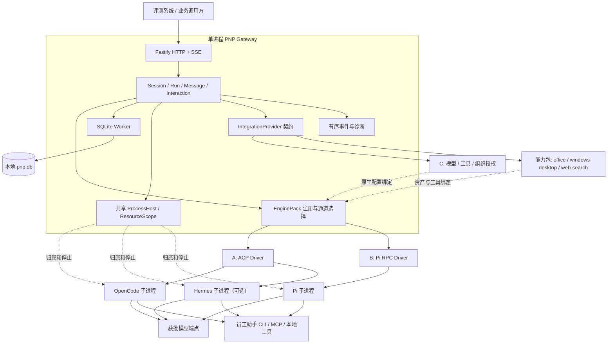
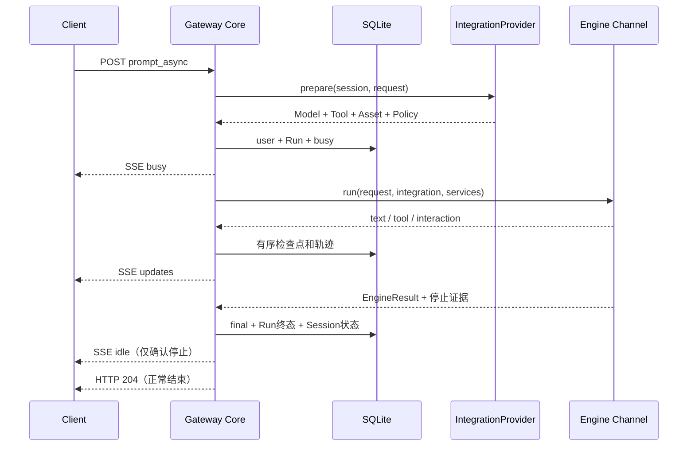

# PNP 架构与详细实现设计

## 1. 系统职责

PNP 对外提供统一 Agent Gateway，对内连接异构 Harness。网关管理会话标识、Run 状态、持久化、事件、交互和资源；Harness 管理 Agent Loop、上下文组织、模型决策与原生工具执行；内网集成模块提供已授权的模型和工具访问。

同一请求不能因为引擎切换而改变北向协议。不同 Harness 不需要被改写为同一种 Agent Loop。

## 2. 运行拓扑

图中的模块是代码职责，不是必须分别部署的服务。每个 Gateway 实例选择一个 Engine Profile。一个引擎可存在多个独立 Session Channel。全局同时只有一个活跃 Run，桌面类用例天然互斥；同一 Session 的第二个请求 409，跨 Session 的请求进入有界队列，队列满才 409。驻留 Channel 上限默认 16，可配；满额时按最近使用时间淘汰最旧的空闲通道（`close`，保留原生历史），不拒绝新会话，不启动无界进程池。

## 3. 公共框架与并行实现

公共框架包含：类型契约、Fastify 接口、SQLite Worker、会话与运行控制、消息投影、交互 Broker、事件通道、进程 Host、资源 Scope、配置选择、资产校验、能力包骨架、显式测试引擎、契约测试和部署脚本。

A 实现 ACP/OpenCode，Hermes 为可选；B 实现 Pi RPC/Pi 原生工具和扩展桥；C 实现内部模型、员工助手工具与权限。能力包的内容归各自所有者（契约第 10 节）。三者依赖公共框架，不依赖对方未完成的实现。内网的最终联合验收由 C 组织，A/B 分别修复自身模块。

## 4. 标识与会话

对象关系为 `GatewaySession → Run → Message/Event`。原生绑定是 `engineId + channelId + nativeId + engineVersion + protocolVersion`。Native Resume 标识只能是非秘密标识，不能将认证 Token 保存为恢复令牌。

Session 创建时持久化网关身份和 `directory`；原生 Channel 在首轮 Prompt 已确定模型和工具配置后打开。后续请求复用该 Channel，但每轮重新解析 IntegrationContext。模型、凭据和权限不能因为 Channel 缓存而使用旧配置。

Session 固定绑定引擎和通道。启动其他 Engine 后可读取历史；不能对不匹配的 Session 执行 Prompt 或隐式迁移。正常进程退出保留原生会话文件；显式删除清理网关记录和拥有的原生历史，绝不删除用户工作目录或交付产物。

## 5. 数据与持久化

SQLite 保存五类数据：`sessions`、`runs`、`messages`、`events`、`interactions`。Schema 版本使用 `PRAGMA user_version`。每条业务记录使用稳定的 TypeScript 数据结构；索引覆盖会话消息顺序、Run 唯一幂等键与每会话唯一活跃执行。

配置为 WAL、外键校验、FULL 同步、有界 busy timeout。SQLite 文件在本机固定数据目录，不能置于共享网络盘或临时目录。`data/native/<engine>/<channel>/<session>/` 保存原生上下文，不能在启动时清空。

开始事务同时写用户消息、Run 和 `busy`。结束事务同时写最终消息、Run 终态、Session 可用状态。SSE 的最终 idle 只在该事务提交后发布。

文本增量在内存组装并按时间/大小合并为检查点；完整最终文本独立提交。已发布的规范事件进入同一个持久化事件序列。诊断 JSONL 是导出视图，不是另一份独立业务真相。已知秘密的跨分片前缀暂不发布，完整字段和累计文本统一脱敏。

## 6. 状态模型

Run 状态：`running / cancelling / completed / failed / cancelled / interrupted`。

Session 对外状态：`idle / busy`；内部恢复状态：`ready / needs-native-resume / blocked`；删除状态：`active / deleting`。

正常完成和已确认停止可回 idle。无法核验停止时，即使 HTTP 已结束、Run 已记 interrupted，该 Session 仍 blocked，只有该会话拒绝新执行；进程级就绪不受影响。`completed` 描述本轮执行正常结束，任务业务是否成功另存 `taskOutcome`，不得由一句模型文本推导成功。

| recovery | 进入条件 | 下一轮打开时的处理 |
|---|---|---|
| `ready` | 从未打开过通道；通道正常 `close()` | 首次打开，或按原生引用正常复用 |
| `needs-native-resume` | 通道被 `terminate()`，无论静默与否；围栏解除之后 | 按契约第 5.2 节恢复或新建原生会话，不拒绝执行 |
| `blocked` | 停止不可证明；启动发现未终态 Run；归属核验未完成 | 拒绝执行（409），直到核验为真或会话被删除 |

## 7. 执行闭环

1. 校验请求、幂等键、引擎通道、会话状态；取得全局执行槽或进入有界队列。
2. IntegrationProvider 解析模型、工具、资产（含启用的能力包）和授权闭包。
3. 提交用户消息与 Run；发布 busy。
4. 通过预先存在的 ResourceScope 打开或恢复原生 Channel；首次打开时投影能力包并执行探测。
5. Driver 发送 Prompt，持续提交有序的规范事件并处理交互。
6. Driver 按具体通道的终态证据返回 EngineResult。
7. Core 排空已接受事件，核对工具状态，提交最终消息与停止原因。
8. 仅在停止状态可信时发布 idle；HTTP 正常路径返回 204。

## 8. 通道终态

ACP v1 以 `session/prompt` 的停止原因响应为核心完成证据；不强制等待协议未定义的第二个完成事件。Pi RPC 的命令 ACK 不是执行完成；适配器必须处理锁定版本的 settled、retry、compaction 和队列语义。旧版本不支持某个事件时，不能永远等待该事件，也不能靠短暂静默推定成功。

Driver 保留原生停止原因并映射 `stop / length / error / content-filter / unknown / cancelled` 等值。不把错误、长度耗尽或拒绝改写成 `stop`。正常最终消息同时含 `finish=stop` 与 `step-finish`；工具步骤完成不能提前结束整个请求。

## 9. 取消、超时与资源隔离

取消有三项独立责任：接收取消请求、在有界时间内结束调用方等待、确认实际执行停止。协议取消 ACK 只完成第一项。

Core 发送取消、继续接收有效收尾事件、等待停止证据；无响应时调用资源终止。超时或取消时尚无结果的工具记录 `gateway-observation` 和 `result_unknown/cancelled`，不伪造引擎工具结果。停止仍不确定则只阻断该会话的后续执行：Run 记 interrupted，会话置 blocked，其通道与作用域从常驻表摘除，诊断记录 `degraded` 与原因；`/health/ready` 不变，其他会话照常执行。

围栏范围：不确定只隔离到会话，永远不污染进程。进程级不可用只表达一件事：存储不可用；存储恢复后就绪恢复为真。中止、删除、凭据回收失败、诊断读取失败都不改变进程级状态。

每次打开 Channel 前建立 ResourceScope。Host 在启动进程前登记清理函数和归属记录。启动超时后迟到的 Channel 仍被终止；未完成的打开操作不能被当成“没有资源”。

Windows Host 用独立 helper 持有 Job Object，子进程暂停创建、入 Job 后恢复；`KILL_ON_JOB_CLOSE` 处理网关或 helper 退出。stdin EOF、进程退出、协议无响应均有有界清理路径。禁止按 `node.exe/python.exe/OUTLOOK.EXE` 等进程名全量终止。

外部桌面应用与已经完成的业务副作用不等于 Harness 自身资源。需要持续存在的用户应用由工具提供方明确管理其生命周期；必须在内网验证会话关闭不会撤销“打开应用”等任务结果。Job Object 不是模型行为沙箱，也不能撤销远端已提交操作。

## 10. 启动、恢复与删除

### 10.1 拒绝启动的判据

判据只有一句：能否证明“继续运行会破坏数据”。能证明的只有两种情况：

| 情况 | 错误码 |
|---|---|
| 数据目录此刻有另一个活着的拥有者 | `INSTANCE_LOCKED` |
| 存储打不开，或 Schema 版本比可执行文件新 | `STORAGE_UNAVAILABLE` |

其余全部降级到会话级并写进诊断。启动配置无效（引擎未知或冲突、集成配置无法加载、监听参数非法）同样拒绝启动，但那是调用方输入错误，与数据安全无关，见契约第 3.4 节。

### 10.2 启动顺序

1. 取得独占。Windows 用进程生命周期守卫；守卫建立失败回退到锁文件加进程列表判活，诊断标记 `degraded`，不拒绝启动。
2. 打开存储；把未提交终态的 Run 记为 interrupted，补充恢复观察消息，相关会话置 blocked。
3. 监听端口；`/health/ready` 为真。
4. 异步核验归属记录，总时限 20 秒；结果只作用于会话。核验期间相关会话保持 blocked，对它们的请求 409；其他会话照常。

### 10.3 归属记录的证据分级

每条记录按下表从便宜到贵取证，命中即停。

| 序 | 证据 | 结论 |
|---|---|---|
| 1 | 记录的 `quiescent` 已为真 | 静默 |
| 2 | 记录创建时间早于系统开机时间 | 静默；开机前的进程必死，顺带覆盖登录会话号变化 |
| 3 | 字段校验失败 | 无法判定；只标该会话 |
| 4 | 辅助进程已死且 Windows 会话标识一致 | 静默；不需要解释器。会话标识缺失时不否决，落到第 6 级 |
| 5 | 辅助进程号存活但进程列表映像名不匹配 | 静默；进程号被复用 |
| 6 | 辅助进程确实存活，或会话标识缺失 | 作业检视；对所有需要检视的记录一次调用批量检视，作业不存在即静默 |

### 10.4 处置

| 结论 | 处置 |
|---|---|
| 自证静默 | 解除该会话围栏（置 `needs-native-resume`），删除记录 |
| 确实存活 | 该会话保持 blocked；诊断列出记录文件名与原因 |
| 无法判定 | 记录移入 `hosts/quarantine/` 并计数；该会话保持 blocked；不参与就绪门禁 |

`npm run recover` 执行同一段核验并输出同样的摘要，逐条列出文件名与原因；它不提供盲目 `--force`。

### 10.5 运行期的围栏

- 取消或终止后不能证明停止：Run 记 interrupted，会话置 blocked，通道与作用域从常驻表摘除，诊断记录 `degraded` 与原因。`/health/ready` 不变，其他会话不受影响。
- 对 blocked 会话：`prompt_async` 409 `SESSION_UNAVAILABLE`；无活跃 Run 时 abort 409；两者都不改变进程级状态。
- Core 在中止、删除、关机与诊断触发时对未证实的作用域再核验；核验为真即解除围栏（置 `needs-native-resume`）并删除记录。
- 删除是解除围栏的合法出口：尽力停止后删除网关记录、原生目录与该会话的归属记录。

### 10.6 原生恢复

原生恢复能力由具体 Channel 声明并验证。`needs-native-resume` 的会话在下一轮打开时按契约第 5.2 节处理：实测支持会话恢复就恢复并报告；否则新建原生会话、保留谱系、发布 `context.lost` 原生事件、由 Core 在轨迹追加一条观察态消息。不因不可恢复而拒绝执行。V1 不通过把历史重新拼成 Prompt 冒充无损恢复。

### 10.7 删除

删除先尽力停止执行，持久化 deleting，再清理自身原生目录、归属记录和网关数据；任何清理失败都保留可重试的删除状态。用户文件产物不在删除范围。

## 11. 能力与资产

能力粒度为引擎、通道、版本和绑定配置。每项能力描述可用性、配置作用域、控制方式、观察方式、参数 Schema 与证据等级。静态声明不等同于实测。

公共能力是会话、Prompt、取消、消息、模型和工具绑定。Skill、MCP、Hook、Memory、Subagent 等扩展在可用通道内原生保留；不同引擎的名字相同不代表语义相同。至少一项原生扩展必须完成配置—调用—观察—验证链路。

能力包（契约第 10 节）是资产层的内容组织单位：`office`、`windows-desktop`、`web-search` 三个包由配置启用，IntegrationProvider 每轮展开为资产与工具绑定，各引擎 Pack 投影到该会话的私有原生目录。能力包不进入 Core，不含任务标识判断。

公共资产解析器校验源目录、普通文件、大小及 SHA-256。Adapter 将资产投影到自身受管目录；不能覆盖用户已有 AGENTS.md、全局配置或项目资产。不可用的必需资产导致执行前失败，可选资产则明确记录能力不可用。

## 12. 内网解耦

IntegrationProvider 不拥有 Session 状态、不写最终消息、不调度 Agent Loop。它返回 `ResolvedModel`、`ToolBinding`、`AssetBinding` 和授权函数。Harness 直接访问配置后的模型或工具；默认不经过网关模型代理。

员工助手 CLI 是通用工具入口，不是第二种 Harness。C 将真实 CLI 转成约定的结构化工具接口；A/B 只处理各引擎的注册和事件映射。内网日志、账号、凭据和材料不进入公开源码。

## 13. 轻量化边界

一个网关进程、一个 SQLite Worker、按需驻留的少量 Harness/Host 进程；没有数据库服务、MQ、配置中心和分布式调度。核心结构保持独立接口，但不把每个类部署成单独服务。

目标是业务契约稳定、接入成本可验证、执行状态可信。多引擎效果和可用性只由锁定版本及内网测试证明，不预设所有引擎同样兼容。
