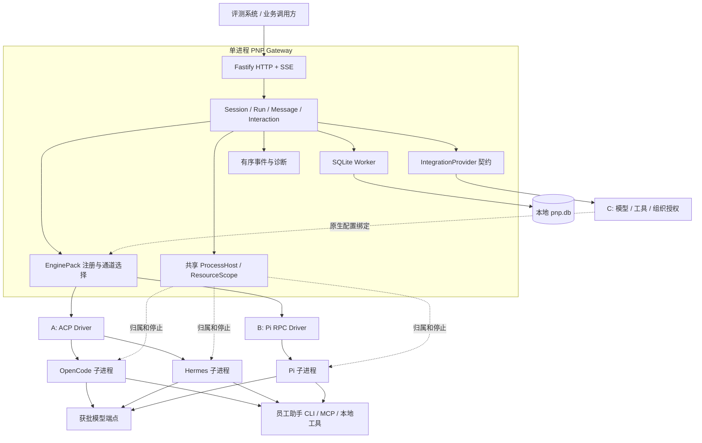

# PNP 架构与详细实现设计

## 1. 系统职责

PNP 对外提供统一 Agent Gateway，对内连接异构 Harness。网关管理会话标识、Run 状态、持久化、事件、交互和资源；Harness 管理 Agent Loop、上下文组织、模型决策与原生工具执行；内网集成模块提供已授权的模型和工具访问。

同一请求不能因为引擎切换而改变北向协议。不同 Harness 不需要被改写为同一种 Agent Loop。

## 2. 运行拓扑

图中的模块是代码职责，不是必须分别部署的服务。每个 Gateway 实例选择一个 Engine Profile。一个引擎可存在多个独立 Session Channel；默认全局只有一个活跃 Run，避免竞争同一桌面。驻留 Channel 有容量上限，超限明确拒绝，不启动无界进程池。

## 3. 公共框架与并行实现

公共框架包含：类型契约、Fastify 接口、SQLite Worker、会话与运行控制、消息投影、交互 Broker、事件通道、进程 Host、资源 Scope、配置选择、资产校验、显式测试引擎、契约测试和部署脚本。

A 实现 ACP/OpenCode/Hermes；B 实现 Pi RPC/Pi 原生工具和扩展桥；C 实现内部模型、员工助手工具与权限。三者依赖公共框架，不依赖对方未完成的实现。内网的最终联合验收由 C 组织，A/B 分别修复自身模块。

## 4. 标识与会话

对象关系为 `GatewaySession → Run → Message/Event`。原生绑定是 `engineId + channelId + nativeId + engineVersion + protocolVersion`。Native Resume 标识只能是非秘密标识，不能将认证 Token 保存为恢复令牌。

Session 创建时持久化网关身份和 `directory`；原生 Channel 在首轮 Prompt 已确定模型和工具配置后打开。后续请求复用该 Channel，但每轮重新解析 IntegrationContext。模型、凭据和权限不能因为 Channel 缓存而使用旧配置。

Session 固定绑定引擎和通道。启动其他 Engine 后可读取历史；不能对不匹配的 Session 执行 Prompt 或隐式迁移。正常进程退出保留原生会话文件；显式删除清理网关记录和拥有的原生历史，绝不删除用户工作目录或交付产物。

## 5. 数据与持久化

SQLite 保存五类数据：`sessions`、`runs`、`messages`、`events`、`interactions`。Schema 版本使用 `PRAGMA user_version`。每条业务记录使用稳定的 TypeScript 数据结构；索引覆盖会话消息顺序、Run 唯一幂等键与每会话唯一活跃执行。

配置为 WAL、外键校验、FULL 同步、有界 busy timeout。SQLite 文件在本机固定数据目录，不能置于共享网络盘或临时目录。`data/native/<engine>/<channel>/<session>/` 保存原生上下文，不能在启动时清空。

开始事务同时写用户消息、Run 和 `busy`。结束事务同时写最终消息、Run 终态、Session 可用状态。SSE 的最终 idle 只在该事务提交后发布。

文本增量在内存组装并按时间/大小合并为检查点；完整最终文本独立提交。已发布的规范事件进入同一个持久化事件序列。诊断 JSONL 是导出视图，不是另一份独立业务真相。已知秘密的跨分片前缀暂不发布，完整字段和累计文本统一脱敏。

## 6. 状态模型

Run 状态：`running / cancelling / completed / failed / cancelled / interrupted`。

Session 对外状态：`idle / busy`；内部恢复状态：`ready / needs-native-resume / blocked`；删除状态：`active / deleting`。

正常完成和已确认停止可回 idle。无法核验停止时，即使 HTTP 已结束、Run 已记 interrupted，Session 仍 blocked，网关拒绝新执行。`completed` 描述本轮执行正常结束，任务业务是否成功另存 `taskOutcome`，不得由一句模型文本推导成功。

## 7. 执行闭环

1. 校验请求、幂等键、引擎通道、会话状态及全局执行槽。
2. IntegrationProvider 解析模型、工具、资产和授权闭包。
3. 提交用户消息与 Run；发布 busy。
4. 通过预先存在的 ResourceScope 打开或恢复原生 Channel。
5. Driver 发送 Prompt，持续提交有序的规范事件并处理交互。
6. Driver 按具体通道的终态证据返回 EngineResult。
7. Core 排空已接受事件，核对工具状态，提交最终消息与停止原因。
8. 仅在停止状态可信时发布 idle；HTTP 正常路径返回 204。

## 8. 通道终态

ACP v1 以 `session/prompt` 的停止原因响应为核心完成证据；不强制等待协议未定义的第二个完成事件。Pi RPC 的命令 ACK 不是执行完成；适配器必须处理锁定版本的 settled、retry、compaction 和队列语义。旧版本不支持某个事件时，不能永远等待该事件，也不能靠短暂静默推定成功。

Driver 保留原生停止原因并映射 `stop / length / error / content-filter / unknown / cancelled` 等值。不把错误、长度耗尽或拒绝改写成 `stop`。正常最终消息同时含 `finish=stop` 与 `step-finish`；工具步骤完成不能提前结束整个请求。

## 9. 取消、超时与资源隔离

取消有三项独立责任：接收取消请求、在有界时间内结束调用方等待、确认实际执行停止。协议取消 ACK 只完成第一项。

Core 发送取消、继续接收有效收尾事件、等待停止证据；无响应时调用资源终止。超时或取消时尚无结果的工具记录 `gateway-observation` 和 `result_unknown/cancelled`，不伪造引擎工具结果。停止仍不确定则阻断后续执行。

每次打开 Channel 前建立 ResourceScope。Host 在启动进程前登记清理函数和归属记录。启动超时后迟到的 Channel 仍被终止；未完成的打开操作不能被当成“没有资源”。

Windows Host 用独立 helper 持有 Job Object，子进程暂停创建、入 Job 后恢复；`KILL_ON_JOB_CLOSE` 处理网关或 helper 退出。stdin EOF、进程退出、协议无响应均有有界清理路径。禁止按 `node.exe/python.exe/OUTLOOK.EXE` 等进程名全量终止。

外部桌面应用与已经完成的业务副作用不等于 Harness 自身资源。需要持续存在的用户应用由工具提供方明确管理其生命周期；必须在内网验证会话关闭不会撤销“打开应用”等任务结果。Job Object 不是模型行为沙箱，也不能撤销远端已提交操作。

## 10. 恢复与删除

启动扫描将未提交终态的 Run 记录为 interrupted，补充恢复观察消息并阻断相关会话。Windows 进程生命周期独占锁防止两个 Gateway 或恢复器同时拥有一个数据目录。取得该锁后自动核验全部 retained Host/Job 记录；只有所有记录都有停止证据时才解除对应会话阻断。核验失败保持 not-ready，可由独立恢复命令重试同一流程；没有证据时失败，不提供盲目 `--force`。

原生恢复能力由具体 Channel 声明并验证。不能恢复的会话仍可查询历史，但执行明确报错。V1 不通过把历史重新拼成 Prompt 冒充无损恢复。

删除先停止执行，持久化 deleting，再清理自身原生目录和网关数据；任何清理失败都保留可重试的删除状态。用户文件产物不在删除范围。

## 11. 能力与资产

能力粒度为引擎、通道、版本和绑定配置。每项能力描述可用性、配置作用域、控制方式、观察方式、参数 Schema 与证据等级。静态声明不等同于实测。

公共能力是会话、Prompt、取消、消息、模型和工具绑定。Skill、MCP、Hook、Memory、Subagent 等扩展在可用通道内原生保留；不同引擎的名字相同不代表语义相同。至少一项原生扩展必须完成配置—调用—观察—验证链路。

公共资产解析器校验源目录、普通文件、大小及 SHA-256。Adapter 将资产投影到自身受管目录；不能覆盖用户已有 AGENTS.md、全局配置或项目资产。不可用的必需资产导致执行前失败，可选资产则明确记录能力不可用。

## 12. 内网解耦

IntegrationProvider 不拥有 Session 状态、不写最终消息、不调度 Agent Loop。它返回 `ResolvedModel`、`ToolBinding`、`AssetBinding` 和授权函数。Harness 直接访问配置后的模型或工具；默认不经过网关模型代理。

员工助手 CLI 是通用工具入口，不是第二种 Harness。C 将真实 CLI 转成约定的结构化工具接口；A/B 只处理各引擎的注册和事件映射。内网日志、账号、凭据和材料不进入公开源码。

## 13. 轻量化边界

一个网关进程、一个 SQLite Worker、按需驻留的少量 Harness/Host 进程；没有数据库服务、MQ、配置中心和分布式调度。核心结构保持独立接口，但不把每个类部署成单独服务。

目标是业务契约稳定、接入成本可验证、执行状态可信。多引擎效果和可用性只由锁定版本及内网测试证明，不预设所有引擎同样兼容。
