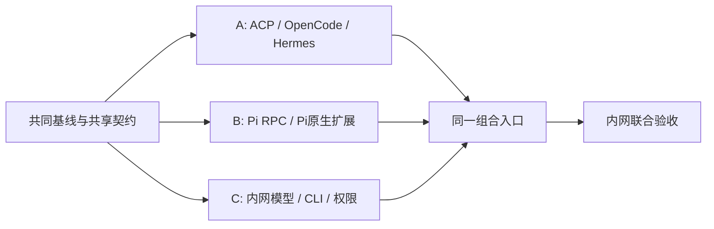

# 并行工作包与所有权

## 1. 组织模型

A 为用户本人，B 为另一位引擎开发，C 为内网对接开发。A/B 是并行关系，不是 A 交付公共实现后 B 才能开发。

共同输入是同一个已审核的公共代码基线：规范、契约、公共运行库、Fake、测试工具和依赖锁文件。公共代码在交付包中提供；基础验收属于共同基线准入，不重新分配为 A 的长期前置开发任务。

## 2. 公共框架交付范围

已提供源代码的共用能力：HTTP 路由、Schema、Session/Run、SQLite、事件、交互、取消、资源 Scope、ProcessHost、Windows Job helper、资产校验、配置注册、Mock 与契约测试。

目标平台是否通过验证单独记录在 `verification/results.json`。A/B 不需要复制另一份 Core 才能编写和运行自己的协议单测。任何公共缺陷通过独立共享变更提交修复，不藏在引擎功能 PR 中。

## 3. A 工作包：ACP 与两种引擎

### 所有目录

- `code/src/drivers/acp/**`
- `code/src/engines/opencode/**`
- `code/src/engines/hermes/**`
- `code/config/engines/opencode.json`、`hermes.json`
- `code/tests/adapters/acp/**`
- `docs/engines/opencode.md`、`hermes.md`

### 交付内容

| ID | 任务 | 验收 |
|---|---|---|
| A01 | 通用 ACP v1 连接与初始化 | 使用公共 Host；处理 JSON-RPC 响应、通知、错误与进程退出 |
| A02 | Session/new、原生恢复、Prompt、取消 | 不混淆 ACK/完成；不等待协议不存在的终态事件 |
| A03 | 消息/工具/审批映射 | 调用 id 稳定，更新按序，真实停止原因保留 |
| A04 | OpenCode EnginePack | 模型、工具与资产配置无全局污染；Windows 原生运行 |
| A05 | Hermes EnginePack | 复用 ACP；以实际 ACP 工具面验证，不套用其他通道能力 |
| A06 | 原生能力保留 | 至少一种资产或原生扩展完成配置、执行与证据链 |
| A07 | 版本、配置与测试 | 声明确切安装方式、协议版本、许可、能力证据 |

禁止复制 Fastify、SQLite、权限 Broker 或进程终止逻辑。EnginePack 的差异放在各引擎目录，不用引擎 if/else 污染 Core。

## 4. B 工作包：Pi RPC 与原生工具/扩展

### 所有目录

- `code/src/drivers/pi-rpc/**`
- `code/src/engines/pi/**`
- `code/config/engines/pi.json`
- `code/tests/adapters/pi/**`
- `docs/engines/pi.md`

### 交付内容

| ID | 任务 | 验收 |
|---|---|---|
| B01 | Pi JSONL/RPC 连接 | 使用公共 Host/JsonlDecoder；LF 分帧、UTF-8 分片、请求关联 |
| B02 | 接受与 settled 语义 | ACK 不能结束 Run；处理实际版本的 retry/compaction/队列 |
| B03 | 会话与取消 | 独立原生会话目录；复用/恢复；abort 与真停止分开 |
| B04 | 模型、工具和资产注入 | 每轮刷新 IntegrationContext；不支持的修改明确拒绝 |
| B05 | 原生扩展桥 | 通过 Pi 原生工具/Extension 接入 ToolBinding；不重新实现内部 CLI |
| B06 | 事件与交互 | 工具状态收敛、UI 交互映射、错误和扩展事件保留 |
| B07 | 版本、配置与测试 | 声明确切安装方式和能力证据；使用共同测试套件 |
| B08 | Office 能力包（`code/assets/packs/office/**`） | docx/xlsx/pptx/csv 的读写、转换与产物自检；`pack.json`（`owner:"B"`）、`SKILL.md`、`instructions/office.md` 齐备；探测（`probes[]`）失败时按 `onFailure` 处理，不静默通过；投影到两个必过引擎（opencode、pi）后各自产生一次 `pack.projected` 原生事件；包内不含 `task_id`、固定答案或测试材料；自检步骤在无引擎环境下可单独运行 |

B 的完成不依赖 A 的 ACP Driver。B 不承担“等 ACP 完成后再接 Hermes”的串行工作；Hermes 与 ACP 由 A 同域维护。能力包骨架与字段定义见 [`code/assets/packs/README.md`](../../code/assets/packs/README.md) 与 [`docs/spec/contracts.md` 第 10 节](../spec/contracts.md#10-能力包)；验收对应 [`dfx-and-testing.md`](../spec/dfx-and-testing.md) E03。

## 5. C 工作包：独立内网接入

### 所有目录

- `code/src/integration/internal/**`
- `code/tests/integration/internal/**`
- `code/config/internal.example.json`
- `docs/internal/**`
- `verification/internal/**` 中的脱敏证明

### 统一工具边界

C 的员工助手/内网工具对 A/B 的唯一公共交付边界是 [`PNP-MCP/1`](../spec/mcp-integration-profile.md)。C 可以在 MCP Server 内部调用员工助手 CLI 或内网 API，但不能要求 A/B 解析 CLI 文本、复制 CLI wrapper 或理解内网私有参数。

MCP Server 的跨 Core 配置使用 `code/config/settings.json` 的 `common.mcp.servers`；Core 只在确有差异时覆盖 `cores.<engineId>.mcp.servers`。配置格式见 [`code/config/SETTINGS.md`](../../code/config/SETTINGS.md)。

### 交付内容

| ID | 任务 | 验收 |
|---|---|---|
| C01 | 模型协议与认证 | 确认真实 wire 协议、模型 id、鉴权/Header、代理/CA、流式与工具回传；提供脱敏正常/异常夹具 |
| C02 | 员工助手 CLI → PNP-MCP/1 | 交付标准 `stdio`（本地默认）或 `streamable-http` MCP Server；实现 `tools/list`/`tools/call`、稳定 schema/错误/取消/副作用/幂等语义；通过 PNP-MCP/1 M01–M12；A/B 不解析 CLI |
| C03 | 组织权限与审批 | allow/deny/ask 与真实服务权限一致；`deny` 不被默认 allow、MCP annotations 或用户回复覆盖 |
| C04 | 脱敏夹具 | 模型 + MCP 目录/调用/错误/unknown submission/UTF-8/权限夹具；不含内网地址、账号、密钥、真实用户材料 |
| C05 | 内网部署/证书/网络自检 | Windows 身份、桌面可用性、CLI/MCP Server 版本、证书/代理/网络、环境变量名称与缺失诊断可复现 |
| C06 | 最终联合验收证据 | 记录代码 SHA、Harness/MCP/CLI/模型版本、实际 protocol revision、权限、任务轨迹和脱敏输出；真实员工助手 + 至少两个必过 Core 完成同一 MCP contract 调用 |

C 不修改 Agent Loop、不把每种引擎的配置格式写进内网服务、不根据测试任务 ID 提供专用答案。PNP-MCP/1 是统一 wire/profile；OpenCode/Pi/Hermes 的原生 MCP 配置投影属于 A/B Engine Adapter。

### 新增：能力包（桌面交互与网页检索）

目录：`code/assets/packs/windows-desktop/**`、`code/assets/packs/web-search/**`。骨架与字段定义同 B08，见 [`code/assets/packs/README.md`](../../code/assets/packs/README.md)。

| ID | 任务 | 验收 |
|---|---|---|
| C07 | Windows 桌面交互能力包（`windows-desktop/`） | 打开应用、UI 自动化、即时通讯客户端；`pack.json`（`owner:"C"`）、`SKILL.md` 齐备；`sideEffect` 如实标注 `write`/`external`；投影到两个必过引擎各产生一次 `pack.projected`；不访问网关存储、不 spawn 引擎；包内不含任务标识或固定答案 |
| C08 | 网页检索能力包（`web-search/`） | 网页检索与来源引用；同 C07 的投影与探测验收；返回结果可核查来源，不编造引用 |

## 6. 共同与集成责任

公共目录 `contracts/core/gateway/storage/runtime/security/assets/registry`、根依赖、构建脚本和公共规范由双方共同审查。A 可以作为仓库合并负责人，但不因此承担 B 的共享前置需求。公共变更用单独 PR，A/B 两侧契约测试均通过后合并。

C 的夹具让 A/B 在不接内网的环境验证结构和错误路径；A/B 的 Fake Channel 让 C 不等待引擎开发验证模型/工具契约。最终联合验证必须使用真实 Harness 和内网资源。

## 7. 并行可执行条件

`foundation:check` 通过、共同提交 SHA 和契约版本一致、依赖锁一致，即可同时执行 A/B/C Prompt。工作包之间不通过共享可变文件、全局配置或同一个原生会话通信。

分工交付以可组合模块和验证证据为单位，不以“写完多少文件”为单位。
